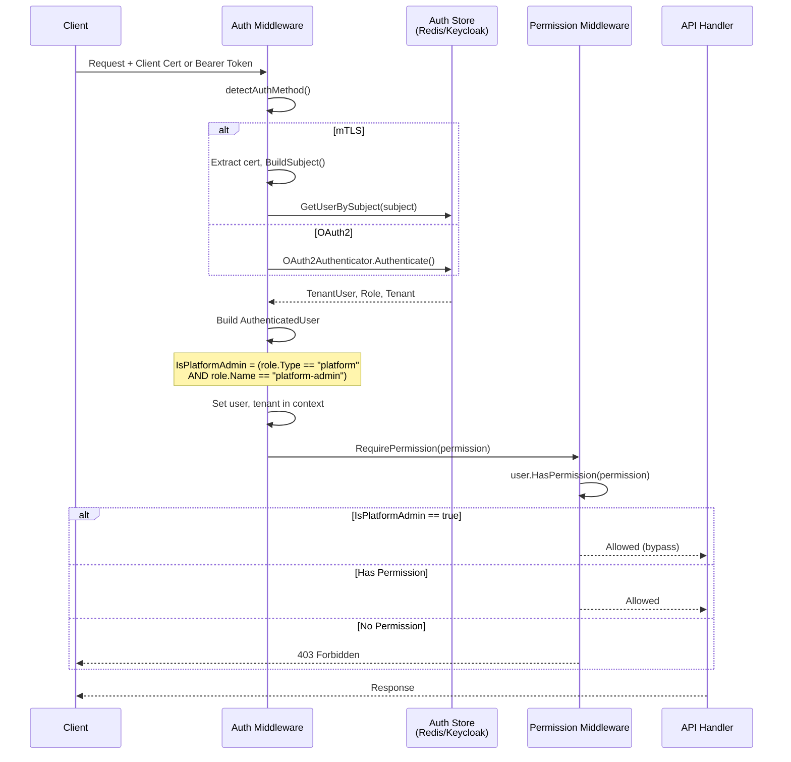

# Authorization

**RBAC model, roles, permissions, and tenant isolation for the O2-IMS Gateway.**

## Table of Contents

1. [Overview](#overview)
2. [Permission Model](#permission-model)
3. [Built-in Roles](#built-in-roles)
4. [Authorization Flow](#authorization-flow)
5. [Route Permissions](#route-permissions)
6. [Tenant Isolation](#tenant-isolation)
7. [Testing Authorization](#testing-authorization)

---

## Overview

### Authorization Model

The O2-IMS Gateway implements Role-Based Access Control (RBAC) with strict tenant isolation. Permissions are simple strings in `resource:action` format, roles are predefined collections of permissions, and authorization is enforced via Gin middleware.

**Key Features:**
- **String-Based Permissions**: Simple `resource:action` format (e.g., `subscriptions:read`)
- **Platform Admin Bypass**: `platform-admin` role with `IsPlatformAdmin` flag bypasses all permission checks
- **Middleware-Based Enforcement**: `RequirePermission()` and `RequirePlatformAdmin()` Gin middleware
- **Tenant Isolation**: Users can only access resources within their own tenant
- **Dual Authentication**: mTLS client certificates and OAuth2/OIDC (Keycloak) supported
- **Audit Trail**: All authorization decisions logged as audit events

### Design Principles

1. **Zero Access by Default**: Users have no permissions until a role is assigned
2. **Explicit Permission Checks**: Every route declares its required permission
3. **Tenant Boundaries**: Non-admin users cannot access other tenants' resources
4. **Platform Admin Override**: `platform-admin` role bypasses all permission checks via `IsPlatformAdmin`
5. **Comprehensive Auditing**: Authentication failures and access denials logged as audit events

---

## Permission Model

### Resource:Action Format

Permissions follow the pattern: **`resource:action`**

Each permission is a simple Go string constant of type `Permission` defined in `internal/auth/models.go`.

### All Permissions

| Permission | Constant | Description |
|-----------|----------|-------------|
| `subscriptions:read` | `PermissionSubscriptionRead` | Read subscriptions |
| `subscriptions:create` | `PermissionSubscriptionCreate` | Create subscriptions |
| `subscriptions:delete` | `PermissionSubscriptionDelete` | Delete subscriptions |
| `resourcePools:read` | `PermissionResourcePoolRead` | Read resource pools |
| `resourcePools:create` | `PermissionResourcePoolCreate` | Create resource pools |
| `resourcePools:update` | `PermissionResourcePoolUpdate` | Update resource pools |
| `resourcePools:delete` | `PermissionResourcePoolDelete` | Delete resource pools |
| `resources:read` | `PermissionResourceRead` | Read resources |
| `resources:create` | `PermissionResourceCreate` | Create resources |
| `resources:update` | `PermissionResourceUpdate` | Update resources |
| `resources:delete` | `PermissionResourceDelete` | Delete resources |
| `resourceTypes:read` | `PermissionResourceTypeRead` | Read resource types |
| `deploymentManagers:read` | `PermissionDeploymentManagerRead` | Read deployment managers |
| `tenants:read` | `PermissionTenantRead` | Read tenants |
| `tenants:create` | `PermissionTenantCreate` | Create tenants |
| `tenants:update` | `PermissionTenantUpdate` | Update tenants |
| `tenants:delete` | `PermissionTenantDelete` | Delete tenants |
| `users:read` | `PermissionUserRead` | Read users |
| `users:create` | `PermissionUserCreate` | Create users |
| `users:update` | `PermissionUserUpdate` | Update users |
| `users:delete` | `PermissionUserDelete` | Delete users |
| `roles:read` | `PermissionRoleRead` | Read roles |
| `roles:create` | `PermissionRoleCreate` | Create roles |
| `roles:update` | `PermissionRoleUpdate` | Update roles |
| `roles:delete` | `PermissionRoleDelete` | Delete roles |
| `audit:read` | `PermissionAuditRead` | Read audit logs |

### Data Model

```go
// internal/auth/models.go

// Permission represents a specific action on a resource.
// Format: "resource:action" (e.g., "subscriptions:create").
type Permission string

// RoleType defines the scope of a role.
type RoleType string

const (
    RoleTypePlatform RoleType = "platform" // Cross-tenant
    RoleTypeTenant   RoleType = "tenant"   // Tenant-scoped
)

// Role represents a collection of permissions assigned to users.
type Role struct {
    ID          string       `json:"roleId"`
    Name        RoleName     `json:"name"`
    Type        RoleType     `json:"type"`
    Description string       `json:"description,omitempty"`
    Permissions []Permission `json:"permissions"`
    TenantID    string       `json:"tenantId,omitempty"`
    CreatedAt   time.Time    `json:"createdAt"`
    UpdatedAt   time.Time    `json:"updatedAt,omitempty"`
}

// HasPermission checks if the role includes the specified permission.
func (r *Role) HasPermission(perm Permission) bool {
    for _, p := range r.Permissions {
        if p == perm {
            return true
        }
    }
    return false
}

// AuthenticatedUser represents the current authenticated user context.
type AuthenticatedUser struct {
    UserID          string
    TenantID        string
    Subject         string
    CommonName      string
    Role            *Role
    IsPlatformAdmin bool
    AuthMethod      AuthMethod
}

// HasPermission checks if the user has the specified permission.
// Platform admins always return true (bypass all checks).
func (u *AuthenticatedUser) HasPermission(perm Permission) bool {
    if u.IsPlatformAdmin {
        return true
    }
    if u.Role == nil {
        return false
    }
    return u.Role.HasPermission(perm)
}
```

---

## Built-in Roles

All built-in roles are defined in `GetDefaultRoles()` in `internal/auth/models.go`.

### Platform Roles

#### platform-admin

**Role Type:** `RoleTypePlatform`
**Special:** `IsPlatformAdmin = true` -- bypasses all permission checks

```yaml
roleId: role-platform-admin
name: platform-admin
type: platform
description: Full platform access across all tenants
permissions:
  # All permissions are granted, AND IsPlatformAdmin bypasses HasPermission()
  - tenants:read, tenants:create, tenants:update, tenants:delete
  - users:read, users:create, users:update, users:delete
  - roles:read, roles:create, roles:update, roles:delete
  - subscriptions:read, subscriptions:create, subscriptions:delete
  - resourcePools:read, resourcePools:create, resourcePools:update, resourcePools:delete
  - resources:read, resources:create, resources:update, resources:delete
  - resourceTypes:read
  - deploymentManagers:read
  - audit:read
```

**Use Case:** Full system administration across all tenants. The `IsPlatformAdmin` flag means `HasPermission()` always returns `true`, regardless of the permissions list.

#### tenant-admin

**Role Type:** `RoleTypePlatform`

```yaml
roleId: role-tenant-admin
name: tenant-admin
type: platform
description: Administrative access for tenant management
permissions:
  - tenants:read
  - tenants:create
  - tenants:update
  - users:read
  - users:create
  - users:update
  - users:delete
  - audit:read
```

**Use Case:** Create and manage tenants, manage users within tenants. Cannot delete tenants or access O2-IMS resources (subscriptions, resource pools, etc.).

### Tenant Roles

#### owner

**Role Type:** `RoleTypeTenant`

```yaml
roleId: role-owner
name: owner
type: tenant
description: Full access within a tenant
permissions:
  - users:read, users:create, users:update, users:delete
  - roles:read
  - subscriptions:read, subscriptions:create, subscriptions:delete
  - resourcePools:read, resourcePools:create, resourcePools:update, resourcePools:delete
  - resources:read, resources:create, resources:update, resources:delete
  - resourceTypes:read
  - deploymentManagers:read
  - audit:read
```

**Use Case:** Full control within a tenant, including user management and audit access.

#### admin

**Role Type:** `RoleTypeTenant`

```yaml
roleId: role-admin
name: admin
type: tenant
description: Administrative access within a tenant
permissions:
  - users:read, users:create, users:update
  - roles:read
  - subscriptions:read, subscriptions:create, subscriptions:delete
  - resourcePools:read, resourcePools:create, resourcePools:update, resourcePools:delete
  - resources:read, resources:create, resources:update, resources:delete
  - resourceTypes:read
  - deploymentManagers:read
```

**Use Case:** Manage resources and users (read/create/update only -- cannot delete users). No audit access.

#### operator

**Role Type:** `RoleTypeTenant`

```yaml
roleId: role-operator
name: operator
type: tenant
description: Operational access for resource management
permissions:
  - subscriptions:read, subscriptions:create, subscriptions:delete
  - resourcePools:read
  - resources:read, resources:create, resources:update
  - resourceTypes:read
  - deploymentManagers:read
```

**Use Case:** Day-to-day operations: manage subscriptions, create/update resources. Read-only access to resource pools. Cannot manage users or roles.

#### viewer

**Role Type:** `RoleTypeTenant`

```yaml
roleId: role-viewer
name: viewer
type: tenant
description: Read-only access to resources
permissions:
  - subscriptions:read
  - resourcePools:read
  - resources:read
  - resourceTypes:read
  - deploymentManagers:read
```

**Use Case:** Read-only monitoring and observability. Cannot create, update, or delete any resources.

### Role Comparison Matrix

| Permission | platform-admin | tenant-admin | owner | admin | operator | viewer |
|-----------|:-:|:-:|:-:|:-:|:-:|:-:|
| `tenants:read` | * | Y | - | - | - | - |
| `tenants:create` | * | Y | - | - | - | - |
| `tenants:update` | * | Y | - | - | - | - |
| `tenants:delete` | * | - | - | - | - | - |
| `users:read` | * | Y | Y | Y | - | - |
| `users:create` | * | Y | Y | Y | - | - |
| `users:update` | * | Y | Y | Y | - | - |
| `users:delete` | * | Y | Y | - | - | - |
| `roles:read` | * | - | Y | Y | - | - |
| `roles:create` | * | - | - | - | - | - |
| `roles:update` | * | - | - | - | - | - |
| `roles:delete` | * | - | - | - | - | - |
| `subscriptions:read` | * | - | Y | Y | Y | Y |
| `subscriptions:create` | * | - | Y | Y | Y | - |
| `subscriptions:delete` | * | - | Y | Y | Y | - |
| `resourcePools:read` | * | - | Y | Y | Y | Y |
| `resourcePools:create` | * | - | Y | Y | - | - |
| `resourcePools:update` | * | - | Y | Y | - | - |
| `resourcePools:delete` | * | - | Y | Y | - | - |
| `resources:read` | * | - | Y | Y | Y | Y |
| `resources:create` | * | - | Y | Y | Y | - |
| `resources:update` | * | - | Y | Y | Y | - |
| `resources:delete` | * | - | Y | Y | - | - |
| `resourceTypes:read` | * | - | Y | Y | Y | Y |
| `deploymentManagers:read` | * | - | Y | Y | Y | Y |
| `audit:read` | * | Y | Y | - | - | - |

`*` = `IsPlatformAdmin` bypass (all permissions granted regardless of list)

---

## Authorization Flow

### Authentication and Authorization Sequence


```mermaid
sequenceDiagram
    participant Client
    participant AuthMw as Auth Middleware
    participant Store as Auth Store<br/>(Redis/Keycloak)
    participant PermMw as Permission Middleware
    participant Handler as API Handler

    Client->>AuthMw: Request + Client Cert or Bearer Token
    AuthMw->>AuthMw: detectAuthMethod()

    alt mTLS
        AuthMw->>AuthMw: Extract cert, BuildSubject()
        AuthMw->>Store: GetUserBySubject(subject)
    else OAuth2
        AuthMw->>Store: OAuth2Authenticator.Authenticate()
    end

    Store-->>AuthMw: TenantUser, Role, Tenant

    AuthMw->>AuthMw: Build AuthenticatedUser
    Note over AuthMw: IsPlatformAdmin = (role.Type == "platform"<br/>AND role.Name == "platform-admin")
    AuthMw->>AuthMw: Set user, tenant in context

    AuthMw->>PermMw: RequirePermission(permission)
    PermMw->>PermMw: user.HasPermission(permission)

    alt IsPlatformAdmin == true
        PermMw-->>Handler: Allowed (bypass)
    else Has Permission
        PermMw-->>Handler: Allowed
    else No Permission
        PermMw-->>Client: 403 Forbidden
    end

    Handler-->>Client: Response
```

### Platform Admin Detection

The `IsPlatformAdmin` flag is set during authentication finalization:

```go
// internal/auth/middleware.go - finalizeAuthentication()
authUser := &AuthenticatedUser{
    // ...
    IsPlatformAdmin: role.Type == RoleTypePlatform && role.Name == RolePlatformAdmin,
}
```

### Permission Check Flow

```go
// internal/auth/middleware.go
func (m *Middleware) RequirePermission(permission string) gin.HandlerFunc {
    return func(c *gin.Context) {
        user := UserFromContext(c.Request.Context())
        if user == nil {
            c.AbortWithStatusJSON(401, ...) // Unauthorized
            return
        }
        if !user.HasPermission(Permission(permission)) {
            m.logAccessDenied(ctx, c, user, Permission(permission))
            c.AbortWithStatusJSON(403, ...) // Forbidden
            return
        }
        c.Next()
    }
}
```

---

## Route Permissions

### Route-to-Permission Mapping

Routes are protected using `withPermission()` in `internal/server/routes.go` and middleware groups in `internal/server/auth_routes.go`.

#### O2-IMS API Routes (`/o2ims-infrastructureInventory/v1/...`)

| Route | Method | Permission |
|-------|--------|------------|
| `/subscriptions` | GET | `subscriptions:read` |
| `/subscriptions` | POST | `subscriptions:create` |
| `/subscriptions/:id` | GET | `subscriptions:read` |
| `/subscriptions/:id` | PUT | `subscriptions:create` |
| `/subscriptions/:id` | DELETE | `subscriptions:delete` |
| `/resourcePools` | GET | `resourcePools:read` |
| `/resourcePools` | POST | `resourcePools:create` |
| `/resourcePools/:id` | GET | `resourcePools:read` |
| `/resourcePools/:id` | PUT | `resourcePools:update` |
| `/resourcePools/:id` | DELETE | `resourcePools:delete` |
| `/resourcePools/:id/resources` | GET | `resourcePools:read` |
| `/resources` | GET | `resources:read` |
| `/resources` | POST | `resources:create` |
| `/resources/:id` | GET | `resources:read` |
| `/resources/:id` | PUT | `resources:update` |
| `/resources/:id` | DELETE | `resources:delete` |
| `/resourceTypes` | GET | `resourceTypes:read` |
| `/resourceTypes/:id` | GET | `resourceTypes:read` |
| `/deploymentManagers` | GET | `deploymentManagers:read` |
| `/deploymentManagers/:id` | GET | `deploymentManagers:read` |
| `/oCloudInfrastructure` | GET | `deploymentManagers:read` |

#### Admin Routes (`/admin/...`)

| Route | Method | Auth Requirement |
|-------|--------|-----------------|
| `/admin/tenants` | GET | `RequirePlatformAdmin()` |
| `/admin/tenants` | POST | `RequirePlatformAdmin()` |
| `/admin/tenants/:id` | GET | `RequirePlatformAdmin()` |
| `/admin/tenants/:id` | PUT | `RequirePlatformAdmin()` |
| `/admin/tenants/:id` | DELETE | `RequirePlatformAdmin()` |
| `/admin/tenants/:id/users` | GET | `RequirePlatformAdmin()` |
| `/admin/tenants/:id/users` | POST | `RequirePlatformAdmin()` |
| `/admin/audit/events` | GET | `RequirePlatformAdmin()` |

#### Tenant Routes (`/tenant/...`)

| Route | Method | Permission |
|-------|--------|------------|
| `/tenant` | GET | Authenticated (any role) |
| `/tenant/users` | GET | `users:read` (group-level) |
| `/tenant/users` | POST | `users:read` + `users:create` |
| `/tenant/users/:id` | GET | `users:read` |
| `/tenant/users/:id` | PUT | `users:read` + `users:update` |
| `/tenant/users/:id` | DELETE | `users:read` + `users:delete` |
| `/tenant/audit/events` | GET | `audit:read` |
| `/tenant/audit/events/type/:type` | GET | `audit:read` |
| `/tenant/audit/events/user/:id` | GET | `audit:read` |

#### User Routes (`/user/...`)

| Route | Method | Auth Requirement |
|-------|--------|-----------------|
| `/user` | GET | Authenticated (any role) |

#### Role Routes (`/roles/...`)

| Route | Method | Permission |
|-------|--------|------------|
| `/roles` | GET | `roles:read` |
| `/roles/:id` | GET | `roles:read` |

#### Unauthenticated Routes

| Route | Method | Description |
|-------|--------|-------------|
| `/health`, `/healthz` | GET | Health check |
| `/ready`, `/readyz` | GET | Readiness check |
| `/metrics` | GET | Prometheus metrics |
| `/`, `/o2ims` | GET | API info |

---

## Tenant Isolation

### Isolation Mechanisms

#### 1. Tenant Context in Requests

All authenticated requests include the user's tenant ID in the context:

```go
// Set during authentication
c.Set("tenant_id", user.TenantID)
ctx = auth.ContextWithTenant(ctx, tenant)
```

#### 2. List Filtering by Tenant

List operations filter results by tenant (unless platform admin):

```go
func (s *Server) handleListSubscriptions(c *gin.Context) {
    tenantID := auth.TenantIDFromContext(ctx)

    if tenantID != "" && !auth.IsPlatformAdminFromContext(ctx) {
        subs, err = s.store.ListByTenant(ctx, tenantID)
    } else {
        subs, err = s.store.List(ctx) // Platform admin sees all
    }
}
```

#### 3. Get Verification

Get operations verify tenant ownership (return 404 to avoid leaking existence):

```go
// Verify subscription belongs to tenant (unless platform admin)
if tenantID != "" && !auth.IsPlatformAdminFromContext(ctx) && sub.TenantID != tenantID {
    c.JSON(http.StatusNotFound, gin.H{"error": "NotFound"}) // Don't leak existence
    return
}
```

### Resource Quotas

Per-tenant resource limits prevent quota exhaustion:

```go
type TenantQuota struct {
    MaxSubscriptions     int `json:"maxSubscriptions"`     // Default: 100
    MaxResourcePools     int `json:"maxResourcePools"`     // Default: 50
    MaxDeployments       int `json:"maxDeployments"`       // Default: 200
    MaxUsers             int `json:"maxUsers"`             // Default: 20
    MaxRequestsPerMinute int `json:"maxRequestsPerMinute"` // Default: 1000
}
```

Quota enforcement occurs at creation time with rollback on failure:

```go
// Check quota before creating
if err := s.AuthStore.IncrementUsage(ctx, tenantID, "subscriptions"); err != nil {
    if errors.Is(err, auth.ErrQuotaExceeded) {
        c.JSON(429, ...) // QuotaExceeded
        return
    }
}

// On failure, rollback
if err := s.AuthStore.DecrementUsage(ctx, tenantID, "subscriptions"); decErr != nil {
    s.logger.Error("failed to rollback quota", ...)
}
```

---

## Testing Authorization

### RBAC Test Matrix (Verified Working)

| Endpoint | platform-admin | tenant-admin | operator | viewer |
|----------|:-:|:-:|:-:|:-:|
| `GET /admin/tenants` | 200 | 403 | 403 | 403 |
| `GET /o2ims.../subscriptions` | 200 | 403 | 200 | 200 |
| `POST /o2ims.../subscriptions` | 201 | 403 | 201 | 403 |
| `GET /o2ims.../resourceTypes` | 200 | 403 | 200 | 200 |
| `GET /o2ims.../deploymentManagers` | 200 | 403 | 200 | 200 |
| `GET /o2ims.../resourcePools` | 200 | 403 | 200 | 200 |
| `GET /tenant/users` | 200 | 200 | 403 | 403 |
| `GET /user` | 200 | 200 | 200 | 200 |
| No certificate | 401 | - | - | - |

### Manual Testing

```bash
# 1. Test as platform-admin (full access)
curl -X GET https://netweave-gateway.example.com/admin/tenants \
  --cert platform-admin.crt --key platform-admin.key --cacert ca.crt
# Expected: 200 OK

# 2. Test as operator (resource access)
curl -X GET https://netweave-gateway.example.com/o2ims-infrastructureInventory/v1/resourcePools \
  --cert operator.crt --key operator.key --cacert ca.crt
# Expected: 200 OK

# 3. Test viewer cannot create subscriptions
curl -X POST https://netweave-gateway.example.com/o2ims-infrastructureInventory/v1/subscriptions \
  --cert viewer.crt --key viewer.key --cacert ca.crt \
  -H "Content-Type: application/json" \
  -d '{"callback": "https://smo.example.com/notify"}'
# Expected: 403 Forbidden

# 4. Test without certificate
curl -X GET https://netweave-gateway.example.com/o2ims-infrastructureInventory/v1/subscriptions
# Expected: 401 Unauthorized (Client certificate required)
```

### Automated Testing

```go
func TestRBACPermissions(t *testing.T) {
    tests := []struct {
        name       string
        roleName   auth.RoleName
        permission auth.Permission
        wantAllow  bool
    }{
        {
            name:       "operator can read resource pools",
            roleName:   auth.RoleOperator,
            permission: auth.PermissionResourcePoolRead,
            wantAllow:  true,
        },
        {
            name:       "viewer cannot create subscriptions",
            roleName:   auth.RoleViewer,
            permission: auth.PermissionSubscriptionCreate,
            wantAllow:  false,
        },
        {
            name:       "tenant-admin cannot read subscriptions",
            roleName:   auth.RoleTenantAdmin,
            permission: auth.PermissionSubscriptionRead,
            wantAllow:  false,
        },
    }

    roles := auth.GetDefaultRoles()
    roleMap := make(map[auth.RoleName]*auth.Role)
    for _, r := range roles {
        roleMap[r.Name] = r
    }

    for _, tt := range tests {
        t.Run(tt.name, func(t *testing.T) {
            role := roleMap[tt.roleName]
            require.NotNil(t, role)
            got := role.HasPermission(tt.permission)
            assert.Equal(t, tt.wantAllow, got)
        })
    }
}
```

---

**Last Updated:** 2026-02-06
**Version:** 2.0
