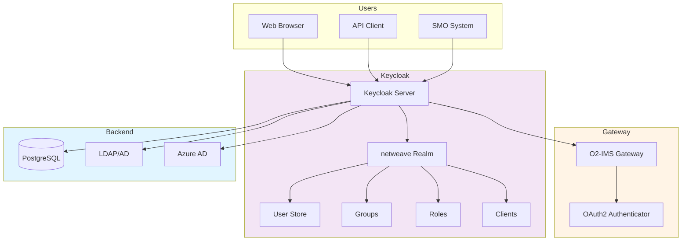

# Keycloak Administration Guide

**Complete guide for administering Keycloak identity and access management for the O2-IMS Gateway.**

## Table of Contents

1. [Overview](#overview)
2. [Accessing Keycloak](#accessing-keycloak)
3. [Tenant Management](#tenant-management)
4. [User Management](#user-management)
5. [Role Management](#role-management)
6. [Group Management](#group-management)
7. [Client Configuration](#client-configuration)
8. [Identity Provider Integration](#identity-provider-integration)
9. [Security Settings](#security-settings)
10. [Monitoring and Audit](#monitoring-and-audit)
11. [Troubleshooting](#troubleshooting)

---

## Overview

### What is Keycloak?

Keycloak is an open-source identity and access management solution that provides:

- ✅ **Single Sign-On (SSO)**: Centralized authentication
- ✅ **OAuth2/OIDC**: Industry-standard authentication protocols
- ✅ **User Federation**: LDAP, Active Directory integration
- ✅ **Identity Brokering**: External IdP integration (Azure AD, Google, Okta)
- ✅ **Social Login**: GitHub, Google, Facebook authentication
- ✅ **Fine-grained Authorization**: Role-based access control

### Architecture



---

## Accessing Keycloak

### Admin Console Access

**Via Port Forward (Development):**

```bash
# Forward Keycloak port
kubectl port-forward -n netweave svc/netweave-keycloak 8080:80

# Access admin console
open http://localhost:8080
```

**Via Ingress (Production):**

```bash
# Access via ingress
open https://auth.netweave.local
```

**Default Credentials:**

```bash
# Get admin credentials from Kubernetes secret
kubectl get secret -n netweave netweave-keycloak \
    -o jsonpath='{.data.admin-password}' | base64 -d

# Admin username: admin
# Admin password: <from secret>
```

### Initial Login

1. Navigate to Keycloak admin console
2. Login with admin credentials
3. Select `netweave` realm from realm dropdown (top-left)
4. Verify realm settings and configuration

---

## Tenant Management

### Understanding Tenants

In the O2-IMS Gateway context, tenants represent isolated organizational units (e.g., SMO operators). Each tenant has:

- Separate user namespaces
- Isolated resources (resource pools, deployments)
- Independent quotas and limits
- Dedicated roles and permissions

### Tenant Representation in Keycloak

Tenants are represented using Keycloak **Groups** with custom attributes:

```
netweave realm
├── Groups
│   ├── /tenant-smo-alpha          # Tenant group
│   │   ├── Attributes
│   │   │   ├── tenant_id: smo-alpha
│   │   │   ├── tenant_name: SMO Alpha
│   │   │   └── tenant_status: active
│   │   └── Members
│   │       ├── user1@smo-alpha.com
│   │       └── user2@smo-alpha.com
│   └── /tenant-smo-beta
│       └── ...
```

### Create Tenant

**Via Admin Console:**

1. Navigate to **Groups** (left sidebar)
2. Click **Create group**
3. Configure group:
   - **Name**: `tenant-<tenant-id>` (e.g., `tenant-smo-alpha`)
   - **Attributes**:
     - `tenant_id`: `smo-alpha`
     - `tenant_name`: `SMO Alpha Inc`
     - `tenant_status`: `active`
     - `tenant_quota_users`: `100`
     - `tenant_quota_resources`: `1000`
4. Click **Create**

**Via Keycloak REST API:**

```bash
# Get admin access token
ADMIN_TOKEN=$(curl -X POST \
    https://keycloak.example.com/realms/master/protocol/openid-connect/token \
    -d "client_id=admin-cli" \
    -d "username=admin" \
    -d "password=$ADMIN_PASSWORD" \
    -d "grant_type=password" \
    | jq -r '.access_token')

# Create tenant group
curl -X POST \
    -H "Authorization: Bearer $ADMIN_TOKEN" \
    -H "Content-Type: application/json" \
    -d '{
      "name": "tenant-smo-alpha",
      "attributes": {
        "tenant_id": ["smo-alpha"],
        "tenant_name": ["SMO Alpha Inc"],
        "tenant_status": ["active"],
        "tenant_quota_users": ["100"]
      }
    }' \
    https://keycloak.example.com/admin/realms/netweave/groups
```

### Manage Tenant

**Update Tenant:**

1. Navigate to **Groups** → Select tenant group
2. Go to **Attributes** tab
3. Update tenant attributes
4. Click **Save**

**Disable Tenant:**

```bash
# Set tenant status to suspended
curl -X PUT \
    -H "Authorization: Bearer $ADMIN_TOKEN" \
    -H "Content-Type: application/json" \
    -d '{
      "attributes": {
        "tenant_status": ["suspended"]
      }
    }' \
    https://keycloak.example.com/admin/realms/netweave/groups/<group-id>
```

**Delete Tenant:**

> ⚠️ **Warning**: Deleting a tenant group does not remove users or resources. Perform cleanup first.

1. Remove all members from tenant group
2. Verify no resources assigned to tenant in gateway
3. Navigate to **Groups** → Select tenant group
4. Click **Delete**
5. Confirm deletion

---

## User Management

### Create User

**Via Admin Console:**

1. Navigate to **Users** (left sidebar)
2. Click **Add user**
3. Configure user:
   - **Username**: `operator1@smo-alpha.com`
   - **Email**: `operator1@smo-alpha.com`
   - **First name**: `Operator`
   - **Last name**: `One`
   - **Email verified**: ✅ (check)
   - **Enabled**: ✅ (check)
4. Click **Create**
5. Go to **Credentials** tab
6. Set password:
   - **Password**: `<secure-password>`
   - **Temporary**: ❌ (uncheck for permanent password)
7. Click **Set password**
8. Go to **Groups** tab
9. Join tenant group (e.g., `/tenant-smo-alpha`)
10. Go to **Role mapping** tab
11. Assign roles (e.g., `tenant-operator`)

**Via Keycloak REST API:**

```bash
# Create user
curl -X POST \
    -H "Authorization: Bearer $ADMIN_TOKEN" \
    -H "Content-Type: application/json" \
    -d '{
      "username": "operator1@smo-alpha.com",
      "email": "operator1@smo-alpha.com",
      "firstName": "Operator",
      "lastName": "One",
      "enabled": true,
      "emailVerified": true,
      "credentials": [{
        "type": "password",
        "value": "SecurePassword123!",
        "temporary": false
      }],
      "groups": ["/tenant-smo-alpha"],
      "realmRoles": ["tenant-operator"]
    }' \
    https://keycloak.example.com/admin/realms/netweave/users
```

### Manage User

**Reset Password:**

1. Navigate to **Users** → Search for user
2. Go to **Credentials** tab
3. Click **Reset password**
4. Enter new password
5. Check **Temporary** if user should change on first login
6. Click **Reset password**

**Disable User:**

1. Navigate to **Users** → Search for user
2. Toggle **Enabled** to OFF
3. Click **Save**

**Delete User:**

1. Navigate to **Users** → Search for user
2. Click **Delete**
3. Confirm deletion

---

## Role Management

### Built-in Roles

The O2-IMS Gateway uses these predefined roles:

| Role | Scope | Permissions |
|------|-------|-------------|
| **platform-admin** | System | Full system administration |
| **tenant-admin** | System | Create and manage tenants |
| **tenant-owner** | Tenant | Full tenant access |
| **tenant-operator** | Tenant | Create, read, update, delete resources |
| **tenant-viewer** | Tenant | Read-only access to tenant resources |
| **auditor** | System | Read-only audit log access |

### Create Realm Role

1. Navigate to **Realm roles** (left sidebar)
2. Click **Create role**
3. Configure role:
   - **Role name**: `custom-role`
   - **Description**: `Custom role for specific use case`
4. Click **Save**

### Assign Role to User

1. Navigate to **Users** → Search for user
2. Go to **Role mapping** tab
3. Click **Assign role**
4. Filter by **Realm roles**
5. Select role
6. Click **Assign**

### Role Mappings

Map Keycloak roles to Gateway permissions via configuration:

```yaml
# Gateway config.yaml
auth:
  backend: keycloak
  keycloak:
    realm_role_mapping:
      "platform-admin": "PlatformAdmin"
      "tenant-admin": "TenantAdmin"
      "tenant-owner": "Owner"
      "tenant-operator": "Operator"
      "tenant-viewer": "Viewer"
      "auditor": "Auditor"
```

---

## Group Management

### Group Hierarchy

```
netweave realm
├── /platform-admins          # System-level access
├── /tenant-admins            # Tenant administration
├── /tenants                  # Root for all tenants
│   ├── /tenant-smo-alpha     # Tenant-specific group
│   │   ├── /tenant-smo-alpha-admins
│   │   ├── /tenant-smo-alpha-operators
│   │   └── /tenant-smo-alpha-viewers
│   └── /tenant-smo-beta
└── /auditors                 # Audit access
```

### Create Group

1. Navigate to **Groups** (left sidebar)
2. Click **Create group**
3. Configure group:
   - **Name**: `/tenant-smo-alpha-operators`
   - **Parent**: Select `/tenants/tenant-smo-alpha`
4. Click **Create**
5. Go to **Attributes** tab (optional)
6. Add custom attributes
7. Go to **Role mapping** tab
8. Assign default roles for group members

### Group Membership

**Add User to Group:**

1. Navigate to **Users** → Search for user
2. Go to **Groups** tab
3. Click **Join group**
4. Select group
5. Click **Join**

**Or from Groups view:**

1. Navigate to **Groups** → Select group
2. Go to **Members** tab
3. Click **Add member**
4. Search for user
5. Click **Add**

---

## Client Configuration

### Gateway Client

The `netweave-gateway` client is pre-configured for OAuth2/OIDC authentication.

**View Client Configuration:**

1. Navigate to **Clients** (left sidebar)
2. Click **netweave-gateway**
3. Review configuration:
   - **Client ID**: `netweave-gateway`
   - **Client authentication**: ON (confidential client)
   - **Authorization**: OFF (not using fine-grained authorization)
   - **Standard flow**: ON (authorization code flow)
   - **Direct access grants**: ON (password grant for testing)
   - **Valid redirect URIs**: `https://api.netweave.local/*`
   - **Web origins**: `https://api.netweave.local`

**Get Client Secret:**

1. Go to **Credentials** tab
2. Copy **Client secret**
3. Store securely in gateway configuration or Kubernetes secret

### Create Additional Client

For integrating additional services:

1. Navigate to **Clients** → Click **Create client**
2. Configure client:
   - **Client type**: OpenID Connect
   - **Client ID**: `my-service`
3. Click **Next**
4. Configure capability:
   - **Client authentication**: ON (for confidential client)
   - **Authorization**: OFF
   - **Standard flow**: ON
5. Click **Save**
6. Configure **Valid redirect URIs** and **Web origins**
7. Note client secret from **Credentials** tab

---

## Identity Provider Integration

### Azure Active Directory

**Step 1: Register Application in Azure**

1. Go to Azure Portal → Azure Active Directory
2. Navigate to **App registrations** → **New registration**
3. Configure:
   - **Name**: `Keycloak Netweave`
   - **Redirect URI**: `https://keycloak.example.com/realms/netweave/broker/azure/endpoint`
4. Note **Application (client) ID** and **Directory (tenant) ID**
5. Generate client secret in **Certificates & secrets**

**Step 2: Configure Identity Provider in Keycloak**

1. Navigate to **Identity providers** (left sidebar)
2. Select **Microsoft**
3. Configure provider:
   - **Alias**: `azure`
   - **Display name**: `Azure Active Directory`
   - **Client ID**: `<azure-app-id>`
   - **Client Secret**: `<azure-client-secret>`
   - **Tenant**: `<azure-tenant-id>`
   - **Sync mode**: `Import`
4. Click **Save**
5. Test connection with **Test** button

### LDAP Integration

1. Navigate to **User federation** (left sidebar)
2. Select **Add LDAP providers**
3. Configure LDAP:
   - **Vendor**: Active Directory / Other
   - **Connection URL**: `ldap://ldap.example.com:389`
   - **Bind DN**: `cn=admin,dc=example,dc=com`
   - **Bind Credential**: `<ldap-password>`
   - **User DN**: `ou=users,dc=example,dc=com`
   - **User Object Classes**: `person, organizationalPerson, inetOrgPerson`
   - **Username LDAP attribute**: `uid` or `sAMAccountName`
   - **RDN LDAP attribute**: `uid` or `cn`
   - **UUID LDAP attribute**: `entryUUID` or `objectGUID`
4. Click **Test connection** and **Test authentication**
5. Click **Save**
6. Click **Synchronize all users** to import users

---

## Security Settings

### Password Policies

1. Navigate to **Authentication** → **Policies** tab
2. Configure password policy:
   - **Minimum length**: 12
   - **Require uppercase**: ON
   - **Require lowercase**: ON
   - **Require digits**: ON
   - **Require special characters**: ON
   - **Not username**: ON
   - **Password history**: 5
   - **Expire password**: 90 days
3. Click **Save**

### Session Management

1. Navigate to **Realm settings** → **Sessions** tab
2. Configure:
   - **SSO Session Idle**: 30 minutes
   - **SSO Session Max**: 10 hours
   - **Client Session Idle**: 30 minutes
   - **Client Session Max**: 10 hours
   - **Offline Session Idle**: 30 days
3. Click **Save**

### Brute Force Detection

1. Navigate to **Realm settings** → **Security defenses** tab
2. Enable **Brute force detection**
3. Configure:
   - **Max login failures**: 5
   - **Wait increment**: 60 seconds
   - **Max wait**: 15 minutes
   - **Failure reset time**: 12 hours
4. Click **Save**

### Token Settings

1. Navigate to **Realm settings** → **Tokens** tab
2. Configure:
   - **Access token lifespan**: 15 minutes
   - **Access token lifespan for implicit flow**: 15 minutes
   - **Client login timeout**: 1 minute
   - **Login timeout**: 30 minutes
   - **Refresh token max reuse**: 0 (single-use)
3. Click **Save**

---

## Monitoring and Audit

### Event Logging

**Enable Event Logging:**

1. Navigate to **Realm settings** → **Events** tab
2. **Login events**:
   - Enable **Save events**
   - **Expiration**: 7 days
   - **Saved types**: Select all relevant events
3. **Admin events**:
   - Enable **Save events**
   - Enable **Include representation**
4. Click **Save**

**View Events:**

1. Navigate to **Events** (left sidebar)
2. Select **Login events** or **Admin events** tab
3. Use filters to search events
4. Click event to view details

### Metrics

Keycloak exposes Prometheus metrics at `/metrics` endpoint.

**Key Metrics:**

```promql
# Active sessions
keycloak_sessions_active{realm="netweave"}

# Login attempts
rate(keycloak_logins_total[5m])

# Failed logins
rate(keycloak_failed_login_attempts_total[5m])

# Token issuance
rate(keycloak_user_event_CREATE_total{realm="netweave",event="LOGIN"}[5m])
```

### Health Checks

```bash
# Keycloak health endpoint
curl https://keycloak.example.com/health

# Readiness probe
curl https://keycloak.example.com/health/ready

# Liveness probe
curl https://keycloak.example.com/health/live
```

---

## Troubleshooting

### Common Issues

**Issue: Cannot Login to Admin Console**

```bash
# Reset admin password
kubectl exec -it -n netweave netweave-keycloak-0 -- \
    /opt/keycloak/bin/kcadm.sh config credentials \
    --server http://localhost:8080 \
    --realm master \
    --user admin \
    --password "$OLD_PASSWORD"

kubectl exec -it -n netweave netweave-keycloak-0 -- \
    /opt/keycloak/bin/kcadm.sh update users/$(id) \
    -s enabled=true \
    -r master

# Or reset via PostgreSQL
kubectl exec -it -n netweave netweave-postgresql-0 -- \
    psql -U keycloak -d keycloak -c \
    "UPDATE user_entity SET password='<bcrypt-hash>' WHERE username='admin';"
```

**Issue: Users Cannot Login**

1. Verify user is enabled: **Users** → Search → Check **Enabled**
2. Check password expiry: **Users** → **Credentials** tab
3. Verify user is in correct tenant group
4. Check role assignments
5. Review login events: **Events** → **Login events**

**Issue: Token Verification Failing**

```bash
# Verify Keycloak certificate
openssl s_client -connect keycloak.example.com:443 -showcerts

# Test token introspection
curl -X POST \
    -d "token=$ACCESS_TOKEN" \
    -d "client_id=netweave-gateway" \
    -d "client_secret=$CLIENT_SECRET" \
    https://keycloak.example.com/realms/netweave/protocol/openid-connect/token/introspect
```

**Issue: LDAP Sync Failing**

1. Navigate to **User federation** → Select LDAP provider
2. Click **Test connection** and **Test authentication**
3. Review **Synchronization settings**
4. Check Keycloak logs:

```bash
kubectl logs -n netweave -l app.kubernetes.io/component=keycloak --tail=100
```

### Debug Mode

Enable debug logging:

1. Navigate to **Realm settings** → **General** tab
2. Enable **Event listeners** → Add **jboss-logging**
3. Adjust log level via environment variable:

```yaml
# keycloak StatefulSet
env:
  - name: KEYCLOAK_LOGLEVEL
    value: DEBUG
```

---

## Best Practices

### Security

- ✅ **Strong Passwords**: Enforce 12+ character passwords with complexity
- ✅ **MFA**: Enable multi-factor authentication for admin accounts
- ✅ **Session Limits**: Set reasonable session timeouts (30 min idle, 10 hrs max)
- ✅ **Brute Force Protection**: Enable and configure brute force detection
- ✅ **HTTPS Only**: Never expose Keycloak over HTTP in production
- ✅ **Regular Updates**: Keep Keycloak updated to latest stable version

### Operations

- ✅ **Backup Database**: Regular PostgreSQL backups
- ✅ **Monitor Events**: Review login and admin events regularly
- ✅ **Audit Logs**: Enable and retain event logs for compliance
- ✅ **High Availability**: Deploy Keycloak in HA mode (2+ replicas)
- ✅ **Resource Limits**: Set appropriate CPU/memory limits
- ✅ **Health Checks**: Configure liveness and readiness probes

### User Management

- ✅ **Email Verification**: Require email verification for new users
- ✅ **Password Expiry**: Enforce 90-day password rotation
- ✅ **Role Assignment**: Follow least privilege principle
- ✅ **Cleanup**: Remove inactive users and expired sessions
- ✅ **Self-Service**: Enable password reset and profile management

---

## Resources

### Documentation

- [Keycloak Official Documentation](https://www.keycloak.org/documentation)
- [Keycloak Admin REST API](https://www.keycloak.org/docs-api/latest/rest-api/index.html)
- [Authentication Guide](authentication.md)
- [Authorization Guide](authorization.md)
- [User Guide](keycloak-user-guide.md)

### Tools

- [Keycloak Admin CLI](https://www.keycloak.org/docs/latest/server_admin/#admin-cli)
- [kcadm.sh Script Reference](https://www.keycloak.org/docs/latest/server_admin/#the-admin-cli)

---

**Last Updated:** 2026-01-22
**Version:** 1.0
