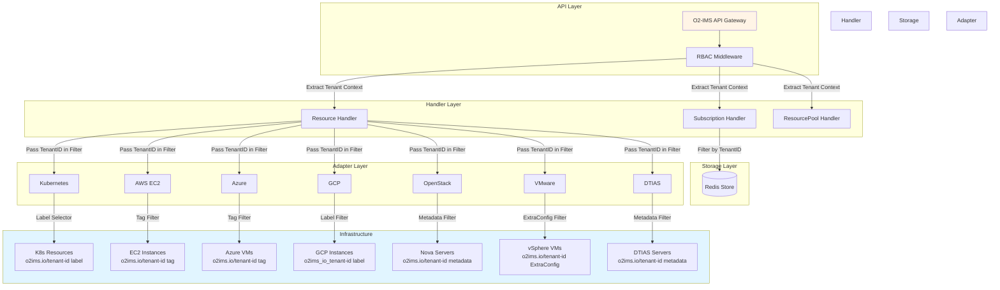

# Multi-Tenancy Guide

The O2-IMS Gateway implements comprehensive multi-tenancy support, enabling multiple organizations to securely share the same infrastructure while maintaining complete isolation between tenants.

## Table of Contents

- [Overview](#overview)
- [Architecture](#architecture)
- [Tenant Isolation Layers](#tenant-isolation-layers)
- [Configuration](#configuration)
- [Usage Examples](#usage-examples)
- [Best Practices](#best-practices)
- [Troubleshooting](#troubleshooting)

## Overview

Multi-tenancy in the O2-IMS Gateway provides:

- **Complete Tenant Isolation**: Resources, subscriptions, and data are isolated per tenant
- **Role-Based Access Control (RBAC)**: Fine-grained permissions within each tenant
- **Infrastructure-Level Filtering**: Native cloud provider tags/labels for tenant separation
- **Secure Cross-Tenant Prevention**: 404 responses prevent information disclosure
- **Audit Trail**: All tenant operations are logged for compliance

### Key Concepts

- **Tenant**: An organization or business unit with isolated resources
- **TenantID**: Unique identifier for a tenant (typically a UUID)
- **Tenant Context**: Authentication context that identifies the current tenant
- **Tenant Isolation**: Technical mechanisms preventing cross-tenant data access

## Architecture



## Tenant Isolation Layers

The O2-IMS Gateway implements defense-in-depth with four isolation layers:

### 1. Authentication Layer (JWT)

```yaml
# JWT Token Claims
{
  "sub": "user-123",
  "email": "user@acme.com",
  "tenant_id": "tenant-abc",          # Tenant identification
  "role": "tenant-admin",              # Tenant-specific role
  "permissions": ["resources:read"],   # Granted permissions
  "exp": 1704067200
}
```

**Security Properties**:
- Token signed by auth service (HMAC-SHA256 or RS256)
- Tenant ID extracted from verified token
- Token tampering results in authentication failure

### 2. Handler Layer (Tenant Context)

All handlers extract and validate tenant context:

```go
// Extract tenant ID from authenticated context
tenantID := auth.TenantIDFromContext(ctx)

// Filter subscriptions by tenant
subscriptions, err := store.ListByTenant(ctx, tenantID)

// Verify ownership before operations
if resource.TenantID != tenantID {
    return http.StatusNotFound // Prevent information disclosure
}
```

**Security Properties**:
- Always return 404 (not 403) for cross-tenant access
- Log security events with full context
- Never expose tenant information in error messages

### 3. Storage Layer (Redis Tenant Keys)

Subscription data is isolated using tenant-prefixed keys:

```
# Key Pattern
subscriptions:{tenantID}:{subscriptionID}

# Examples
subscriptions:tenant-abc:sub-123
subscriptions:tenant-xyz:sub-456
```

**Security Properties**:
- `ListByTenant()` only scans keys for specific tenant
- Cross-tenant key access prevented by design
- Atomic operations maintain consistency

### 4. Infrastructure Layer (Cloud Provider Metadata)

Each cloud provider uses native metadata for tenant filtering:

| Provider | Mechanism | Key Format | Example |
|----------|-----------|------------|---------|
| **Kubernetes** | Labels | `o2ims.io/tenant-id` | `o2ims.io/tenant-id=tenant-abc` |
| **AWS EC2** | Tags | `o2ims.io/tenant-id` | `o2ims.io/tenant-id=tenant-abc` |
| **Azure ARM** | Tags | `o2ims.io/tenant-id` | `o2ims.io/tenant-id=tenant-abc` |
| **GCP Compute** | Labels | `o2ims_io_tenant-id` | `o2ims_io_tenant-id=tenant-abc` |
| **OpenStack Nova** | Metadata | `o2ims.io/tenant-id` | `o2ims.io/tenant-id=tenant-abc` |
| **VMware vSphere** | ExtraConfig | `o2ims.io/tenant-id` | `o2ims.io/tenant-id=tenant-abc` |
| **Dell DTIAS** | Metadata | `o2ims.io/tenant-id` | `o2ims.io/tenant-id=tenant-abc` |

**Note**: GCP uses underscores instead of dots/slashes due to label naming restrictions.

**Security Properties**:
- Server-side filtering at infrastructure API level
- Tenant resources never returned to wrong tenant
- Native cloud IAM policies can enforce additional restrictions

## Configuration

### Enable Multi-Tenancy

```yaml
# config.yaml
auth:
  enabled: true
  jwt:
    secret: "${JWT_SECRET}"            # Required for token verification
    issuer: "o2ims-auth"
    audience: "o2ims-gateway"
  redis:
    addr: "redis:6379"
    db: 0

  # Enable tenant isolation
  multi_tenancy:
    enabled: true                       # Required
    default_tenant: ""                  # Optional: tenant for non-authenticated requests
```

### Create Tenants

```bash
# Using the admin API
curl -X POST https://gateway.example.com/admin/v1/tenants \
  -H "Authorization: Bearer $ADMIN_TOKEN" \
  -H "Content-Type: application/json" \
  -d '{
    "id": "tenant-acme",
    "name": "ACME Corporation",
    "description": "Primary tenant for ACME Corp",
    "quotas": {
      "max_subscriptions": 100,
      "max_resources": 10000
    }
  }'
```

### Tag Infrastructure Resources

#### Kubernetes

```yaml
apiVersion: v1
kind: Node
metadata:
  name: worker-node-1
  labels:
    o2ims.io/tenant-id: tenant-acme
    o2ims.io/resource-pool-id: k8s-pool-1
```

#### AWS EC2

```bash
aws ec2 create-tags \
  --resources i-1234567890abcdef0 \
  --tags Key=o2ims.io/tenant-id,Value=tenant-acme
```

#### Azure

```bash
az vm update \
  --resource-group my-rg \
  --name my-vm \
  --set tags.\"o2ims.io/tenant-id\"=tenant-acme
```

#### GCP

```bash
gcloud compute instances add-labels worker-1 \
  --labels=o2ims_io_tenant-id=tenant-acme \
  --zone=us-central1-a
```

#### OpenStack

```bash
openstack server set \
  --property o2ims.io/tenant-id=tenant-acme \
  my-server
```

#### VMware vSphere

```bash
govc vm.change -vm worker-vm \
  -e="o2ims.io/tenant-id=tenant-acme"
```

#### Dell DTIAS

```bash
# Via DTIAS API
curl -X PUT https://dtias.example.com/v2/inventory/servers/server-123/metadata \
  -H "Authorization: Bearer $TOKEN" \
  -d '{
    "metadata": {
      "o2ims.io/tenant-id": "tenant-acme"
    }
  }'
```

## Usage Examples

### List Tenant Resources

Each tenant sees only their own resources:

```bash
# Tenant ACME (tenant-acme) request
curl -H "Authorization: Bearer $ACME_TOKEN" \
  https://gateway.example.com/o2ims-infrastructureInventory/v1/resourcePools

# Response: Only ACME's resource pools returned
{
  "resourcePools": [
    {
      "resourcePoolId": "k8s-pool-acme",
      "name": "ACME Kubernetes Cluster",
      "location": "us-west-2"
    }
  ]
}
```

```bash
# Tenant XYZ (tenant-xyz) request
curl -H "Authorization: Bearer $XYZ_TOKEN" \
  https://gateway.example.com/o2ims-infrastructureInventory/v1/resourcePools

# Response: Only XYZ's resource pools returned
{
  "resourcePools": [
    {
      "resourcePoolId": "openstack-pool-xyz",
      "name": "XYZ OpenStack Cloud",
      "location": "eu-central-1"
    }
  ]
}
```

### Cross-Tenant Access Prevention

Attempting to access another tenant's resource returns 404:

```bash
# Tenant ACME attempts to access Tenant XYZ's resource
curl -H "Authorization: Bearer $ACME_TOKEN" \
  https://gateway.example.com/o2ims-infrastructureInventory/v1/resources/openstack-server-xyz-123

# Response: 404 Not Found (resource existence not disclosed)
{
  "error": "NotFound",
  "message": "Resource not found: openstack-server-xyz-123",
  "code": 404
}
```

**Security Note**: The gateway intentionally returns 404 (not 403) to prevent tenants from discovering the existence of other tenants' resources.

### Create Tenant Subscription

Subscriptions are isolated per tenant:

```bash
curl -X POST \
  https://gateway.example.com/o2ims-infrastructureInventory/v1/subscriptions \
  -H "Authorization: Bearer $ACME_TOKEN" \
  -H "Content-Type: application/json" \
  -d '{
    "consumerSubscriptionId": "sub-acme-001",
    "callback": "https://acme-smo.example.com/notify",
    "filter": "(resourceTypeId=k8s-node;location=us-west-2)"
  }'

# Subscription automatically tagged with tenant-acme
# Only receives events for ACME's resources
```

### Tenant Quotas

Tenants are subject to usage quotas:

```bash
# Check tenant quota usage
curl -H "Authorization: Bearer $ACME_TOKEN" \
  https://gateway.example.com/admin/v1/tenants/tenant-acme/usage

# Response
{
  "tenantId": "tenant-acme",
  "quotas": {
    "max_subscriptions": 100,
    "max_resources": 10000
  },
  "usage": {
    "subscriptions": 12,
    "resources": 342
  }
}
```

## Best Practices

### 1. Tenant Identification

- **Use UUIDs**: Generate tenant IDs as UUIDs (e.g., `uuid.New()`)
- **Immutable IDs**: Never change tenant IDs after creation
- **Consistent Format**: Use lowercase with hyphens: `tenant-acme-12345`

### 2. Resource Tagging

- **Tag at Creation**: Apply tenant tags when provisioning infrastructure
- **Automated Tagging**: Use infrastructure-as-code (Terraform, CloudFormation) to ensure consistent tagging
- **Audit Tags**: Regularly scan for untagged or mistagged resources
- **Tag Policies**: Enforce tenant tagging via cloud provider tag policies

### 3. Tenant Onboarding

```bash
#!/bin/bash
# Automated tenant onboarding script

TENANT_ID="tenant-acme"
TENANT_NAME="ACME Corporation"

# 1. Create tenant in auth system
curl -X POST https://gateway.example.com/admin/v1/tenants \
  -H "Authorization: Bearer $ADMIN_TOKEN" \
  -d "{
    \"id\": \"$TENANT_ID\",
    \"name\": \"$TENANT_NAME\",
    \"quotas\": {
      \"max_subscriptions\": 100,
      \"max_resources\": 10000
    }
  }"

# 2. Create initial tenant admin user
curl -X POST https://gateway.example.com/admin/v1/users \
  -H "Authorization: Bearer $ADMIN_TOKEN" \
  -d "{
    \"email\": \"admin@acme.com\",
    \"tenant_id\": \"$TENANT_ID\",
    \"role_id\": \"tenant-admin\"
  }"

# 3. Create tenant-specific resource pool
kubectl label namespace acme-ns "o2ims.io/tenant-id=$TENANT_ID"

# 4. Tag existing infrastructure
aws ec2 create-tags \
  --resources $(aws ec2 describe-instances \
    --filters "Name=tag:Project,Values=ACME" \
    --query 'Reservations[].Instances[].InstanceId' \
    --output text) \
  --tags "Key=o2ims.io/tenant-id,Value=$TENANT_ID"

echo "Tenant $TENANT_ID onboarded successfully"
```

### 4. Security Monitoring

Monitor tenant isolation effectiveness:

```yaml
# Prometheus alerts for tenant violations
groups:
  - name: tenant_security
    rules:
      - alert: CrossTenantAccessAttempt
        expr: |
          rate(o2ims_tenant_access_denied_total[5m]) > 0
        annotations:
          summary: "Detected cross-tenant access attempt"
          description: "User {{ $labels.user_id }} attempted to access tenant {{ $labels.target_tenant }}"

      - alert: UntaggedResourceDetected
        expr: |
          o2ims_resources_without_tenant_tag > 0
        annotations:
          summary: "Resources without tenant tag detected"
          description: "{{ $value }} resources missing o2ims.io/tenant-id tag"
```

### 5. Tenant Isolation Testing

Regularly test tenant isolation:

```bash
#!/bin/bash
# Tenant isolation test

TENANT_A_TOKEN="..."
TENANT_B_TOKEN="..."

# List Tenant A's resources
TENANT_A_RESOURCES=$(curl -s -H "Authorization: Bearer $TENANT_A_TOKEN" \
  https://gateway.example.com/o2ims-infrastructureInventory/v1/resources \
  | jq -r '.resources[].resourceId')

# Attempt to access Tenant A's resources as Tenant B
for RESOURCE_ID in $TENANT_A_RESOURCES; do
  RESPONSE=$(curl -s -w "%{http_code}" -o /dev/null \
    -H "Authorization: Bearer $TENANT_B_TOKEN" \
    "https://gateway.example.com/o2ims-infrastructureInventory/v1/resources/$RESOURCE_ID")

  if [ "$RESPONSE" != "404" ]; then
    echo "FAIL: Cross-tenant access detected for resource $RESOURCE_ID"
    exit 1
  fi
done

echo "PASS: All cross-tenant access attempts properly denied"
```

## Troubleshooting

### Issue: Resources Not Visible to Tenant

**Symptom**: Resources exist but don't appear in API responses

**Diagnosis**:
```bash
# 1. Verify resource has tenant tag
kubectl get node worker-1 -o jsonpath='{.metadata.labels.o2ims\.io/tenant-id}'

# 2. Check user's tenant ID
curl -H "Authorization: Bearer $TOKEN" \
  https://gateway.example.com/admin/v1/users/me \
  | jq '.tenant_id'

# 3. Enable debug logging
export LOG_LEVEL=debug
```

**Solutions**:
- Add missing tenant tag to resource
- Verify user is assigned to correct tenant
- Check adapter-specific label/tag syntax (especially GCP underscores)

### Issue: Cross-Tenant Access Not Blocked

**Symptom**: Users can see other tenants' resources

**Diagnosis**:
```bash
# 1. Verify multi-tenancy is enabled
curl https://gateway.example.com/health | jq '.features.multi_tenancy'

# 2. Check JWT token contains tenant_id claim
echo $TOKEN | jwt decode - | jq '.tenant_id'

# 3. Review auth middleware configuration
```

**Solutions**:
- Enable `auth.multi_tenancy.enabled: true` in config
- Ensure JWT tokens include `tenant_id` claim
- Verify RBAC middleware is applied to routes

### Issue: Tenant Tags Not Filtering Correctly

**Symptom**: Infrastructure queries return too many resources

**Diagnosis**:
```bash
# 1. Test infrastructure API directly
aws ec2 describe-instances \
  --filters "Name=tag:o2ims.io/tenant-id,Values=tenant-acme"

# 2. Check adapter logs
kubectl logs -n o2ims deploy/gateway -c gateway | grep "tenant filter"

# 3. Verify tag format matches provider requirements
```

**Solutions**:
- AWS/Azure/OpenStack: Use `o2ims.io/tenant-id`
- GCP: Use `o2ims_io_tenant-id` (underscores, not dots)
- Kubernetes: Ensure label selector syntax is correct
- VMware: Verify ExtraConfig key spelling

### Issue: Quota Exceeded Errors

**Symptom**: Cannot create subscriptions or resources

**Diagnosis**:
```bash
# Check current usage vs quotas
curl -H "Authorization: Bearer $TOKEN" \
  https://gateway.example.com/admin/v1/tenants/$TENANT_ID/usage
```

**Solutions**:
- Request quota increase from platform admin
- Delete unused subscriptions/resources
- Review quota enforcement policies

## Related Documentation

- [Authentication](./authentication.md) - JWT token configuration
- [Authorization](./authorization.md) - RBAC permissions
- [Audit Trail](../operations/monitoring.md#audit-logging) - Tenant activity logging
- [API Reference](../api/README.md) - O2-IMS API endpoints

## References

- [O-RAN O2 IMS Specification](https://specifications.o-ran.org/)
- [NIST Multi-Tenancy Guidelines](https://csrc.nist.gov/publications/detail/sp/800-144/final)
- [Cloud Provider Tag Policies](https://docs.aws.amazon.com/organizations/latest/userguide/orgs_manage_policies_tag-policies.html)
