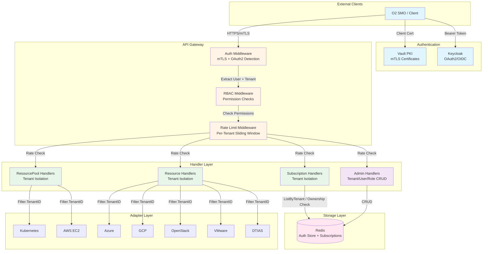
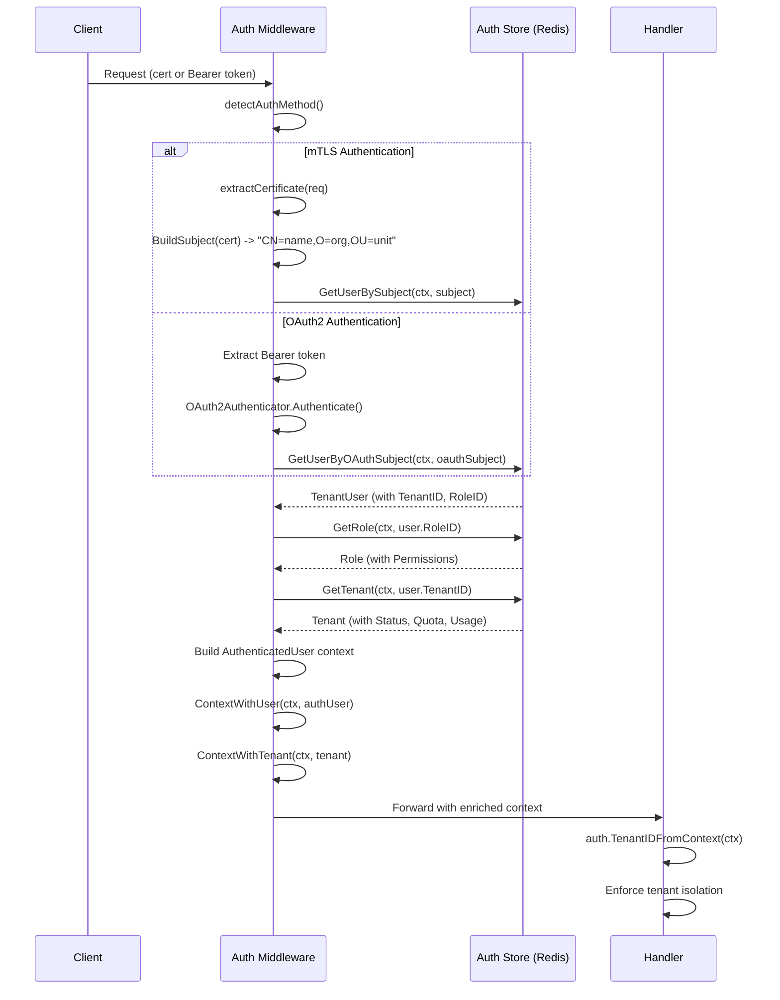

# Multi-Tenancy Guide

> **Version**: 2.0 | **Updated**: 2026-02-06

The O2-IMS Gateway implements production-grade multi-tenancy, enabling multiple organizations to securely share the same infrastructure while maintaining complete isolation between tenants.

## Overview

Multi-tenancy in the O2-IMS Gateway provides:

- **Dual Authentication**: mTLS via Vault PKI and OAuth2/OIDC via Keycloak
- **Complete Tenant Isolation**: Subscriptions, resource pools, and resources are isolated per tenant
- **Role-Based Access Control (RBAC)**: Fine-grained permissions with platform and tenant scoped roles
- **Quota Enforcement**: Per-tenant limits on subscriptions, resource pools, deployments, users, and API requests
- **Per-Tenant Rate Limiting**: Redis-backed sliding window rate limiter with configurable limits per tenant
- **Infrastructure-Level Filtering**: Native cloud provider tags/labels for tenant separation
- **Audit Trail**: All tenant operations are logged with full context for compliance
- **Secure Cross-Tenant Prevention**: 404 responses prevent information disclosure

### Key Concepts

| Concept | Description |
|---------|-------------|
| **Tenant** | An organization or business unit with isolated resources |
| **TenantID** | Unique identifier for a tenant (UUID format) |
| **Tenant Context** | Authentication context that identifies the current tenant via `auth.TenantIDFromContext(ctx)` |
| **TenantQuota** | Resource limits assigned to each tenant (subscriptions, pools, deployments, users, requests/min) |
| **TenantUsage** | Current resource consumption tracked per tenant |

## Implementation Status

| Feature | Status | Details |
|---------|--------|---------|
| mTLS Authentication (Vault PKI) | Done | `BuildSubject(cert)` + `store.GetUserBySubject()` |
| OAuth2/OIDC Authentication (Keycloak) | Done | Bearer token + `OAuth2Authenticator.Authenticate()` |
| Tenant Model (CRUD) | Done | Redis-backed with status, quota, usage tracking |
| RBAC (Roles & Permissions) | Done | 6 predefined roles, 20+ permissions |
| Subscription Isolation | Done | Filter by tenant, ownership verification, quota enforcement |
| Resource Pool Isolation | Done | Filter by tenant, ownership verification, quota enforcement |
| Resource Isolation | Done | Filter by tenant, ownership verification, quota enforcement |
| Per-Tenant Rate Limiting | Done | Redis sliding window, configurable per tenant |
| Quota Enforcement | Done | Subscriptions, resource pools, deployments, users |
| Admin API | Done | Platform admin + tenant self-service routes |
| Audit Logging | Done | Authentication, access, CRUD events logged to Redis |
| Infrastructure-Level Filtering | Done | Cloud provider native metadata/labels/tags |
| Resource Type Isolation | Not Planned | Resource types are shared (not tenant-specific) |
| Deployment Manager Isolation | Not Planned | DMs are shared infrastructure metadata |
| Cross-Adapter Tenant Sync | Planned | Future: synchronize tenant context across adapters |
| Tenant Deletion Cascade | Planned | Future: automated cleanup of all tenant resources |

## Architecture


```mermaid
graph TB
    subgraph "External Clients"
        SMO[O2 SMO / Client]
    end

    subgraph "Authentication"
        VAULT[Vault PKI<br/>mTLS Certificates]
        KC[Keycloak<br/>OAuth2/OIDC]
    end

    subgraph "API Gateway"
        AUTH_MW[Auth Middleware<br/>mTLS + OAuth2 Detection]
        RBAC_MW[RBAC Middleware<br/>Permission Checks]
        RL_MW[Rate Limit Middleware<br/>Per-Tenant Sliding Window]
    end

    subgraph "Handler Layer"
        SH[Subscription Handlers<br/>Tenant Isolation]
        RPH[ResourcePool Handlers<br/>Tenant Isolation]
        RH[Resource Handlers<br/>Tenant Isolation]
        AH[Admin Handlers<br/>Tenant/User/Role CRUD]
    end

    subgraph "Storage Layer"
        REDIS[(Redis<br/>Auth Store + Subscriptions)]
    end

    subgraph "Adapter Layer"
        K8S[Kubernetes]
        AWS[AWS EC2]
        AZ[Azure]
        GCP[GCP]
        OS[OpenStack]
        VM[VMware]
        DT[DTIAS]
    end

    SMO -->|Client Cert| VAULT
    SMO -->|Bearer Token| KC
    SMO -->|HTTPS/mTLS| AUTH_MW

    AUTH_MW -->|Extract User + Tenant| RBAC_MW
    RBAC_MW -->|Check Permissions| RL_MW
    RL_MW -->|Rate Check| SH
    RL_MW -->|Rate Check| RPH
    RL_MW -->|Rate Check| RH
    RL_MW -->|Rate Check| AH

    SH -->|ListByTenant / Ownership Check| REDIS
    RPH -->|Filter.TenantID| K8S
    RPH -->|Filter.TenantID| AWS
    RH -->|Filter.TenantID| AZ
    RH -->|Filter.TenantID| GCP
    RH -->|Filter.TenantID| OS
    RH -->|Filter.TenantID| VM
    RH -->|Filter.TenantID| DT
    AH -->|CRUD| REDIS

    style SMO fill:#e1f5ff
    style VAULT fill:#e1f5ff
    style KC fill:#e1f5ff
    style AUTH_MW fill:#fff4e6
    style RBAC_MW fill:#fff4e6
    style RL_MW fill:#fff4e6
    style REDIS fill:#ffe6f0
    style SH fill:#e8f5e9
    style RPH fill:#e8f5e9
    style RH fill:#e8f5e9
    style AH fill:#f3e5f5
```

### Authentication Flow


```mermaid
sequenceDiagram
    participant C as Client
    participant MW as Auth Middleware
    participant S as Auth Store (Redis)
    participant H as Handler

    C->>MW: Request (cert or Bearer token)
    MW->>MW: detectAuthMethod()

    alt mTLS Authentication
        MW->>MW: extractCertificate(req)
        MW->>MW: BuildSubject(cert) -> "CN=name,O=org,OU=unit"
        MW->>S: GetUserBySubject(ctx, subject)
    else OAuth2 Authentication
        MW->>MW: Extract Bearer token
        MW->>MW: OAuth2Authenticator.Authenticate()
        MW->>S: GetUserByOAuthSubject(ctx, oauthSubject)
    end

    S-->>MW: TenantUser (with TenantID, RoleID)
    MW->>S: GetRole(ctx, user.RoleID)
    S-->>MW: Role (with Permissions)
    MW->>S: GetTenant(ctx, user.TenantID)
    S-->>MW: Tenant (with Status, Quota, Usage)

    MW->>MW: Build AuthenticatedUser context
    MW->>MW: ContextWithUser(ctx, authUser)
    MW->>MW: ContextWithTenant(ctx, tenant)

    MW->>H: Forward with enriched context
    H->>H: auth.TenantIDFromContext(ctx)
    H->>H: Enforce tenant isolation
```

## Authentication & Tenant Identification

The gateway supports two authentication methods that can operate independently or together. When both are available, the `oauth2.priority` configuration determines which takes precedence.

### mTLS via Vault PKI

Clients present TLS certificates issued by Vault PKI using the `netweave-client` role. The middleware extracts the certificate subject and looks up the user:

```
Certificate Subject Format: CN=<name>,O=<organization>,OU=<org-unit>
```

**Authentication flow:**

1. Client presents TLS certificate during handshake
2. Middleware calls `extractCertificate(c)` (supports native TLS, X-Forwarded-Client-Cert, X-SSL-Client-DN)
3. Middleware calls `BuildSubject(cert)` to produce a normalized `CN=...,O=...,OU=...` string
4. Middleware calls `store.GetUserBySubject(ctx, subject)` to load the `TenantUser`
5. Middleware loads associated `Role` and `Tenant` from Redis
6. Middleware validates user is active and tenant is active
7. Middleware stores `AuthenticatedUser` and `Tenant` in request context

### OAuth2/OIDC via Keycloak

Clients present a Bearer token obtained from Keycloak. The middleware validates the token and looks up the user:

1. Client sends `Authorization: Bearer <token>` header
2. Middleware calls `OAuth2Authenticator.Authenticate()` to validate the token with Keycloak
3. User is looked up by OAuth2 subject or auto-provisioned if `auto_provision_users` is enabled
4. Associated role and tenant are loaded from the store
5. Context is enriched identically to mTLS flow

### Authentication Priority

When both mTLS and OAuth2 are configured:

- If `oauth2.priority: true` and a Bearer token is present, OAuth2 is used
- If `oauth2.priority: false` and a client certificate is present, mTLS is used
- If only one method is available on the request, that method is used

### Paths That Skip Authentication

The following paths skip authentication by default:

```
/health, /healthz, /ready, /readyz, /metrics, /, /o2ims
```

Additional paths can be configured via `multi_tenancy.skip_auth_paths`.

## Tenant Model

### Tenant

```go
type Tenant struct {
    ID           string            `json:"tenantId"`
    Name         string            `json:"name"`
    Description  string            `json:"description,omitempty"`
    Status       TenantStatus      `json:"status"`       // active | suspended | pending_deletion
    Quota        TenantQuota       `json:"quota"`
    Usage        TenantUsage       `json:"usage"`
    ContactEmail string            `json:"contactEmail,omitempty"`
    Metadata     map[string]string `json:"metadata,omitempty"`
    CreatedAt    time.Time         `json:"createdAt"`
    UpdatedAt    time.Time         `json:"updatedAt,omitempty"`
}
```

### TenantQuota (Default Values)

| Quota | Default | Description |
|-------|---------|-------------|
| `MaxSubscriptions` | 100 | Maximum number of subscriptions |
| `MaxResourcePools` | 50 | Maximum number of resource pools |
| `MaxDeployments` | 200 | Maximum number of deployments |
| `MaxUsers` | 20 | Maximum number of users |
| `MaxRequestsPerMinute` | 1000 | API request rate limit |

### TenantUsage

```go
type TenantUsage struct {
    Subscriptions int `json:"subscriptions"`
    ResourcePools int `json:"resourcePools"`
    Deployments   int `json:"deployments"`
    Users         int `json:"users"`
}
```

### Tenant Status Transitions

| Status | Description | Allowed Operations |
|--------|-------------|--------------------|
| `active` | Fully operational | All operations |
| `suspended` | Temporarily disabled | Read-only; authentication fails for users |
| `pending_deletion` | Scheduled for deletion | No operations |

### Tenant Context Functions

The `auth` package provides context helpers used throughout the handlers:

```go
// Extract tenant ID from the authenticated user in context
tenantID := auth.TenantIDFromContext(ctx)

// Check if the current user is a platform admin
isAdmin := auth.IsPlatformAdminFromContext(ctx)

// Get the full authenticated user from context
user := auth.UserFromContext(ctx)

// Check if the user has a specific permission
hasAccess := auth.HasPermissionFromContext(ctx, auth.PermissionResourceRead)
```

## Tenant Isolation Layers

The gateway implements defense-in-depth with four isolation layers.

### Layer 1: Authentication (mTLS + OAuth2)

Every request is authenticated via mTLS client certificates or OAuth2 Bearer tokens. The tenant identity is derived from the authenticated user record in Redis, not from any client-supplied claim.

**Security properties:**

- Tenant ID is loaded from the server-side auth store, not from the token/certificate directly
- User must be active (`IsActive: true`) and tenant must be active (`Status: active`)
- Suspended tenants cause authentication failure (403 Forbidden)
- Failed authentication attempts are logged as audit events

### Layer 2: Handler Layer (Tenant Context Enforcement)

All handlers extract and validate tenant context before any data operation:

```go
// Extract tenant ID from authenticated context
tenantID := auth.TenantIDFromContext(ctx)

// Subscriptions: filter by tenant
subscriptions, err := store.ListByTenant(ctx, tenantID)

// Resource pools: verify ownership before returning
if pool.TenantID != tenantID && !auth.IsPlatformAdminFromContext(ctx) {
    return http.StatusNotFound // Prevent information disclosure
}

// Resources: verify ownership before returning
if resource.TenantID != tenantID && !auth.IsPlatformAdminFromContext(ctx) {
    return http.StatusNotFound
}
```

**Isolation enforcement per operation:**

| Endpoint | Operation | Isolation Mechanism |
|----------|-----------|-------------------|
| `GET /subscriptions` | List | `store.ListByTenant(ctx, tenantID)` |
| `GET /subscriptions/:id` | Get | Returns 404 if `sub.TenantID != tenantID` |
| `POST /subscriptions` | Create | Sets `TenantID`, enforces subscription quota |
| `DELETE /subscriptions/:id` | Delete | Verifies tenant ownership before deletion |
| `GET /resourcePools` | List | `filter.TenantID` applied for non-admin users |
| `GET /resourcePools/:id` | Get | Returns 404 if `pool.TenantID != tenantID` |
| `POST /resourcePools` | Create | Quota check + sets `TenantID` |
| `DELETE /resourcePools/:id` | Delete | Ownership verification + usage decrement |
| `GET /resourcePools/:id/resources` | List | `filter.TenantID` applied for non-admin users |
| `GET /resources/:id` | Get | Returns 404 if `resource.TenantID != tenantID` |
| `POST /resources` | Create | Quota check + sets `TenantID` |
| `DELETE /resources/:id` | Delete | Ownership verification + usage decrement |

**Security properties:**

- Always return 404 (not 403) for cross-tenant access to prevent information leakage
- Platform admins can access all tenants' resources
- All security events are logged with full context (user ID, tenant ID, resource ID)
- Tenant information is never exposed in error messages

### Layer 3: Storage Layer (Redis Tenant Keys)

Subscription data is isolated using tenant-prefixed keys:

```
# Key Pattern
subscriptions:{tenantID}:{subscriptionID}

# Examples
subscriptions:tenant-abc:sub-123
subscriptions:tenant-xyz:sub-456
```

**Security properties:**

- `ListByTenant()` only scans keys for the specific tenant
- Cross-tenant key access prevented by key structure
- Atomic operations maintain consistency via Redis transactions

### Layer 4: Infrastructure Layer (Cloud Provider Metadata)

Each cloud provider uses native metadata for tenant filtering at the infrastructure API level:

| Provider | Mechanism | Key Format | Example |
|----------|-----------|------------|---------|
| **Kubernetes** | Labels | `o2ims.io/tenant-id` | `o2ims.io/tenant-id=tenant-abc` |
| **AWS EC2** | Tags | `o2ims.io/tenant-id` | `o2ims.io/tenant-id=tenant-abc` |
| **Azure ARM** | Tags | `o2ims.io/tenant-id` | `o2ims.io/tenant-id=tenant-abc` |
| **GCP Compute** | Labels | `o2ims_io_tenant-id` | `o2ims_io_tenant-id=tenant-abc` |
| **OpenStack Nova** | Metadata | `o2ims.io/tenant-id` | `o2ims.io/tenant-id=tenant-abc` |
| **VMware vSphere** | ExtraConfig | `o2ims.io/tenant-id` | `o2ims.io/tenant-id=tenant-abc` |
| **Dell DTIAS** | Metadata | `o2ims.io/tenant-id` | `o2ims.io/tenant-id=tenant-abc` |

**Note**: GCP uses underscores instead of dots/slashes due to GCP label naming restrictions.

The `adapter.Filter` struct includes a `TenantID` field that each cloud adapter uses to filter using its native mechanism. The `adapter.ResourcePool` and `adapter.Resource` structs also carry a `TenantID` field (tagged `json:"-"` so it is not exposed in API responses).

**Security properties:**

- Server-side filtering at infrastructure API level
- Tenant resources never returned to wrong tenant
- Native cloud IAM policies can enforce additional restrictions

## Quota Enforcement

Quotas are enforced at creation time for each resource type. The tenant's current usage is tracked atomically in Redis.

### Enforcement Points

| Resource | Quota Field | Check Method | Enforcement Location |
|----------|------------|--------------|---------------------|
| Subscriptions | `MaxSubscriptions` | `tenant.CanCreateSubscription()` | `handleCreateSubscription` |
| Resource Pools | `MaxResourcePools` | `tenant.CanCreateResourcePool()` | `handleCreateResourcePool` |
| Deployments | `MaxDeployments` | `tenant.CanCreateDeployment()` | Handler layer |
| Users | `MaxUsers` | `tenant.CanAddUser()` | `UserHandler.CreateUser` |
| API Requests | `MaxRequestsPerMinute` | Rate limiter middleware | `RateLimiter.Middleware()` |

### Quota Check Flow

```go
// 1. Load tenant from context (set by auth middleware)
tenant := auth.TenantFromContext(ctx)

// 2. Check if creation is allowed
if !tenant.CanCreateSubscription() {
    // Returns false if tenant is not active OR usage >= quota
    return http.StatusForbidden // Quota exceeded
}

// 3. Create the resource
err := store.Create(ctx, subscription)

// 4. Increment usage atomically
err = authStore.IncrementUsage(ctx, tenantID, "subscriptions")
```

### Usage Tracking

Usage counters are updated atomically via `IncrementUsage` and `DecrementUsage` on the `auth.Store`:

- **IncrementUsage**: Called after successful resource creation
- **DecrementUsage**: Called after successful resource deletion

Both operations use Redis atomic operations to prevent race conditions.

## Per-Tenant Rate Limiting

The gateway implements per-tenant rate limiting using a Redis-backed token bucket algorithm with sliding window.

### How It Works

1. Every authenticated request extracts the tenant ID from context
2. The rate limiter checks a Redis key `tenant:{tenantID}` using a Lua script for atomicity
3. The Lua script implements token bucket: tokens are replenished based on elapsed time
4. If tokens are available, the request proceeds; otherwise, 429 Too Many Requests is returned
5. Platform admins are identified by tenant ID but still subject to global limits

### Rate Limit Precedence

Rate limits are checked in order, and a request is rejected if any limit is exceeded:

1. **Endpoint-specific limits** (checked first, if configured for the method + path)
2. **Per-tenant limits** (based on `PerTenant.RequestsPerSecond`)
3. **Global limits** (total across all tenants)

### Response Headers

Every response includes rate limit headers:

| Header | Description |
|--------|-------------|
| `X-RateLimit-Limit` | Maximum requests in the current window |
| `X-RateLimit-Remaining` | Remaining requests in the current window |
| `X-RateLimit-Reset` | Unix timestamp when the window resets |
| `Retry-After` | Seconds to wait before retrying (only on 429 responses) |

### Fail-Open Behavior

If Redis is unavailable, the rate limiter fails open and allows the request through. This prevents a Redis outage from causing a total service disruption. Rate limit check failures are logged at error level.

### Rate Limit Response

```json
{
  "error": "rate limit exceeded",
  "retry_after": 1
}
```

HTTP status: `429 Too Many Requests`

## Admin API Reference

### Platform Admin Routes

All routes under `/admin/*` require the `platform-admin` role.

#### Tenant Management

```bash
# List all tenants
curl -X GET https://gateway.example.com/admin/tenants \
  --cert client.crt --key client.key --cacert ca.crt

# Create a tenant
curl -X POST https://gateway.example.com/admin/tenants \
  --cert client.crt --key client.key --cacert ca.crt \
  -H "Content-Type: application/json" \
  -d '{
    "tenantId": "tenant-acme",
    "name": "ACME Corporation",
    "description": "Primary tenant for ACME Corp",
    "status": "active",
    "quota": {
      "maxSubscriptions": 100,
      "maxResourcePools": 50,
      "maxDeployments": 200,
      "maxUsers": 20,
      "maxRequestsPerMinute": 1000
    }
  }'

# Get a specific tenant
curl -X GET https://gateway.example.com/admin/tenants/tenant-acme \
  --cert client.crt --key client.key --cacert ca.crt

# Update a tenant
curl -X PUT https://gateway.example.com/admin/tenants/tenant-acme \
  --cert client.crt --key client.key --cacert ca.crt \
  -H "Content-Type: application/json" \
  -d '{
    "name": "ACME Corp (Updated)",
    "quota": {
      "maxSubscriptions": 200
    }
  }'

# Delete a tenant
curl -X DELETE https://gateway.example.com/admin/tenants/tenant-acme \
  --cert client.crt --key client.key --cacert ca.crt
```

#### Tenant User Management (Admin)

```bash
# List users in a tenant
curl -X GET https://gateway.example.com/admin/tenants/tenant-acme/users \
  --cert client.crt --key client.key --cacert ca.crt

# Create a user in a tenant
curl -X POST https://gateway.example.com/admin/tenants/tenant-acme/users \
  --cert client.crt --key client.key --cacert ca.crt \
  -H "Content-Type: application/json" \
  -d '{
    "userId": "user-alice",
    "tenantId": "tenant-acme",
    "subject": "CN=alice,O=ACME,OU=Engineering",
    "commonName": "alice",
    "email": "alice@acme.com",
    "roleId": "role-operator",
    "isActive": true
  }'
```

#### Platform Audit Logs

```bash
# List all audit events
curl -X GET https://gateway.example.com/admin/audit/events \
  --cert client.crt --key client.key --cacert ca.crt
```

### Tenant Self-Service Routes

Routes under `/tenant/*` require authentication and apply to the current user's tenant.

```bash
# Get current tenant info
curl -X GET https://gateway.example.com/tenant \
  --cert client.crt --key client.key --cacert ca.crt

# List users in my tenant (requires users:read)
curl -X GET https://gateway.example.com/tenant/users \
  --cert client.crt --key client.key --cacert ca.crt

# Create user in my tenant (requires users:create)
curl -X POST https://gateway.example.com/tenant/users \
  --cert client.crt --key client.key --cacert ca.crt \
  -H "Content-Type: application/json" \
  -d '{...}'

# Get/Update/Delete specific user (requires respective permissions)
curl -X GET https://gateway.example.com/tenant/users/user-bob \
  --cert client.crt --key client.key --cacert ca.crt

# List tenant audit events (requires audit:read)
curl -X GET https://gateway.example.com/tenant/audit/events \
  --cert client.crt --key client.key --cacert ca.crt

# Filter audit events by type
curl -X GET https://gateway.example.com/tenant/audit/events/type/auth.success \
  --cert client.crt --key client.key --cacert ca.crt

# Filter audit events by user
curl -X GET https://gateway.example.com/tenant/audit/events/user/user-alice \
  --cert client.crt --key client.key --cacert ca.crt
```

### Current User & Roles

```bash
# Get current user info
curl -X GET https://gateway.example.com/user \
  --cert client.crt --key client.key --cacert ca.crt

# List available roles (requires roles:read)
curl -X GET https://gateway.example.com/roles \
  --cert client.crt --key client.key --cacert ca.crt

# Get specific role
curl -X GET https://gateway.example.com/roles/role-operator \
  --cert client.crt --key client.key --cacert ca.crt

# List all permissions
curl -X GET https://gateway.example.com/permissions \
  --cert client.crt --key client.key --cacert ca.crt
```

### Complete Route Map

| Method | Path | Auth | Description |
|--------|------|------|-------------|
| `GET` | `/admin/tenants` | Platform Admin | List all tenants |
| `POST` | `/admin/tenants` | Platform Admin | Create tenant |
| `GET` | `/admin/tenants/:tenantId` | Platform Admin | Get tenant |
| `PUT` | `/admin/tenants/:tenantId` | Platform Admin | Update tenant |
| `DELETE` | `/admin/tenants/:tenantId` | Platform Admin | Delete tenant |
| `GET` | `/admin/tenants/:tenantId/users` | Platform Admin | List tenant users |
| `POST` | `/admin/tenants/:tenantId/users` | Platform Admin | Create tenant user |
| `GET` | `/admin/audit/events` | Platform Admin | List all audit events |
| `GET` | `/tenant` | Authenticated | Get current tenant info |
| `GET` | `/tenant/users` | `users:read` | List users in my tenant |
| `POST` | `/tenant/users` | `users:create` | Create user in my tenant |
| `GET` | `/tenant/users/:userId` | `users:read` | Get user |
| `PUT` | `/tenant/users/:userId` | `users:update` | Update user |
| `DELETE` | `/tenant/users/:userId` | `users:delete` | Delete user |
| `GET` | `/tenant/audit/events` | `audit:read` | List tenant audit events |
| `GET` | `/tenant/audit/events/type/:eventType` | `audit:read` | Filter events by type |
| `GET` | `/tenant/audit/events/user/:userId` | `audit:read` | Filter events by user |
| `GET` | `/user` | Authenticated | Get current user info |
| `GET` | `/roles` | `roles:read` | List roles |
| `GET` | `/roles/:roleId` | `roles:read` | Get role |
| `GET` | `/permissions` | Authenticated | List all permissions |

## RBAC & Permissions

### Predefined Roles

#### Platform-Level Roles

| Role | ID | Description |
|------|----|-------------|
| `platform-admin` | `role-platform-admin` | Full access across all tenants (all permissions) |
| `tenant-admin` | `role-tenant-admin` | Tenant management + user management + audit access |

#### Tenant-Scoped Roles

| Role | ID | Description |
|------|----|-------------|
| `owner` | `role-owner` | Full access within a tenant (users, resources, subscriptions, audit) |
| `admin` | `role-admin` | Administrative access within a tenant (no audit, no user delete) |
| `operator` | `role-operator` | Operational access (subscriptions, resources, no user management) |
| `viewer` | `role-viewer` | Read-only access to subscriptions, resource pools, resources, types, DMs |

### Permission Matrix

| Permission | platform-admin | tenant-admin | owner | admin | operator | viewer |
|-----------|:-:|:-:|:-:|:-:|:-:|:-:|
| `tenants:read` | x | x | | | | |
| `tenants:create` | x | x | | | | |
| `tenants:update` | x | x | | | | |
| `tenants:delete` | x | | | | | |
| `users:read` | x | x | x | x | | |
| `users:create` | x | x | x | x | | |
| `users:update` | x | x | x | x | | |
| `users:delete` | x | x | x | | | |
| `roles:read` | x | | x | x | | |
| `roles:create` | x | | | | | |
| `roles:update` | x | | | | | |
| `roles:delete` | x | | | | | |
| `subscriptions:read` | x | | x | x | x | x |
| `subscriptions:create` | x | | x | x | x | |
| `subscriptions:delete` | x | | x | x | x | |
| `resourcePools:read` | x | | x | x | x | x |
| `resourcePools:create` | x | | x | x | | |
| `resourcePools:update` | x | | x | x | | |
| `resourcePools:delete` | x | | x | x | | |
| `resources:read` | x | | x | x | x | x |
| `resources:create` | x | | x | x | x | |
| `resources:update` | x | | x | x | x | |
| `resources:delete` | x | | x | x | | |
| `resourceTypes:read` | x | | x | x | x | x |
| `deploymentManagers:read` | x | | x | x | x | x |
| `audit:read` | x | x | x | | | |

### Permission Check Flow

```go
// The RBAC middleware checks permissions before handlers execute
authMw.RequirePermission("subscriptions:create")

// Platform admins bypass permission checks
func (u *AuthenticatedUser) HasPermission(perm Permission) bool {
    if u.IsPlatformAdmin {
        return true
    }
    if u.Role == nil {
        return false
    }
    return u.Role.HasPermission(perm)
}
```

## Configuration

### Multi-Tenancy Configuration

```yaml
# config.yaml

# Multi-tenancy and RBAC
multi_tenancy:
  enabled: true
  require_mtls: true
  initialize_default_roles: true
  audit_log_retention_days: 30
  skip_auth_paths:
    - /health
    - /healthz
    - /ready
    - /readyz
    - /metrics
    - /
    - /o2ims
  default_tenant_quota:
    max_subscriptions: 100
    max_resource_pools: 50
    max_deployments: 200
    max_users: 20
    max_requests_per_minute: 1000

# Auth backend: "redis" or "keycloak"
auth:
  backend: redis
  keycloak:
    base_url: "http://keycloak:8090"
    realm: "netweave"
    client_id: "netweave-gateway"
    client_secret_env_var: "KEYCLOAK_CLIENT_SECRET"
    admin_username: "admin"
    admin_password_env_var: "KEYCLOAK_ADMIN_PASSWORD"
    timeout: 30s

# OAuth2/OIDC authentication
oauth2:
  enabled: true
  priority: false                    # mTLS takes priority when both present
  keycloak_base_url: "http://keycloak:8090"
  keycloak_realm: "netweave"
  keycloak_client_id: "netweave-gateway"
  keycloak_secret_env_var: "KEYCLOAK_SECRET"
  auto_provision_users: false
  default_role: "role-viewer"
  require_tenant_claim: false
  group_role_mapping:
    /platform-admins: "role-platform-admin"
    /tenant-admins: "role-tenant-admin"

# TLS/mTLS
tls:
  enabled: true
  cert_file: "/certs/server.crt"
  key_file: "/certs/server.key"
  ca_file: "/certs/ca.crt"
  client_auth: "require-and-verify"
  min_version: "1.3"

# Redis (shared for subscriptions and auth store)
redis:
  mode: sentinel
  addresses:
    - "sentinel1:26379"
    - "sentinel2:26379"
    - "sentinel3:26379"
  master_name: "mymaster"
  password_env_var: "REDIS_PASSWORD"
  db: 0

# Rate limiting
security:
  rate_limit_enabled: true
  rate_limit:
    tenant:
      requests_per_second: 1000
      burst_size: 2000
    global:
      requests_per_second: 10000
      max_concurrent_requests: 1000
    endpoints:
      - path: "/o2ims-infrastructureInventory/v1/subscriptions"
        method: "POST"
        requests_per_second: 10
        burst_size: 20
```

## Cloud Provider Tagging

### Kubernetes

```yaml
apiVersion: v1
kind: Node
metadata:
  name: worker-node-1
  labels:
    o2ims.io/tenant-id: tenant-acme
    o2ims.io/resource-pool-id: k8s-pool-1
```

### AWS EC2

```bash
aws ec2 create-tags \
  --resources i-1234567890abcdef0 \
  --tags Key=o2ims.io/tenant-id,Value=tenant-acme
```

### Azure

```bash
az vm update \
  --resource-group my-rg \
  --name my-vm \
  --set tags.\"o2ims.io/tenant-id\"=tenant-acme
```

### GCP

```bash
gcloud compute instances add-labels worker-1 \
  --labels=o2ims_io_tenant-id=tenant-acme \
  --zone=us-central1-a
```

**Note**: GCP uses underscores (`o2ims_io_tenant-id`) instead of dots/slashes due to GCP label naming restrictions.

### OpenStack

```bash
openstack server set \
  --property o2ims.io/tenant-id=tenant-acme \
  my-server
```

### VMware vSphere

```bash
govc vm.change -vm worker-vm \
  -e="o2ims.io/tenant-id=tenant-acme"
```

### Dell DTIAS

```bash
curl -X PUT https://dtias.example.com/v2/inventory/servers/server-123/metadata \
  -H "Authorization: Bearer $TOKEN" \
  -d '{
    "metadata": {
      "o2ims.io/tenant-id": "tenant-acme"
    }
  }'
```

## Troubleshooting

### Issue: Authentication Fails with 401 Unauthorized

**Symptom**: Requests return `401 Unauthorized` with "Client certificate required" or "Invalid or expired OAuth2 token".

**Diagnosis**:

```bash
# Verify the client certificate is valid and issued by the correct CA
openssl verify -CAfile ca.crt client.crt

# Check the certificate subject matches a registered user
openssl x509 -in client.crt -noout -subject
# Expected: subject=CN=alice,O=ACME,OU=Engineering

# For OAuth2, verify the token is valid
curl -X POST https://keycloak.example.com/realms/netweave/protocol/openid-connect/token/introspect \
  -d "client_id=netweave-gateway&client_secret=$SECRET&token=$TOKEN"
```

**Solutions**:

- Ensure the certificate is issued by the Vault PKI `netweave-client` role
- Verify the user exists in the auth store with the matching subject
- For OAuth2, ensure the token is not expired and is issued by the correct realm
- Check `multi_tenancy.require_mtls` matches your intended auth method

### Issue: Resources Not Visible to Tenant

**Symptom**: Resources exist but do not appear in API responses.

**Diagnosis**:

```bash
# 1. Verify resource has tenant tag
kubectl get node worker-1 -o jsonpath='{.metadata.labels.o2ims\.io/tenant-id}'

# 2. Check user's tenant ID
curl -X GET https://gateway.example.com/user \
  --cert client.crt --key client.key --cacert ca.crt

# 3. Check gateway logs for tenant filtering
kubectl logs -n netweave deploy/gateway | grep "tenant_id"
```

**Solutions**:

- Add missing tenant tag to the infrastructure resource
- Verify the user is assigned to the correct tenant
- Check adapter-specific label/tag syntax (especially GCP underscores)
- Ensure the adapter `Filter.TenantID` is being passed correctly

### Issue: Cross-Tenant Access Returns Data (Should Return 404)

**Symptom**: A user from one tenant can see another tenant's resources.

**Diagnosis**:

```bash
# 1. Verify multi-tenancy is enabled in config
# Should show multi_tenancy.enabled: true

# 2. Check if the user is a platform admin (platform admins see all resources)
curl -X GET https://gateway.example.com/user \
  --cert client.crt --key client.key --cacert ca.crt
# Check role: if "platform-admin", cross-tenant access is expected

# 3. Check the resource has a TenantID set
# Resources without TenantID may be visible to all tenants
```

**Solutions**:

- Enable `multi_tenancy.enabled: true` in config
- Verify the RBAC middleware is applied to the route
- Ensure resources have `TenantID` set (check `adapter.Resource.TenantID`)
- Verify the user's role is tenant-scoped, not platform-level

### Issue: Rate Limit Exceeded (429 Too Many Requests)

**Symptom**: API requests return `429 Too Many Requests` with `Retry-After` header.

**Diagnosis**:

```bash
# Check rate limit headers in the response
curl -v -X GET https://gateway.example.com/o2ims-infrastructureInventory/v1/resourcePools \
  --cert client.crt --key client.key --cacert ca.crt 2>&1 | grep X-RateLimit

# X-RateLimit-Limit: 1000
# X-RateLimit-Remaining: 0
# Retry-After: 1
```

**Solutions**:

- Wait for the `Retry-After` period before retrying
- Request a quota increase from the platform admin (increase `maxRequestsPerMinute`)
- Implement exponential backoff in your client
- Check if endpoint-specific limits are more restrictive than tenant limits

### Issue: Quota Exceeded Errors

**Symptom**: Cannot create subscriptions, resource pools, or users. Returns 403 with quota error.

**Diagnosis**:

```bash
# Check current tenant info (includes quota and usage)
curl -X GET https://gateway.example.com/tenant \
  --cert client.crt --key client.key --cacert ca.crt
```

**Solutions**:

- Request quota increase from platform admin (update tenant via admin API)
- Delete unused subscriptions, resource pools, or resources to free quota
- Check if usage counters are accurate; contact admin if they appear stale

## Related Documentation

- [Authentication](./authentication.md) - Detailed mTLS and OAuth2 configuration
- [Authorization](./authorization.md) - RBAC permissions reference
- [Vault PKI](./vault-pki.md) - Certificate management with HashiCorp Vault
- [API Reference](../api/README.md) - O2-IMS API endpoints

## References

- [O-RAN O2 IMS Specification](https://specifications.o-ran.org/)
- [HashiCorp Vault PKI](https://developer.hashicorp.com/vault/docs/secrets/pki)
- [Keycloak Documentation](https://www.keycloak.org/documentation)
