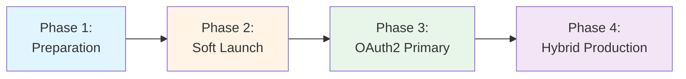

# OAuth2/OIDC Migration Guide

Step-by-step guide for migrating from mTLS-only authentication to dual authentication (mTLS + OAuth2/OIDC).

## Table of Contents

1. [Overview](#overview)
2. [Prerequisites](#prerequisites)
3. [Migration Strategy](#migration-strategy)
4. [Phase 1: Preparation](#phase-1-preparation)
5. [Phase 2: Soft Launch](#phase-2-soft-launch)
6. [Phase 3: OAuth2 Primary](#phase-3-oauth2-primary)
7. [Phase 4: Production Hybrid](#phase-4-production-hybrid)
8. [Rollback Procedures](#rollback-procedures)
9. [Troubleshooting](#troubleshooting)

---

## Overview

### What's Changing?

The O2-IMS Gateway now supports **dual authentication**:
- **mTLS** (existing): Certificate-based authentication
- **OAuth2/OIDC** (new): Token-based authentication via Keycloak

### Why Migrate?

- ✅ **Single Sign-On**: Integrate with existing identity providers
- ✅ **Modern Auth**: Industry-standard OAuth2/OIDC protocol
- ✅ **Auto-Provisioning**: Automatically create users from tokens
- ✅ **Flexibility**: Support both authentication methods simultaneously
- ✅ **Better UX**: Token-based auth for web/mobile applications

### 100% Backward Compatibility

**All existing mTLS clients continue to work unchanged.**

No breaking changes to:
- API endpoints
- Request/response formats
- Certificate formats
- Authorization logic
- Tenant isolation

---

## Prerequisites

Before starting migration, ensure you have:

### 1. Keycloak Instance

```bash
# Verify Keycloak is accessible
curl https://keycloak.example.com/realms/netweave

# Expected: JSON with realm configuration
```

### 2. Keycloak Realm Configuration

- ✅ Realm created: `netweave`
- ✅ Client configured: `o2ims-gateway`
- ✅ Client secret obtained
- ✅ Groups created for role mapping:
  - `/platform-admins`
  - `/tenant-admins`
  - `/tenant-editors`
  - `/tenant-viewers`

### 3. Gateway Version

```bash
# Check gateway version (must be >= v2.0)
curl https://o2ims-gateway.example.com/o2ims-infrastructureInventory/v1/api_versions

# Expected: version >= 2.0 with OAuth2 support
```

### 4. Backup Current Configuration

```bash
# Backup Redis data
redis-cli --rdb /backup/redis-$(date +%Y%m%d).rdb

# Backup configuration
cp config.yaml config.yaml.backup-$(date +%Y%m%d)

# Backup tenant/user data
redis-cli KEYS "tenant:*" > /backup/tenants-$(date +%Y%m%d).txt
redis-cli KEYS "user:*" > /backup/users-$(date +%Y%m%d).txt
```

---

## Migration Strategy

### Safe Phased Approach



| Phase | Duration | OAuth2 Status | mTLS Status | Risk Level |
|-------|----------|---------------|-------------|------------|
| **1. Preparation** | 1-2 days | Disabled | Primary | None |
| **2. Soft Launch** | 1-2 weeks | Secondary | Primary | Low |
| **3. OAuth2 Primary** | 2-4 weeks | Primary | Secondary | Medium |
| **4. Hybrid Production** | Ongoing | Primary | Supported | Low |

**Key Principle**: **Never break existing clients**

---

## Phase 1: Preparation

**Goal**: Deploy OAuth2-capable gateway without enabling OAuth2.

### Step 1.1: Update Configuration

```yaml
# config.yaml

# Keep OAuth2 disabled initially
oauth2:
  enabled: false  # <-- OAuth2 disabled, mTLS only

# Existing mTLS configuration unchanged
tls:
  enabled: true
  cert_file: /etc/certs/tls.crt
  key_file: /etc/certs/tls.key
  ca_file: /etc/certs/ca.crt
  client_auth: require-and-verify
```

### Step 1.2: Deploy New Gateway Version

```bash
# Deploy with Helm (example)
helm upgrade o2ims-gateway netweave/o2ims-gateway \
  --version 2.0.0 \
  --set oauth2.enabled=false \
  --wait

# Or with kubectl
kubectl apply -f k8s/gateway-v2.0.yaml
kubectl rollout status deployment/o2ims-gateway
```

### Step 1.3: Verify mTLS Still Works

```bash
# Test with existing mTLS client
curl -X GET https://o2ims-gateway.example.com/o2ims-infrastructureInventory/v1/api_versions \
  --cert client.crt --key client.key --cacert ca.crt

# Expected: 200 OK with API versions
```

### Step 1.4: Monitor for Issues

```bash
# Check logs for any errors
kubectl logs -f deployment/o2ims-gateway

# Check metrics
curl https://o2ims-gateway.example.com/metrics | grep authentication

# Expected: No increase in authentication failures
```

**Rollback**: If issues detected, rollback to previous version:
```bash
helm rollback o2ims-gateway
```

---

## Phase 2: Soft Launch

**Goal**: Enable OAuth2 as secondary authentication method (mTLS priority).

### Step 2.1: Configure OAuth2

```yaml
# config.yaml

oauth2:
  enabled: true  # <-- Enable OAuth2
  priority: false  # <-- mTLS takes priority (IMPORTANT)

  # Keycloak connection
  keycloak_base_url: https://keycloak.example.com
  keycloak_realm: netweave
  keycloak_client_id: o2ims-gateway
  keycloak_secret: ${KEYCLOAK_CLIENT_SECRET}  # From environment

  # Conservative settings for soft launch
  auto_provision_users: false  # Manual user approval first
  require_tenant_claim: true  # Strict tenant validation
  default_role: tenant-viewer  # Most restrictive role

  # Group-to-role mappings
  group_role_mapping:
    "/platform-admins": "platform-admin"
    "/tenant-admins": "tenant-admin"
    "/tenant-editors": "tenant-editor"
    "/tenant-viewers": "tenant-viewer"
```

### Step 2.2: Create Environment Secret

```bash
# Kubernetes secret for Keycloak client secret
kubectl create secret generic keycloak-secret \
  --from-literal=client-secret='your-keycloak-client-secret' \
  --namespace=o2ims

# Update deployment to use secret
kubectl set env deployment/o2ims-gateway \
  KEYCLOAK_CLIENT_SECRET=secret://keycloak-secret/client-secret
```

### Step 2.3: Deploy with OAuth2 Enabled

```bash
# Update configuration
helm upgrade o2ims-gateway netweave/o2ims-gateway \
  --version 2.0.0 \
  --set oauth2.enabled=true \
  --set oauth2.priority=false \
  --set oauth2.keycloakBaseURL=https://keycloak.example.com \
  --set oauth2.keycloakRealm=netweave \
  --set oauth2.keycloakClientID=o2ims-gateway \
  --set-string oauth2.autoProvisionUsers=false \
  --wait

# Verify deployment
kubectl rollout status deployment/o2ims-gateway
```

### Step 2.4: Test OAuth2 Authentication

```bash
# Get test token from Keycloak
TOKEN=$(curl -s -X POST \
  https://keycloak.example.com/realms/netweave/protocol/openid-connect/token \
  -d "client_id=o2ims-gateway" \
  -d "client_secret=your-secret" \
  -d "username=test@example.com" \
  -d "password=test-password" \
  -d "grant_type=password" \
  | jq -r '.access_token')

# Test OAuth2 authentication
curl -X GET https://o2ims-gateway.example.com/o2ims-infrastructureInventory/v1/api_versions \
  -H "Authorization: Bearer $TOKEN"

# Expected: 401 Unauthorized (user not provisioned yet)
```

### Step 2.5: Manually Provision Test User

```bash
# Create test user in Redis
redis-cli HSET user:test-user-id \
  id test-user-id \
  tenantID test-tenant-id \
  oauthSubject "keycloak-user-id-from-token" \
  oauthProvider keycloak \
  email test@example.com \
  commonName "Test User" \
  roleID tenant-viewer \
  isActive true

# Create OAuth subject index
redis-cli SET "users:oauth:$(echo -n 'keycloak-user-id' | sha256sum | cut -d' ' -f1)" test-user-id

# Test again
curl -X GET https://o2ims-gateway.example.com/o2ims-infrastructureInventory/v1/api_versions \
  -H "Authorization: Bearer $TOKEN"

# Expected: 200 OK
```

### Step 2.6: Verify mTLS Priority

```bash
# Request with both Bearer token AND certificate
# Should use mTLS (priority=false)
curl -v -X GET https://o2ims-gateway.example.com/o2ims-infrastructureInventory/v1/api_versions \
  -H "Authorization: Bearer $TOKEN" \
  --cert client.crt --key client.key --cacert ca.crt

# Check response headers or logs to confirm mTLS was used
# Expected: Authenticated via mTLS (certificate), NOT OAuth2
```

### Step 2.7: Monitor Metrics

```bash
# Check authentication metrics
curl -s https://o2ims-gateway.example.com/metrics | grep o2ims_authentication

# Expected metrics:
# o2ims_authentication_total{method="mtls",status="success"} 1000+
# o2ims_authentication_total{method="oauth2",status="success"} 0-10 (test users)
```

**Success Criteria**:
- ✅ All existing mTLS clients work unchanged
- ✅ OAuth2 authentication works for test users
- ✅ mTLS takes priority when both present
- ✅ No authentication failures for existing clients

---

## Phase 3: OAuth2 Primary

**Goal**: Make OAuth2 the primary authentication method.

### Step 3.1: Enable Auto-Provisioning

```yaml
# config.yaml

oauth2:
  enabled: true
  priority: true  # <-- OAuth2 now takes priority

  # Enable auto-provisioning
  auto_provision_users: true  # <-- Auto-create users
  require_tenant_claim: true
  default_role: tenant-viewer

  # Rest unchanged...
```

### Step 3.2: Deploy Priority Change

```bash
helm upgrade o2ims-gateway netweave/o2ims-gateway \
  --version 2.0.0 \
  --set oauth2.enabled=true \
  --set oauth2.priority=true \
  --set-string oauth2.autoProvisionUsers=true \
  --wait
```

### Step 3.3: Test Priority Behavior

```bash
# Request with both auth methods
# Should now use OAuth2 (priority=true)
curl -v -X GET https://o2ims-gateway.example.com/o2ims-infrastructureInventory/v1/api_versions \
  -H "Authorization: Bearer $TOKEN" \
  --cert client.crt --key client.key --cacert ca.crt

# Expected: Authenticated via OAuth2, NOT mTLS
```

### Step 3.4: Test Auto-Provisioning

```bash
# Get token for NEW user (not in database)
NEW_TOKEN=$(curl -s -X POST \
  https://keycloak.example.com/realms/netweave/protocol/openid-connect/token \
  -d "client_id=o2ims-gateway" \
  -d "client_secret=your-secret" \
  -d "username=newuser@example.com" \
  -d "password=password" \
  -d "grant_type=password" \
  | jq -r '.access_token')

# First request - user auto-provisioned
curl -X GET https://o2ims-gateway.example.com/o2ims-infrastructureInventory/v1/api_versions \
  -H "Authorization: Bearer $NEW_TOKEN"

# Expected: 200 OK + user created in Redis

# Verify user was created
redis-cli KEYS "user:*" | grep newuser
```

### Step 3.5: Monitor User Provisioning

```bash
# Check provisioning metrics
curl -s https://o2ims-gateway.example.com/metrics | grep oauth2_user_provisions_total

# Check audit logs
kubectl logs deployment/o2ims-gateway | grep "Auto-provisioned OAuth2 user"
```

**Success Criteria**:
- ✅ OAuth2 takes priority over mTLS
- ✅ New users auto-provisioned correctly
- ✅ Group-to-role mapping works
- ✅ Tenant quotas enforced
- ✅ mTLS clients still work (as fallback)

---

## Phase 4: Production Hybrid

**Goal**: Stable production with both authentication methods.

### Step 4.1: Fine-Tune Configuration

```yaml
# config.yaml - Production settings

oauth2:
  enabled: true
  priority: true

  # Production Keycloak
  keycloak_base_url: https://keycloak.prod.example.com
  keycloak_realm: netweave-prod
  keycloak_client_id: o2ims-gateway
  keycloak_secret: ${KEYCLOAK_CLIENT_SECRET}

  # Production settings
  auto_provision_users: true
  require_tenant_claim: true
  default_role: tenant-viewer

  # Refined group mappings
  group_role_mapping:
    "/prod-platform-admins": "platform-admin"
    "/prod-tenant-admins": "tenant-admin"
    "/prod-tenant-editors": "tenant-editor"
    "/prod-tenant-viewers": "tenant-viewer"
    "/legacy-smo-admins": "tenant-admin"  # Legacy group support
```

### Step 4.2: Set Up Monitoring

```yaml
# prometheus-rules.yaml

groups:
  - name: authentication
    interval: 30s
    rules:
      # Alert on high OAuth2 failure rate
      - alert: HighOAuth2FailureRate
        expr: |
          rate(o2ims_authentication_total{method="oauth2",status="failure"}[5m]) > 0.1
        for: 5m
        annotations:
          summary: "High OAuth2 authentication failure rate"

      # Alert on Keycloak connectivity issues
      - alert: KeycloakConnectivityIssue
        expr: |
          rate(o2ims_oauth2_token_verification_errors_total[5m]) > 0.05
        for: 2m
        annotations:
          summary: "Keycloak connectivity or verification issues"

      # Track authentication method distribution
      - record: authentication_method_percentage
        expr: |
          100 * rate(o2ims_authentication_total[5m])
          / ignoring(method) group_left sum(rate(o2ims_authentication_total[5m]))
```

### Step 4.3: Create Runbook

Document common scenarios:

**Scenario 1: OAuth2 user locked out**
```bash
# Check user status
redis-cli HGET user:<user-id> isActive

# Reactivate user
redis-cli HSET user:<user-id> isActive true
```

**Scenario 2: Keycloak downtime**
```bash
# Temporarily disable OAuth2 (emergency)
helm upgrade o2ims-gateway \
  --set oauth2.enabled=false \
  --wait

# All clients fall back to mTLS
```

**Scenario 3: Token verification slow**
```bash
# Check Keycloak response time
curl -w "@curl-format.txt" -o /dev/null -s \
  https://keycloak.example.com/realms/netweave

# Scale Keycloak if needed
kubectl scale deployment/keycloak --replicas=5
```

### Step 4.4: Document Client Migration

Create client migration guide:

**mTLS Client (Keep as-is)**:
```bash
# No changes required - continues to work
curl -X GET https://o2ims-gateway.example.com/api/v1/resources \
  --cert client.crt --key client.key --cacert ca.crt
```

**New OAuth2 Client**:
```python
import requests

# Get token from Keycloak
def get_token():
    response = requests.post(
        "https://keycloak.example.com/realms/netweave/protocol/openid-connect/token",
        data={
            "client_id": "o2ims-gateway",
            "client_secret": "secret",
            "username": "user@example.com",
            "password": "password",
            "grant_type": "password"
        }
    )
    return response.json()["access_token"]

# Make authenticated request
token = get_token()
response = requests.get(
    "https://o2ims-gateway.example.com/api/v1/resources",
    headers={"Authorization": f"Bearer {token}"}
)
```

---

## Rollback Procedures

### Emergency Rollback (Disable OAuth2)

```bash
# Immediate: Disable OAuth2 via helm
helm upgrade o2ims-gateway \
  --set oauth2.enabled=false \
  --wait

# Result: All traffic uses mTLS only
```

### Partial Rollback (OAuth2 Secondary)

```bash
# Keep OAuth2 enabled but make mTLS primary
helm upgrade o2ims-gateway \
  --set oauth2.enabled=true \
  --set oauth2.priority=false \
  --wait

# Result: mTLS takes priority, OAuth2 fallback
```

### Full Rollback (Remove OAuth2)

```bash
# Rollback to previous version
helm rollback o2ims-gateway

# Or redeploy old version
helm upgrade o2ims-gateway netweave/o2ims-gateway \
  --version 1.x.x \
  --wait
```

---

## Troubleshooting

### Issue: OAuth2 authentication fails with 401

**Symptoms**:
```bash
curl -H "Authorization: Bearer $TOKEN" https://gateway.example.com/api
# 401 Unauthorized: invalid token
```

**Diagnosis**:
```bash
# 1. Verify token is valid
curl -X POST https://keycloak.example.com/realms/netweave/protocol/openid-connect/token/introspect \
  -d "token=$TOKEN" \
  -d "client_id=o2ims-gateway" \
  -d "client_secret=secret"

# 2. Check gateway logs
kubectl logs deployment/o2ims-gateway | grep "token verification failed"

# 3. Verify Keycloak connectivity
kubectl exec -it deployment/o2ims-gateway -- \
  curl -v https://keycloak.example.com/realms/netweave
```

**Solutions**:
- Token expired → Get new token
- Keycloak unreachable → Check network/firewall
- Wrong client secret → Update secret in config
- Token from wrong realm → Verify realm name

### Issue: User auto-provisioning fails

**Symptoms**:
```bash
# First request with new token
curl -H "Authorization: Bearer $TOKEN" https://gateway.example.com/api
# 401 Unauthorized: user not found and auto-provisioning disabled
```

**Diagnosis**:
```bash
# 1. Check config
kubectl get configmap o2ims-config -o yaml | grep auto_provision_users

# 2. Check tenant exists
redis-cli GET tenant:<tenant-id-from-token>

# 3. Check tenant quota
redis-cli HGET tenant:<tenant-id> quota.maxUsers
redis-cli KEYS user:* | wc -l  # Current user count
```

**Solutions**:
- `auto_provision_users=false` → Enable in config
- Tenant not found → Create tenant first
- Quota exceeded → Increase tenant quota or remove inactive users
- No `tenant_id` claim → Set `require_tenant_claim: false` or add claim

### Issue: Wrong authentication method used

**Symptoms**:
```bash
# Expected OAuth2, but mTLS used
curl -v -H "Authorization: Bearer $TOKEN" --cert client.crt ... https://gateway.example.com/api
# Authenticated via mTLS instead of OAuth2
```

**Diagnosis**:
```bash
# Check priority setting
kubectl get configmap o2ims-config -o yaml | grep priority

# Check logs
kubectl logs deployment/o2ims-gateway | grep "authentication method detected"
```

**Solutions**:
- Set `oauth2.priority: true` for OAuth2 priority
- Set `oauth2.priority: false` for mTLS priority
- Verify Bearer token is present: `Authorization: Bearer ...`

### Issue: Keycloak group not mapped to role

**Symptoms**:
```bash
# User provisioned with wrong role
redis-cli HGET user:<user-id> roleID
# Shows "tenant-viewer" but user is in "tenant-admins" group
```

**Diagnosis**:
```bash
# 1. Check token groups claim
echo $TOKEN | jwt decode - | jq .groups

# 2. Check group_role_mapping
kubectl get configmap o2ims-config -o yaml | grep -A 10 group_role_mapping

# 3. Check if role exists
redis-cli GET role:<role-id-from-mapping>
```

**Solutions**:
- Group path mismatch → Use exact group path from Keycloak (e.g., `/tenant-admins`)
- Role ID not found → Create role or use existing role ID
- No group match → Add group to mapping or set `default_role`

---

**Last Updated:** 2026-01-19
**Version:** 1.0 - Initial OAuth2 migration guide
