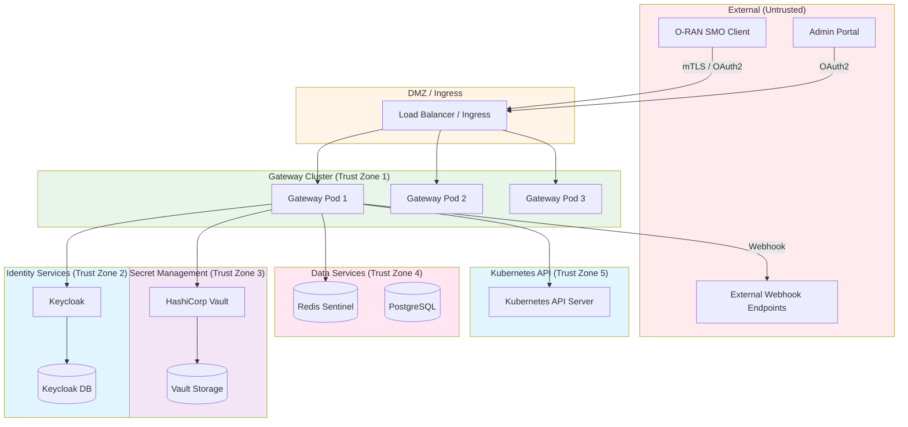
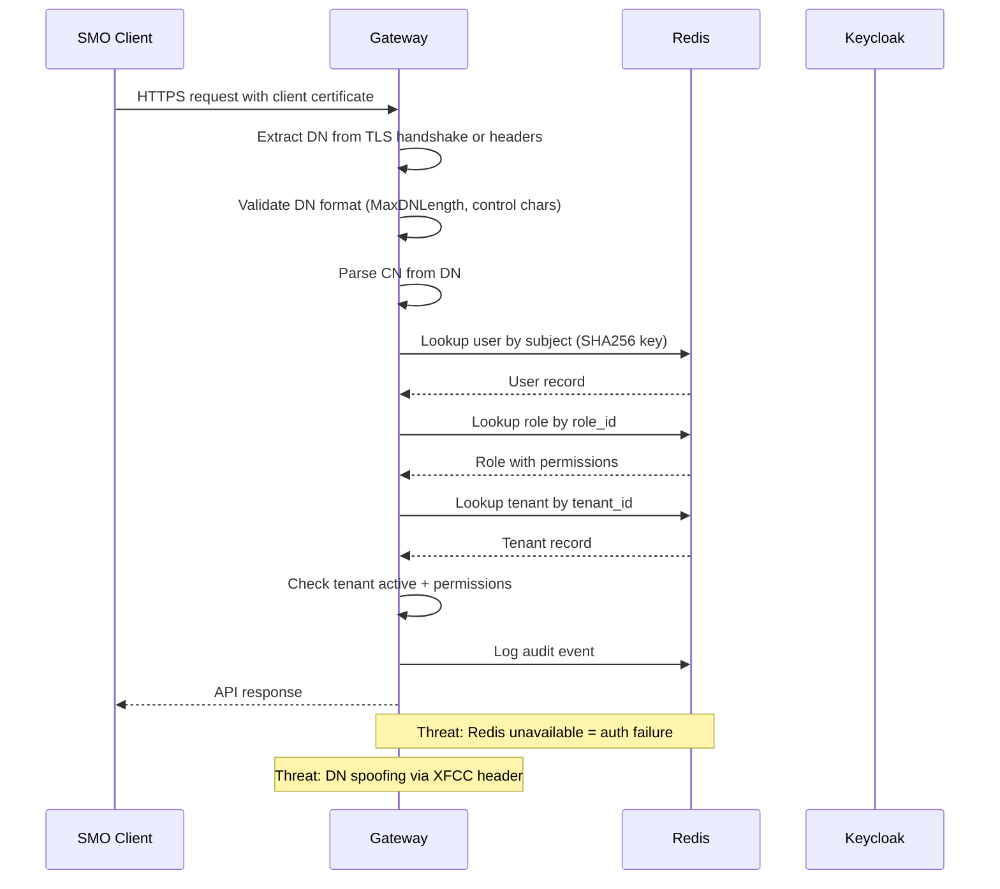
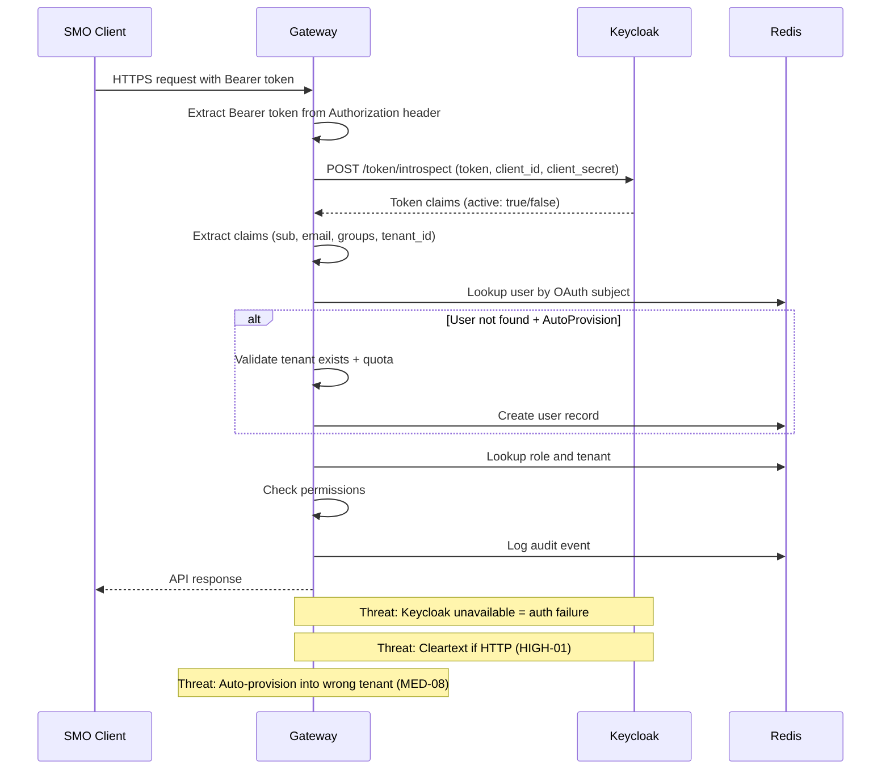
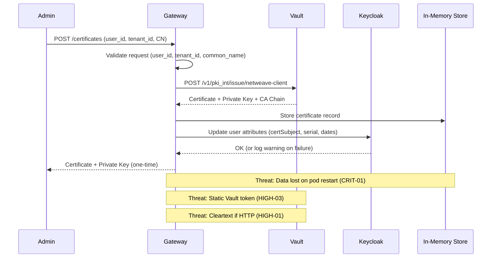

# Threat Model - Netweave O2-IMS Gateway

**Date:** 2026-02-06
**Author:** Pascal Watteel
**Methodology:** STRIDE
**Classification:** CONFIDENTIAL

---

## Table of Contents

1. [System Overview](#system-overview)
2. [Assets](#assets)
3. [Threat Actors](#threat-actors)
4. [Trust Boundaries](#trust-boundaries)
5. [Attack Surface Analysis](#attack-surface-analysis)
6. [STRIDE Threat Analysis](#stride-threat-analysis)
7. [Data Flow Analysis](#data-flow-analysis)
8. [Risk Matrix](#risk-matrix)
9. [Mitigations Summary](#mitigations-summary)

---

## System Overview

The Netweave O2-IMS Gateway is an ORAN-compliant API gateway that provides:

- Multi-tenant API access to O2 Infrastructure Management Services
- Dual authentication via mTLS certificates and OAuth2/OIDC tokens
- Role-based access control (RBAC) with six predefined role levels
- Certificate lifecycle management via HashiCorp Vault PKI
- User management via Keycloak identity provider
- Subscription management with webhook notifications
- Kubernetes resource abstraction for telecom infrastructure

### Architecture Diagram

---

## Assets

### Critical Assets

| ID | Asset | Description | Confidentiality | Integrity | Availability |
|----|-------|-------------|-----------------|-----------|--------------|
| A1 | Vault PKI Root/Intermediate CA | Root of trust for all mTLS certificates | CRITICAL | CRITICAL | HIGH |
| A2 | Vault Authentication Tokens | Access to all PKI operations | CRITICAL | CRITICAL | HIGH |
| A3 | Keycloak Admin Credentials | Full control over identity management | CRITICAL | CRITICAL | HIGH |
| A4 | Client Private Keys | mTLS authentication material | CRITICAL | HIGH | MEDIUM |
| A5 | OAuth2 Client Secrets | Service-to-service authentication | CRITICAL | HIGH | HIGH |
| A6 | Redis Authentication Data | User records, roles, tenant mappings | HIGH | CRITICAL | HIGH |

### High-Value Assets

| ID | Asset | Description | Confidentiality | Integrity | Availability |
|----|-------|-------------|-----------------|-----------|--------------|
| A7 | Tenant Data | Multi-tenant configuration and quotas | HIGH | HIGH | HIGH |
| A8 | Certificate Metadata | Serial numbers, expiry, status | MEDIUM | HIGH | HIGH |
| A9 | Audit Logs | Security event records | HIGH | CRITICAL | MEDIUM |
| A10 | OAuth2 Access Tokens | Bearer tokens for authenticated sessions | HIGH | HIGH | HIGH |
| A11 | Kubernetes API Access | Cluster resource management | HIGH | CRITICAL | HIGH |
| A12 | Subscription Data | Webhook URLs and notification state | MEDIUM | HIGH | HIGH |

### Infrastructure Assets

| ID | Asset | Description | Confidentiality | Integrity | Availability |
|----|-------|-------------|-----------------|-----------|--------------|
| A13 | Gateway Service | API gateway availability | LOW | HIGH | CRITICAL |
| A14 | Keycloak Service | Authentication availability | LOW | HIGH | CRITICAL |
| A15 | Vault Service | Certificate operations availability | LOW | HIGH | HIGH |
| A16 | Redis Service | State management availability | LOW | HIGH | HIGH |

---

## Threat Actors

### TA1: External Attacker (Unauthenticated)

- **Motivation:** Data theft, service disruption, infrastructure compromise
- **Capability:** High -- access to public endpoints, can craft arbitrary requests
- **Access:** Network-level access to gateway ingress
- **Relevant Threats:** Authentication bypass, DDoS, reconnaissance, brute force

### TA2: Malicious Tenant User (Authenticated)

- **Motivation:** Access other tenants' data, privilege escalation, quota bypass
- **Capability:** Medium -- has valid credentials for one tenant
- **Access:** Authenticated API access within their tenant scope
- **Relevant Threats:** Tenant isolation bypass, privilege escalation, data exfiltration

### TA3: Compromised Service Account

- **Motivation:** Lateral movement, persistent access, data exfiltration
- **Capability:** High -- has internal network access and service credentials
- **Access:** Internal cluster network, service account tokens
- **Relevant Threats:** Lateral movement to Vault/Keycloak/Redis, credential theft

### TA4: Malicious Administrator

- **Motivation:** Data theft, sabotage, backdoor installation
- **Capability:** Very High -- has platform admin credentials
- **Access:** Full administrative API access, Keycloak admin
- **Relevant Threats:** Audit log tampering, backdoor user creation, CA compromise

### TA5: Supply Chain Attacker

- **Motivation:** Widespread compromise via dependency poisoning
- **Capability:** Variable -- depends on compromised package
- **Access:** Code execution within the gateway process
- **Relevant Threats:** Malicious code injection, credential harvesting, backdoor

---

## Trust Boundaries

### TB1: External to DMZ

**Crossing point:** Load Balancer / Ingress Controller
**Security controls:**
- TLS termination (TLS 1.3)
- mTLS client certificate validation
- Rate limiting at ingress level
- IP allowlisting (optional)

### TB2: DMZ to Gateway

**Crossing point:** Kubernetes Service / Pod Network
**Security controls:**
- NetworkPolicy (when enabled)
- Kubernetes RBAC
- Pod security context

### TB3: Gateway to Keycloak

**Crossing point:** HTTP/HTTPS connection
**Security controls:**
- OAuth2 client credentials
- Admin username/password authentication
- TLS encryption (when configured)
- **Gap:** Default configuration uses HTTP

### TB4: Gateway to Vault

**Crossing point:** HTTP/HTTPS connection
**Security controls:**
- Vault token authentication (`X-Vault-Token` header)
- TLS encryption (when configured)
- **Gap:** Static token, default uses HTTP, `skipTLSVerify: true`

### TB5: Gateway to Redis

**Crossing point:** Redis protocol connection
**Security controls:**
- Password authentication (when configured)
- Redis ACLs (when configured)
- **Gap:** Default empty password

### TB6: Gateway to Kubernetes API

**Crossing point:** Kubernetes API server
**Security controls:**
- Service account token authentication
- Kubernetes RBAC policies
- TLS (always enabled for K8s API)

### TB7: Gateway to External Webhooks

**Crossing point:** Outbound HTTPS connections
**Security controls:**
- TLS verification (configurable)
- Webhook URL validation
- **Gap:** InsecureSkipVerify is configurable

---

## Attack Surface Analysis

### External Attack Surface

| Entry Point | Protocol | Authentication | Rate Limited | Notes |
|-------------|----------|---------------|--------------|-------|
| `/health`, `/healthz`, `/ready`, `/readyz` | HTTP(S) | None (skip auth) | No | Health check endpoints |
| `/metrics` | HTTP(S) | None (skip auth) | No | Prometheus metrics endpoint |
| `/` | HTTP(S) | None (skip auth) | No | Root endpoint |
| `/o2ims` | HTTP(S) | None (skip auth) | No | API discovery |
| `/o2ims-infrastructureInventory/*` | HTTP(S) | mTLS or OAuth2 | Yes | O2-IMS inventory API |
| `/o2ims-infrastructureMonitoring/*` | HTTP(S) | mTLS or OAuth2 | Yes | O2-IMS monitoring API |
| `/admin/*` | HTTP(S) | OAuth2 + PlatformAdmin | Yes | Administrative endpoints |
| `/tenant/*` | HTTP(S) | OAuth2 + TenantAccess | Yes | Tenant management endpoints |

### Internal Attack Surface

| Entry Point | Protocol | Authentication | Notes |
|-------------|----------|---------------|-------|
| Keycloak Admin API | HTTP(S) | Admin credentials | Full user/role/realm management |
| Vault PKI API | HTTP(S) | Vault token | Certificate issuance/revocation |
| Redis | Redis protocol | Password (optional) | Auth state, rate limits, subscriptions |
| Kubernetes API | HTTPS | Service account | Resource inventory queries |

### Unauthenticated Endpoints Analysis

The following endpoints bypass authentication and are accessible to any network client:

1. **`/health`, `/healthz`, `/ready`, `/readyz`**: Standard Kubernetes health probes. Minimal risk -- return only status codes.
2. **`/metrics`**: Prometheus metrics endpoint. Exposes operational metrics including tenant IDs in labels. Could aid reconnaissance.
3. **`/`**: Root endpoint. Minimal information disclosure.
4. **`/o2ims`**: API discovery endpoint. Exposes API structure.

**Risk:** The `/metrics` endpoint should ideally require authentication or be restricted to internal monitoring traffic via NetworkPolicy.

---

## STRIDE Threat Analysis

### Spoofing (S)

#### S1: OAuth2 Token Forgery

**Target:** Gateway authentication middleware
**Description:** An attacker crafts or modifies a JWT token to impersonate another user or escalate privileges.
**Likelihood:** Medium
**Impact:** Critical

**Current Mitigations:**
- Token verification via Keycloak introspection endpoint
- Bearer token extraction validates header format

**Gaps:**
- No local JWT signature validation (HIGH-02 in audit report)
- No audience (`aud`) or issuer (`iss`) validation at application level
- No token binding to specific clients

**Recommended Mitigations:**
- Implement local JWKS-based JWT signature verification
- Validate `aud`, `iss`, `exp`, `nbf`, `iat` claims locally
- Implement token binding to prevent token relay attacks

---

#### S2: mTLS Certificate Impersonation

**Target:** Gateway mTLS authentication
**Description:** An attacker obtains or forges a client certificate to impersonate a legitimate user.
**Likelihood:** Low (requires CA compromise or certificate theft)
**Impact:** Critical

**Current Mitigations:**
- Vault PKI issues certificates with proper CN and SANs
- Certificate revocation via Vault CRL
- DN validation with length limits and character restrictions
- Private key never returned after initial issuance (`GetCertificate` strips it)

**Gaps:**
- In-memory certificate tracking (CRIT-01) -- revocation state lost on restart
- CRL distribution relies on Vault availability
- No OCSP stapling support

**Recommended Mitigations:**
- Implement persistent certificate state storage
- Add OCSP responder integration
- Implement certificate pinning for known high-value clients

---

#### S3: Admin Credential Theft

**Target:** Keycloak admin API
**Description:** Attacker intercepts or steals Keycloak admin credentials to gain full identity management control.
**Likelihood:** Medium (credentials in transit over HTTP by default)
**Impact:** Critical

**Current Mitigations:**
- Admin token cached with expiry buffer (60s before expiration)
- Admin credentials only used for admin API operations

**Gaps:**
- Default HTTP transport exposes credentials in transit (HIGH-01)
- Static admin credentials in configuration
- No MFA for admin authentication

**Recommended Mitigations:**
- Enforce HTTPS for all Keycloak communication
- Implement Keycloak service account with scoped permissions
- Rotate admin credentials regularly

---

### Tampering (T)

#### T1: Tenant Data Modification

**Target:** Keycloak realm attributes, Redis auth store
**Description:** Attacker modifies tenant quotas, user roles, or permissions to gain unauthorized access.
**Likelihood:** Low (requires backend access)
**Impact:** High

**Current Mitigations:**
- Redis Lua scripts for atomic user creation
- Tenant quota validation during user provisioning
- Role validation during authentication

**Gaps:**
- TOCTOU race in usage counters (MED-03)
- No integrity verification on realm attribute data
- Redis default has empty password (MED-06)

**Recommended Mitigations:**
- Implement atomic usage counters
- Add data integrity checksums for critical records
- Enforce Redis authentication

---

#### T2: Audit Log Tampering

**Target:** Redis audit store, Keycloak audit store
**Description:** Attacker modifies or deletes audit logs to cover tracks.
**Likelihood:** Medium
**Impact:** High

**Current Mitigations:**
- Redis sorted sets with TTL for audit events
- Audit events include timestamps and request IDs

**Gaps:**
- Keycloak audit store is placeholder only (MED-02)
- Redis audit logs have no integrity protection
- 30-day TTL means old events are automatically deleted
- No write-once/append-only audit log mechanism

**Recommended Mitigations:**
- Forward audit events to an immutable log store (e.g., CloudWatch Logs, S3 with Object Lock)
- Implement log integrity verification (hash chains)
- Add real-time alerts for suspicious audit event patterns

---

#### T3: Certificate Metadata Manipulation

**Target:** In-memory certificate store
**Description:** Attacker manipulates certificate status to mark revoked certificates as active.
**Likelihood:** Low (requires pod access)
**Impact:** Critical

**Current Mitigations:**
- Vault is the source of truth for certificate validity
- Certificate revocation is performed in Vault first

**Gaps:**
- In-memory storage has no integrity protection (CRIT-01)
- Certificate state is lost on pod restart
- No validation of in-memory state against Vault

**Recommended Mitigations:**
- Implement persistent certificate storage with integrity checks
- Periodically reconcile certificate state with Vault CRL

---

### Repudiation (R)

#### R1: Authentication Event Denial

**Target:** Audit logging system
**Description:** A user denies performing an action; insufficient logging prevents proving the action occurred.
**Likelihood:** Medium
**Impact:** Medium

**Current Mitigations:**
- Comprehensive audit event types (AuthSuccess, AuthFailure, ResourceCreate, etc.)
- Request ID correlation
- Structured logging with zap

**Gaps:**
- Keycloak store audit is non-functional (MED-02)
- No digital signatures on audit records
- Audit events in Redis could be modified by anyone with Redis access

**Recommended Mitigations:**
- Implement persistent, tamper-evident audit logging
- Add cryptographic signatures to audit records
- Forward to an external SIEM for independent retention

---

#### R2: Certificate Issuance Denial

**Target:** Certificate manager service
**Description:** An administrator denies issuing a certificate that was later used maliciously.
**Likelihood:** Low
**Impact:** High

**Current Mitigations:**
- OpenTelemetry tracing for certificate operations
- Vault maintains its own audit log of certificate operations
- Certificate issuance logged with serial number, user ID, and tenant ID

**Gaps:**
- In-memory store means certificate issuance records can be lost
- No cross-reference between gateway logs and Vault audit logs

**Recommended Mitigations:**
- Persist certificate issuance records independently of in-memory storage
- Correlate gateway and Vault audit trails

---

### Information Disclosure (I)

#### I1: Credential Exposure via Cleartext Transport

**Target:** Keycloak and Vault connections
**Description:** Credentials transmitted over HTTP are intercepted by a network-level attacker.
**Likelihood:** High (default configurations use HTTP)
**Impact:** Critical

**Current Mitigations:**
- HTTPS is configurable for all services
- Helm chart auto-generates secrets if not provided

**Gaps:**
- All default URLs use HTTP (HIGH-01)
- Vault token in X-Vault-Token header over cleartext
- Keycloak admin password in POST body over cleartext
- OAuth2 client secret in token introspection requests over cleartext

**Recommended Mitigations:**
- Change all defaults to HTTPS
- Add configuration validation rejecting HTTP in production
- Implement mutual TLS for all internal service communication

---

#### I2: Error Message Information Leakage

**Target:** Keycloak client error handling
**Description:** Detailed error messages from Keycloak responses are propagated through the error chain.
**Likelihood:** Medium
**Impact:** Low

**Current Mitigations:**
- SanitizeForLogging function prevents log injection
- Error wrapping provides context

**Gaps:**
- Keycloak response bodies included in error messages (LOW-01)
- Could expose Keycloak version, configuration, or internal state

**Recommended Mitigations:**
- Log full error details at DEBUG level only
- Return generic error messages to API consumers

---

#### I3: Metrics Endpoint Reconnaissance

**Target:** `/metrics` endpoint
**Description:** Unauthenticated access to Prometheus metrics reveals tenant IDs, request patterns, and operational details.
**Likelihood:** High (endpoint is unauthenticated)
**Impact:** Medium

**Current Mitigations:**
- Metrics endpoint listed in SkipPaths (no auth required)

**Gaps:**
- Tenant IDs visible in metric labels
- Rate limit patterns reveal tenant activity
- Certificate metrics reveal PKI configuration
- No authentication or network restriction on metrics endpoint

**Recommended Mitigations:**
- Restrict metrics endpoint via NetworkPolicy to monitoring namespace only
- Remove high-cardinality tenant labels from externally-visible metrics
- Consider authentication for metrics endpoint in high-security deployments

---

### Denial of Service (D)

#### D1: User Enumeration DoS via Keycloak

**Target:** Keycloak admin API
**Description:** Every authentication request triggers a full user listing from Keycloak, creating amplified load.
**Likelihood:** High
**Impact:** Critical

**Current Mitigations:**
- Rate limiting on API endpoints (when Redis is available)

**Gaps:**
- Each auth request lists ALL users (CRIT-02)
- No caching of user lookups
- Rate limiter fails open on Redis failure (MED-01)
- Combined: an attacker can bypass rate limiting and trigger expensive Keycloak queries

**Recommended Mitigations:**
- Implement attribute-based Keycloak user search
- Cache authenticated user records with short TTL
- Add local rate limiting fallback

---

#### D2: Rate Limit Bypass via Redis Failure

**Target:** Rate limiting middleware
**Description:** Attacker causes Redis unavailability (or exploits existing outage) to bypass all rate limiting.
**Likelihood:** Medium
**Impact:** High

**Current Mitigations:**
- Error logging when Redis fails
- Redis Sentinel for high availability

**Gaps:**
- Explicit fail-open behavior (MED-01)
- No local fallback rate limiting
- No alerting on rate limit bypass

**Recommended Mitigations:**
- Implement in-memory rate limit fallback
- Add circuit breaker for Redis connection
- Alert on sustained rate limit check failures

---

#### D3: Tenant Quota Exhaustion

**Target:** Tenant user provisioning
**Description:** Attacker exploits TOCTOU race condition to create users beyond quota limits.
**Likelihood:** Medium (requires concurrent requests)
**Impact:** Medium

**Current Mitigations:**
- Quota checked during provisioning
- Tenant must exist and be active

**Gaps:**
- Non-atomic read-modify-write for usage counters (MED-03)
- Each gateway pod checks independently
- No distributed locking for provisioning operations

**Recommended Mitigations:**
- Use atomic counters (Redis INCR) for quota enforcement
- Implement distributed locks for provisioning operations

---

### Elevation of Privilege (E)

#### E1: Cross-Tenant Access via Auto-Provisioning

**Target:** OAuth2 auto-provisioning
**Description:** Attacker manipulates the `tenant_id` claim in their OAuth2 token to provision themselves into a target tenant.
**Likelihood:** Medium (requires IdP misconfiguration or compromise)
**Impact:** Critical

**Current Mitigations:**
- Tenant must exist and be active
- User quota checked
- RequireTenantClaim configuration option

**Gaps:**
- `tenant_id` claim directly trusted from token (MED-08)
- No validation that the OAuth2 user should have access to the specified tenant
- Group-to-role mapping does not verify tenant membership

**Recommended Mitigations:**
- Validate tenant_id against Keycloak realm/group membership
- Implement tenant-level allowlists for auto-provisioning
- Require admin approval for first-time tenant access

---

#### E2: PlatformAdmin Privilege Escalation

**Target:** RBAC model
**Description:** Attacker escalates to PlatformAdmin role to gain unrestricted access across all tenants.
**Likelihood:** Low
**Impact:** Critical

**Current Mitigations:**
- PlatformAdmin routes under `/admin/*` require explicit PlatformAdmin check
- Role assignment requires admin API access
- RBAC validation on every request

**Gaps:**
- PlatformAdmin has implicit all-permissions bypass (`HasPermission` always returns true)
- No additional verification (MFA, IP restriction) for PlatformAdmin operations
- Role modification through Keycloak admin API is not separately audited at application level

**Recommended Mitigations:**
- Implement step-up authentication for PlatformAdmin operations
- Add IP allowlisting for admin API access
- Implement just-in-time (JIT) PlatformAdmin access with time-limited elevation
- Alert on PlatformAdmin role assignment changes

---

#### E3: Vault Token Escalation

**Target:** Vault PKI operations
**Description:** Attacker obtains the static Vault token and uses it to issue certificates for any identity.
**Likelihood:** Medium (token exposed in config, HTTP transport)
**Impact:** Critical

**Current Mitigations:**
- Vault PKI role constrains certificate issuance (CN, TTL, key types)
- Kubernetes secrets for token storage

**Gaps:**
- Static token never rotated (HIGH-03)
- Token has access to all PKI operations (issue, revoke, sign)
- Token transmitted in cleartext when HTTP is used
- Missing VaultToken validation in certmanager config

**Recommended Mitigations:**
- Implement Vault Kubernetes auth method with auto-rotating tokens
- Apply least-privilege Vault policies (separate tokens for issuance vs revocation)
- Implement token rotation with Vault token renewal

---

## Data Flow Analysis

### Authentication Flow (mTLS)

### Authentication Flow (OAuth2)

### Certificate Issuance Flow

---

## Risk Matrix

| Threat ID | Threat | Likelihood | Impact | Risk Level | Existing Controls | Residual Risk |
|-----------|--------|------------|--------|------------|-------------------|---------------|
| S1 | OAuth2 Token Forgery | Medium | Critical | HIGH | Keycloak introspection | HIGH (no local validation) |
| S2 | mTLS Certificate Impersonation | Low | Critical | MEDIUM | Vault PKI, CRL, DN validation | LOW |
| S3 | Admin Credential Theft | Medium | Critical | HIGH | Token caching | HIGH (HTTP default) |
| T1 | Tenant Data Modification | Low | High | MEDIUM | Lua scripts, validation | MEDIUM (TOCTOU) |
| T2 | Audit Log Tampering | Medium | High | HIGH | Structured logging | HIGH (no immutability) |
| T3 | Certificate Metadata Manipulation | Low | Critical | MEDIUM | Vault as source of truth | MEDIUM (in-memory gap) |
| R1 | Authentication Event Denial | Medium | Medium | MEDIUM | Audit events, request IDs | MEDIUM (KC placeholder) |
| R2 | Certificate Issuance Denial | Low | High | MEDIUM | OTel tracing, Vault audit | LOW |
| I1 | Credential Exposure via Cleartext | High | Critical | CRITICAL | HTTPS configurable | CRITICAL (HTTP default) |
| I2 | Error Message Leakage | Medium | Low | LOW | SanitizeForLogging | LOW |
| I3 | Metrics Reconnaissance | High | Medium | MEDIUM | None | MEDIUM |
| D1 | User Enumeration DoS | High | Critical | CRITICAL | Rate limiting | CRITICAL (O(n) scan) |
| D2 | Rate Limit Bypass | Medium | High | HIGH | Redis Sentinel | HIGH (fail-open) |
| D3 | Tenant Quota Exhaustion | Medium | Medium | MEDIUM | Quota checks | MEDIUM (TOCTOU) |
| E1 | Cross-Tenant Provisioning | Medium | Critical | HIGH | Tenant validation | HIGH (trust claim) |
| E2 | PlatformAdmin Escalation | Low | Critical | MEDIUM | RBAC enforcement | MEDIUM (no step-up) |
| E3 | Vault Token Escalation | Medium | Critical | HIGH | K8s secrets | HIGH (static token) |

### Risk Level Summary

| Risk Level | Count |
|------------|-------|
| CRITICAL | 2 |
| HIGH | 6 |
| MEDIUM | 7 |
| LOW | 2 |
| **Total** | **17** |

---

## Mitigations Summary

### Priority 1 -- Address Critical Risks

| Risk | Mitigation | Effort | Owner |
|------|-----------|--------|-------|
| I1 (Cleartext Credentials) | Change all default URLs to HTTPS; add TLS config to Vault client | Medium | Platform Team |
| D1 (User Enumeration DoS) | Implement Keycloak attribute-based search; add user lookup caching | High | Backend Team |

### Priority 2 -- Address High Risks

| Risk | Mitigation | Effort | Owner |
|------|-----------|--------|-------|
| S1 (Token Forgery) | Implement local JWKS-based JWT validation | Medium | Auth Team |
| S3 (Admin Credential Theft) | Enforce HTTPS for Keycloak; implement service accounts | Medium | Platform Team |
| T2 (Audit Log Tampering) | Forward audit events to immutable external store | Medium | Observability Team |
| D2 (Rate Limit Bypass) | Add in-memory fallback rate limiter | Low | Backend Team |
| E1 (Cross-Tenant Provisioning) | Add tenant allowlist for auto-provisioning | Low | Auth Team |
| E3 (Vault Token Escalation) | Implement Vault Kubernetes auth method | High | Platform Team |

### Priority 3 -- Address Medium Risks

| Risk | Mitigation | Effort | Owner |
|------|-----------|--------|-------|
| S2 (Certificate Impersonation) | Implement persistent certificate storage | High | Backend Team |
| T1 (Tenant Data Modification) | Atomic usage counters via Redis | Low | Backend Team |
| T3 (Certificate Metadata) | Persistent storage + Vault CRL reconciliation | Medium | Backend Team |
| R1 (Event Denial) | Implement Keycloak audit persistence | Medium | Backend Team |
| I3 (Metrics Reconnaissance) | NetworkPolicy for metrics endpoint | Low | Platform Team |
| D3 (Quota Exhaustion) | Atomic counters + distributed locks | Low | Backend Team |
| E2 (PlatformAdmin Escalation) | Step-up auth + IP allowlisting for admin | Medium | Auth Team |

### Priority 4 -- Address Low Risks

| Risk | Mitigation | Effort | Owner |
|------|-----------|--------|-------|
| R2 (Certificate Issuance Denial) | Persist issuance records independently | Low | Backend Team |
| I2 (Error Message Leakage) | Sanitize Keycloak error responses | Low | Backend Team |

---

*This threat model was generated as part of GitHub Issue #280 and should be reviewed and updated quarterly or when significant architectural changes occur.*
