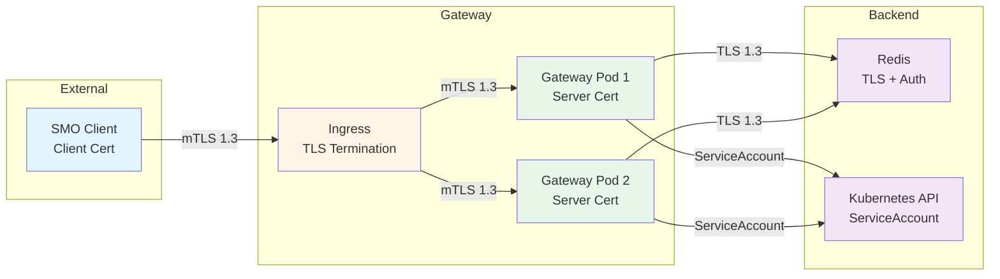
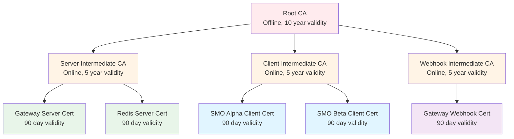

# TLS and mTLS Configuration

**Complete guide for configuring TLS 1.3 and mutual TLS in the O2-IMS Gateway.**

## Table of Contents

1. [Overview](#overview)
2. [TLS 1.3 Requirements](#tls-13-requirements)
3. [Certificate Management](#certificate-management)
4. [mTLS Configuration](#mtls-configuration)
5. [Certificate Hierarchy](#certificate-hierarchy)
6. [cert-manager Integration](#cert-manager-integration)
7. [Certificate Rotation](#certificate-rotation)
8. [Troubleshooting](#troubleshooting)

---

## Overview

### Transport Security

The O2-IMS Gateway enforces TLS 1.3 for all external connections and supports mutual TLS (mTLS) for client authentication.

**Key Features:**
- ✅ TLS 1.3 only (TLS 1.2 and below disabled)
- ✅ Strong cipher suites enforced
- ✅ Mutual TLS for client authentication
- ✅ Automated certificate lifecycle management
- ✅ Certificate rotation with zero downtime

### Architecture



---

## TLS 1.3 Requirements

### Gateway Configuration

```yaml
# config/config.yaml
server:
  # TLS Settings
  tls_enabled: true
  tls_cert_file: /etc/o2ims/certs/tls.crt
  tls_key_file: /etc/o2ims/certs/tls.key
  tls_min_version: "1.3"  # Only TLS 1.3

  # mTLS Settings
  mtls_enabled: true
  mtls_client_ca_file: /etc/o2ims/certs/client-ca.crt
  mtls_client_cert_verification: "require_and_verify"

  # Cipher Suites (TLS 1.3)
  tls_cipher_suites:
    - TLS_AES_256_GCM_SHA384
    - TLS_CHACHA20_POLY1305_SHA256
    - TLS_AES_128_GCM_SHA256
```

### Go TLS Configuration

```go
// internal/server/tls.go
package server

import (
    "crypto/tls"
    "crypto/x509"
    "fmt"
    "os"
)

func configureTLS(cfg *Config) (*tls.Config, error) {
    // Load server certificate
    cert, err := tls.LoadX509KeyPair(cfg.TLSCertFile, cfg.TLSKeyFile)
    if err != nil {
        return nil, fmt.Errorf("failed to load server certificate: %w", err)
    }

    // Load client CA for mTLS
    clientCA, err := os.ReadFile(cfg.MTLSClientCAFile)
    if err != nil {
        return nil, fmt.Errorf("failed to load client CA: %w", err)
    }

    clientCAs := x509.NewCertPool()
    if !clientCAs.AppendCertsFromPEM(clientCA) {
        return nil, fmt.Errorf("failed to parse client CA")
    }

    return &tls.Config{
        // Server certificate
        Certificates: []tls.Certificate{cert},

        // TLS 1.3 only
        MinVersion: tls.VersionTLS13,
        MaxVersion: tls.VersionTLS13,

        // Cipher suites (TLS 1.3)
        CipherSuites: []uint16{
            tls.TLS_AES_256_GCM_SHA384,
            tls.TLS_CHACHA20_POLY1305_SHA256,
            tls.TLS_AES_128_GCM_SHA256,
        },

        // mTLS settings
        ClientAuth: tls.RequireAndVerifyClientCert,
        ClientCAs:  clientCAs,

        // Security settings
        PreferServerCipherSuites: true,
        SessionTicketsDisabled:   true,
        Renegotiation:           tls.RenegotiateNever,
    }, nil
}
```

### Testing TLS Configuration

```bash
# Test TLS 1.3 enforcement
openssl s_client -connect o2ims-gateway.example.com:8443 \
    -tls1_3 -showcerts

# Verify TLS 1.2 is rejected
openssl s_client -connect o2ims-gateway.example.com:8443 \
    -tls1_2
# Expected: handshake failure

# Test with client certificate
openssl s_client -connect o2ims-gateway.example.com:8443 \
    -cert client.crt -key client.key -CAfile ca.crt \
    -tls1_3 -showcerts
```

---

## Certificate Management

### Certificate Requirements

#### Server Certificates

```yaml
# Server certificate requirements
validity: 90 days
key_size: 4096 bits (RSA) or 256 bits (ECDSA)
signature_algorithm: SHA256
key_usage:
  - Digital Signature
  - Key Encipherment
extended_key_usage:
  - Server Authentication
subject_alternative_names:
  - DNS: o2ims-gateway.example.com
  - DNS: *.o2ims-gateway.example.com
  - IP: 10.0.1.100
```

#### Client Certificates

```yaml
# Client certificate requirements
validity: 90 days
key_size: 4096 bits (RSA) or 256 bits (ECDSA)
signature_algorithm: SHA256
key_usage:
  - Digital Signature
  - Key Encipherment
extended_key_usage:
  - Client Authentication
subject:
  common_name: "operator-1.smo-alpha.o2ims.example.com"
  organization: "SMO Alpha Inc"
  organizational_unit: "smo-alpha"  # Tenant ID
subject_alternative_names:
  - DNS: operator-1.tenant.smo-alpha
  - Email: operator1@smo-alpha.example.com
```

### Development: Self-Signed Certificates

**⚠️ WARNING: For development only. Never use in production.**

```bash
#!/bin/bash
# scripts/generate-dev-certs.sh

set -e

CERTS_DIR="./certs"
mkdir -p "$CERTS_DIR"

# Generate CA certificate
openssl genrsa -out "$CERTS_DIR/ca.key" 4096
openssl req -new -x509 -days 3650 -key "$CERTS_DIR/ca.key" \
    -out "$CERTS_DIR/ca.crt" \
    -subj "/CN=O2-IMS-CA/O=Development/OU=O-Cloud"

# Generate server certificate
openssl genrsa -out "$CERTS_DIR/server.key" 4096
openssl req -new -key "$CERTS_DIR/server.key" \
    -out "$CERTS_DIR/server.csr" \
    -subj "/CN=o2ims-gateway/O=Development/OU=O-Cloud"

# Sign server certificate
cat > "$CERTS_DIR/server-ext.cnf" <<EOF
subjectAltName = DNS:o2ims-gateway,DNS:localhost,IP:127.0.0.1
extendedKeyUsage = serverAuth
keyUsage = digitalSignature, keyEncipherment
EOF

openssl x509 -req -days 365 -in "$CERTS_DIR/server.csr" \
    -CA "$CERTS_DIR/ca.crt" -CAkey "$CERTS_DIR/ca.key" \
    -CAcreateserial -out "$CERTS_DIR/server.crt" \
    -extfile "$CERTS_DIR/server-ext.cnf"

# Generate client certificate
openssl genrsa -out "$CERTS_DIR/client.key" 4096
openssl req -new -key "$CERTS_DIR/client.key" \
    -out "$CERTS_DIR/client.csr" \
    -subj "/CN=operator-1.smo-alpha.o2ims.example.com/O=Development/OU=smo-alpha"

# Sign client certificate
cat > "$CERTS_DIR/client-ext.cnf" <<EOF
subjectAltName = DNS:operator-1.tenant.smo-alpha,email:operator1@smo-alpha.example.com
extendedKeyUsage = clientAuth
keyUsage = digitalSignature, keyEncipherment
EOF

openssl x509 -req -days 365 -in "$CERTS_DIR/client.csr" \
    -CA "$CERTS_DIR/ca.crt" -CAkey "$CERTS_DIR/ca.key" \
    -CAcreateserial -out "$CERTS_DIR/client.crt" \
    -extfile "$CERTS_DIR/client-ext.cnf"

# Cleanup CSRs and config files
rm "$CERTS_DIR"/*.csr "$CERTS_DIR"/*.cnf

echo "✅ Development certificates generated in $CERTS_DIR"
```

### Production: Certificate Authorities

#### Public CA (Let's Encrypt)

For publicly accessible endpoints:

```bash
# Install cert-manager
kubectl apply -f https://github.com/cert-manager/cert-manager/releases/latest/download/cert-manager.yaml

# Create Let's Encrypt ClusterIssuer
kubectl apply -f - <<EOF
apiVersion: cert-manager.io/v1
kind: ClusterIssuer
metadata:
  name: letsencrypt-prod
spec:
  acme:
    server: https://acme-v02.api.letsencrypt.org/directory
    email: admin@example.com
    privateKeySecretRef:
      name: letsencrypt-prod-account-key
    solvers:
      - http01:
          ingress:
            class: nginx
EOF
```

#### Enterprise CA

For internal services:

```bash
# Create enterprise CA ClusterIssuer
kubectl apply -f - <<EOF
apiVersion: cert-manager.io/v1
kind: ClusterIssuer
metadata:
  name: enterprise-ca
spec:
  ca:
    secretName: enterprise-ca-key-pair
EOF
```

#### Cloud CA (AWS, GCP, Azure)

AWS Certificate Manager:
```bash
# Request certificate via AWS ACM
aws acm request-certificate \
    --domain-name o2ims-gateway.example.com \
    --subject-alternative-names "*.o2ims-gateway.example.com" \
    --validation-method DNS \
    --region us-east-1

# Get certificate ARN and configure in ingress annotations
```

---

## mTLS Configuration

### Enabling Client Authentication

```yaml
# config/config.yaml
server:
  mtls_enabled: true
  mtls_client_ca_file: /etc/o2ims/certs/client-ca.crt
  mtls_client_cert_verification: "require_and_verify"

  # Optional: CRL for revocation checking
  mtls_crl_file: /etc/o2ims/certs/client-ca.crl
```

### Client Certificate Validation

```go
// internal/auth/mtls.go
package auth

import (
    "crypto/x509"
    "fmt"
    "strings"
)

type MTLSAuthenticator struct {
    trustedCAs *x509.CertPool
}

func (a *MTLSAuthenticator) Authenticate(cert *x509.Certificate) (*AuthContext, error) {
    // 1. Verify certificate chain
    opts := x509.VerifyOptions{
        Roots:     a.trustedCAs,
        KeyUsages: []x509.ExtKeyUsage{x509.ExtKeyUsageClientAuth},
    }

    if _, err := cert.Verify(opts); err != nil {
        return nil, fmt.Errorf("certificate verification failed: %w", err)
    }

    // 2. Extract tenant ID from CN
    // Format: "user-id.tenant-id.o2ims.example.com"
    cn := cert.Subject.CommonName
    parts := strings.Split(cn, ".")

    if len(parts) < 2 {
        return nil, fmt.Errorf("invalid CN format: %s", cn)
    }

    userID := parts[0]
    tenantID := parts[1]

    // 3. Extract additional claims
    claims := map[string]interface{}{
        "email":        extractEmail(cert),
        "organization": extractOrganization(cert),
    }

    return &AuthContext{
        UserID:   userID,
        TenantID: tenantID,
        Method:   "mtls",
        Claims:   claims,
    }, nil
}
```

### Testing mTLS

```bash
# Test with valid client certificate
curl -X GET https://o2ims-gateway.example.com/o2ims-infrastructureInventory/v1/resourcePools \
    --cert client.crt --key client.key --cacert ca.crt

# Test without client certificate (should fail)
curl -X GET https://o2ims-gateway.example.com/o2ims-infrastructureInventory/v1/resourcePools \
    --cacert ca.crt
# Expected: 401 Unauthorized

# Test with invalid client certificate
curl -X GET https://o2ims-gateway.example.com/o2ims-infrastructureInventory/v1/resourcePools \
    --cert invalid-client.crt --key invalid-client.key --cacert ca.crt
# Expected: TLS handshake failure
```

---

## Certificate Hierarchy

### Multi-Tier PKI



### Purpose Separation

| CA Type | Purpose | Validity | Storage |
|---------|---------|----------|---------|
| **Root CA** | Sign intermediate CAs | 10 years | Offline, HSM |
| **Server Intermediate** | Sign server certificates | 5 years | Online, cert-manager |
| **Client Intermediate** | Sign client certificates | 5 years | Online, cert-manager |
| **Webhook Intermediate** | Sign webhook client certs | 5 years | Online, cert-manager |

---

## cert-manager Integration

### Installation

```bash
# Install cert-manager
kubectl apply -f https://github.com/cert-manager/cert-manager/releases/latest/download/cert-manager.yaml

# Verify installation
kubectl get pods -n cert-manager
```

### ClusterIssuers

#### Root CA

```yaml
apiVersion: v1
kind: Secret
metadata:
  name: root-ca-key-pair
  namespace: cert-manager
type: kubernetes.io/tls
data:
  tls.crt: <base64-encoded-root-ca-cert>
  tls.key: <base64-encoded-root-ca-key>
---
apiVersion: cert-manager.io/v1
kind: ClusterIssuer
metadata:
  name: root-ca
spec:
  ca:
    secretName: root-ca-key-pair
```

#### Server Intermediate CA

```yaml
apiVersion: cert-manager.io/v1
kind: Certificate
metadata:
  name: server-ca
  namespace: cert-manager
spec:
  secretName: server-ca-key-pair
  isCA: true
  commonName: "O2-IMS Server CA"
  duration: 43800h  # 5 years
  renewBefore: 8760h  # 1 year
  issuerRef:
    name: root-ca
    kind: ClusterIssuer
---
apiVersion: cert-manager.io/v1
kind: ClusterIssuer
metadata:
  name: server-ca
spec:
  ca:
    secretName: server-ca-key-pair
```

### Gateway Server Certificate

```yaml
apiVersion: cert-manager.io/v1
kind: Certificate
metadata:
  name: o2ims-gateway-server-cert
  namespace: o2ims
spec:
  secretName: o2ims-gateway-tls
  duration: 2160h    # 90 days
  renewBefore: 360h  # 15 days before expiry

  # Subject
  subject:
    organizations:
      - "O-RAN Alliance"
    organizationalUnits:
      - "O2-IMS Gateway"
  commonName: "o2ims-gateway.example.com"

  # SANs
  dnsNames:
    - o2ims-gateway.example.com
    - "*.o2ims-gateway.example.com"
    - o2ims-gateway.o2ims.svc
    - o2ims-gateway.o2ims.svc.cluster.local
  ipAddresses:
    - 10.0.1.100

  # Key usage
  usages:
    - server auth
    - digital signature
    - key encipherment

  # Issuer
  issuerRef:
    name: server-ca
    kind: ClusterIssuer
```

### Client Certificate (Per Tenant)

```yaml
apiVersion: cert-manager.io/v1
kind: Certificate
metadata:
  name: smo-alpha-operator-cert
  namespace: o2ims
spec:
  secretName: smo-alpha-operator-tls
  duration: 2160h    # 90 days
  renewBefore: 360h  # 15 days

  # Subject (tenant identification)
  subject:
    organizations:
      - "SMO Alpha Inc"
    organizationalUnits:
      - "smo-alpha"  # Tenant ID
  commonName: "operator-1.smo-alpha.o2ims.example.com"

  # SANs
  dnsNames:
    - "operator-1.tenant.smo-alpha"
  emailAddresses:
    - "operator1@smo-alpha.example.com"

  # Key usage
  usages:
    - client auth
    - digital signature
    - key encipherment

  # Issuer
  issuerRef:
    name: client-ca
    kind: ClusterIssuer
```

---

## Certificate Rotation

### Automated Rotation

cert-manager handles rotation automatically:

```yaml
# Certificate with automated rotation
apiVersion: cert-manager.io/v1
kind: Certificate
metadata:
  name: o2ims-gateway-cert
spec:
  secretName: o2ims-gateway-tls
  duration: 2160h    # 90 days
  renewBefore: 360h  # Renew 15 days before expiry

  # cert-manager will:
  # 1. Monitor certificate expiry
  # 2. Request renewal when renewBefore threshold reached
  # 3. Update Secret with new certificate
  # 4. Kubernetes will detect Secret change
  # 5. Gateway pods restart automatically (if needed)
```

### Zero-Downtime Rotation

```go
// internal/server/server.go
package server

import (
    "crypto/tls"
    "sync/atomic"
    "time"
)

type Server struct {
    tlsConfig atomic.Value  // *tls.Config
    certPath  string
    keyPath   string
}

// WatchCertificates monitors certificate files and reloads on change
func (s *Server) WatchCertificates(ctx context.Context) {
    ticker := time.NewTicker(1 * time.Minute)
    defer ticker.Stop()

    for {
        select {
        case <-ctx.Done():
            return
        case <-ticker.C:
            s.reloadCertificates()
        }
    }
}

func (s *Server) reloadCertificates() {
    cert, err := tls.LoadX509KeyPair(s.certPath, s.keyPath)
    if err != nil {
        log.Error("failed to reload certificates", "error", err)
        return
    }

    config := s.tlsConfig.Load().(*tls.Config).Clone()
    config.Certificates = []tls.Certificate{cert}

    s.tlsConfig.Store(config)
    log.Info("certificates reloaded successfully")
}
```

### Manual Rotation

For emergency rotation:

```bash
# Delete existing certificate
kubectl delete certificate o2ims-gateway-cert -n o2ims

# cert-manager will automatically request new certificate

# Verify new certificate
kubectl get secret o2ims-gateway-tls -n o2ims -o jsonpath='{.data.tls\.crt}' | \
    base64 -d | openssl x509 -noout -text
```

---

## Troubleshooting

### Common Issues

#### 1. TLS Handshake Failures

```bash
# Enable verbose OpenSSL output
openssl s_client -connect o2ims-gateway.example.com:8443 \
    -tls1_3 -showcerts -debug

# Check certificate chain
openssl s_client -connect o2ims-gateway.example.com:8443 \
    -showcerts | openssl x509 -noout -text
```

#### 2. Client Certificate Rejected

```bash
# Verify client certificate is signed by trusted CA
openssl verify -CAfile ca.crt client.crt

# Check certificate expiration
openssl x509 -in client.crt -noout -dates

# Verify key usage
openssl x509 -in client.crt -noout -text | grep -A 1 "X509v3 Extended Key Usage"
```

#### 3. Certificate Not Renewed

```bash
# Check cert-manager logs
kubectl logs -n cert-manager deploy/cert-manager -f

# Describe Certificate resource
kubectl describe certificate o2ims-gateway-cert -n o2ims

# Check CertificateRequest
kubectl get certificaterequest -n o2ims
kubectl describe certificaterequest <name> -n o2ims
```

#### 4. CN/SAN Mismatch

```bash
# Check certificate SANs
openssl x509 -in server.crt -noout -text | grep -A 1 "Subject Alternative Name"

# Test with specific hostname
openssl s_client -connect o2ims-gateway.example.com:8443 \
    -servername o2ims-gateway.example.com
```

### Debugging Commands

```bash
# Test TLS connection
curl -v https://o2ims-gateway.example.com/healthz

# Check certificate details
echo | openssl s_client -connect o2ims-gateway.example.com:8443 2>/dev/null | \
    openssl x509 -noout -text

# Verify certificate chain
echo | openssl s_client -showcerts -connect o2ims-gateway.example.com:8443 2>/dev/null

# Check cipher suites
nmap --script ssl-enum-ciphers -p 8443 o2ims-gateway.example.com

# Monitor cert-manager
kubectl get certificate -A -w
```

---

**Last Updated:** 2026-01-12
**Version:** 1.0
