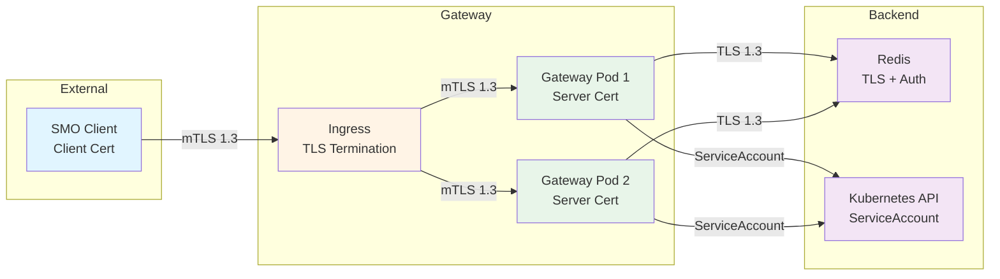
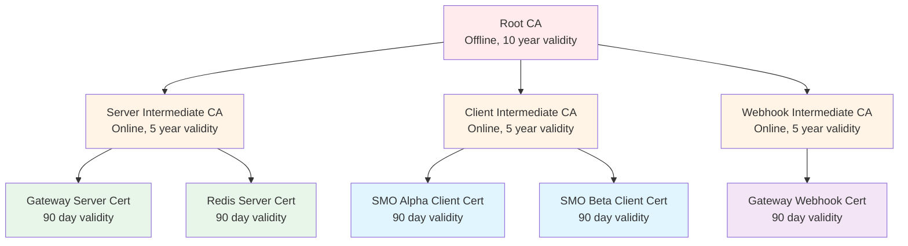

# TLS and mTLS Configuration

**Complete guide for configuring TLS 1.3 and mutual TLS in the O2-IMS Gateway.**

## Table of Contents

1. [Overview](#overview)
2. [TLS 1.3 Requirements](#tls-13-requirements)
3. [Certificate Management](#certificate-management)
4. [mTLS Configuration](#mtls-configuration)
5. [Certificate Hierarchy](#certificate-hierarchy)
6. [Vault PKI Integration](#vault-pki-integration)
7. [Certificate Rotation](#certificate-rotation)
8. [Troubleshooting](#troubleshooting)

---

## Overview

### Transport Security

The O2-IMS Gateway enforces TLS 1.3 for all external connections and supports mutual TLS (mTLS) for client authentication.

**Key Features:**
- ✅ TLS 1.3 only (TLS 1.2 and below disabled)
- ✅ Strong cipher suites enforced
- ✅ Mutual TLS for client authentication
- ✅ Automated certificate lifecycle management
- ✅ Certificate rotation with zero downtime

### Architecture


```mermaid
graph LR
    subgraph External
        SMO[SMO Client<br/>Client Cert]
    end
    subgraph Gateway
        Ingress[Ingress<br/>TLS Termination]
        Pod1[Gateway Pod 1<br/>Server Cert]
        Pod2[Gateway Pod 2<br/>Server Cert]
    end
    subgraph Backend
        Redis[Redis<br/>TLS + Auth]
        K8s[Kubernetes API<br/>ServiceAccount]
    end

    SMO -->|mTLS 1.3| Ingress
    Ingress -->|mTLS 1.3| Pod1
    Ingress -->|mTLS 1.3| Pod2
    Pod1 -->|TLS 1.3| Redis
    Pod2 -->|TLS 1.3| Redis
    Pod1 -->|ServiceAccount| K8s
    Pod2 -->|ServiceAccount| K8s

    style SMO fill:#e1f5ff
    style Ingress fill:#fff4e6
    style Pod1 fill:#e8f5e9
    style Pod2 fill:#e8f5e9
    style Redis fill:#f3e5f5
    style K8s fill:#f3e5f5
```

---

## TLS 1.3 Requirements

### Gateway Configuration

```yaml
# config/config.yaml
server:
  # TLS Settings
  tls_enabled: true
  tls_cert_file: /etc/netweave/certs/tls.crt
  tls_key_file: /etc/netweave/certs/tls.key
  tls_min_version: "1.3"  # Only TLS 1.3

  # mTLS Settings
  mtls_enabled: true
  mtls_client_ca_file: /etc/netweave/certs/client-ca.crt
  mtls_client_cert_verification: "require_and_verify"

  # Cipher Suites (TLS 1.3)
  tls_cipher_suites:
    - TLS_AES_256_GCM_SHA384
    - TLS_CHACHA20_POLY1305_SHA256
    - TLS_AES_128_GCM_SHA256
```

### Go TLS Configuration

```go
// internal/server/tls.go
package server

import (
    "crypto/tls"
    "crypto/x509"
    "fmt"
    "os"
)

func configureTLS(cfg *Config) (*tls.Config, error) {
    // Load server certificate
    cert, err := tls.LoadX509KeyPair(cfg.TLSCertFile, cfg.TLSKeyFile)
    if err != nil {
        return nil, fmt.Errorf("failed to load server certificate: %w", err)
    }

    // Load client CA for mTLS
    clientCA, err := os.ReadFile(cfg.MTLSClientCAFile)
    if err != nil {
        return nil, fmt.Errorf("failed to load client CA: %w", err)
    }

    clientCAs := x509.NewCertPool()
    if !clientCAs.AppendCertsFromPEM(clientCA) {
        return nil, fmt.Errorf("failed to parse client CA")
    }

    return &tls.Config{
        // Server certificate
        Certificates: []tls.Certificate{cert},

        // TLS 1.3 only
        MinVersion: tls.VersionTLS13,
        MaxVersion: tls.VersionTLS13,

        // Cipher suites (TLS 1.3)
        CipherSuites: []uint16{
            tls.TLS_AES_256_GCM_SHA384,
            tls.TLS_CHACHA20_POLY1305_SHA256,
            tls.TLS_AES_128_GCM_SHA256,
        },

        // mTLS settings
        ClientAuth: tls.RequireAndVerifyClientCert,
        ClientCAs:  clientCAs,

        // Security settings
        PreferServerCipherSuites: true,
        SessionTicketsDisabled:   true,
        Renegotiation:           tls.RenegotiateNever,
    }, nil
}
```

### Testing TLS Configuration

```bash
# Test TLS 1.3 enforcement
openssl s_client -connect netweave-gateway.example.com:8443 \
    -tls1_3 -showcerts

# Verify TLS 1.2 is rejected
openssl s_client -connect netweave-gateway.example.com:8443 \
    -tls1_2
# Expected: handshake failure

# Test with client certificate
openssl s_client -connect netweave-gateway.example.com:8443 \
    -cert client.crt -key client.key -CAfile ca.crt \
    -tls1_3 -showcerts
```

---

## Certificate Management

### Certificate Requirements

#### Server Certificates

```yaml
# Server certificate requirements
validity: 90 days
key_size: 4096 bits (RSA) or 256 bits (ECDSA)
signature_algorithm: SHA256
key_usage:
  - Digital Signature
  - Key Encipherment
extended_key_usage:
  - Server Authentication
subject_alternative_names:
  - DNS: netweave-gateway.example.com
  - DNS: api.netweave.local
  - DNS: o2.netweave.local
  - DNS: tmf.netweave.local
  - DNS: graphql.netweave.local
  - IP: 10.0.1.100
```

#### Client Certificates

```yaml
# Client certificate requirements
validity: 90 days
key_size: 4096 bits (RSA) or 256 bits (ECDSA)
signature_algorithm: SHA256
key_usage:
  - Digital Signature
  - Key Encipherment
extended_key_usage:
  - Client Authentication
subject:
  common_name: "operator-1.smo-alpha.o2ims.example.com"
  organization: "SMO Alpha Inc"
  organizational_unit: "smo-alpha"  # Tenant ID
subject_alternative_names:
  - DNS: operator-1.tenant.smo-alpha
  - Email: operator1@smo-alpha.example.com
```

### Development: Self-Signed Certificates

**⚠️ WARNING: For development only. Never use in production.**

```bash
#!/bin/bash
# scripts/generate-dev-certs.sh

set -e

CERTS_DIR="./certs"
mkdir -p "$CERTS_DIR"

# Generate CA certificate
openssl genrsa -out "$CERTS_DIR/ca.key" 4096
openssl req -new -x509 -days 3650 -key "$CERTS_DIR/ca.key" \
    -out "$CERTS_DIR/ca.crt" \
    -subj "/CN=O2-IMS-CA/O=Development/OU=O-Cloud"

# Generate server certificate
openssl genrsa -out "$CERTS_DIR/server.key" 4096
openssl req -new -key "$CERTS_DIR/server.key" \
    -out "$CERTS_DIR/server.csr" \
    -subj "/CN=netweave-gateway/O=Development/OU=O-Cloud"

# Sign server certificate
cat > "$CERTS_DIR/server-ext.cnf" <<EOF
subjectAltName = DNS:netweave-gateway,DNS:localhost,DNS:api.netweave.local,DNS:o2.netweave.local,DNS:tmf.netweave.local,DNS:graphql.netweave.local,IP:127.0.0.1
extendedKeyUsage = serverAuth
keyUsage = digitalSignature, keyEncipherment
EOF

openssl x509 -req -days 365 -in "$CERTS_DIR/server.csr" \
    -CA "$CERTS_DIR/ca.crt" -CAkey "$CERTS_DIR/ca.key" \
    -CAcreateserial -out "$CERTS_DIR/server.crt" \
    -extfile "$CERTS_DIR/server-ext.cnf"

# Generate client certificate
openssl genrsa -out "$CERTS_DIR/client.key" 4096
openssl req -new -key "$CERTS_DIR/client.key" \
    -out "$CERTS_DIR/client.csr" \
    -subj "/CN=operator-1.smo-alpha.o2ims.example.com/O=Development/OU=smo-alpha"

# Sign client certificate
cat > "$CERTS_DIR/client-ext.cnf" <<EOF
subjectAltName = DNS:operator-1.tenant.smo-alpha,email:operator1@smo-alpha.example.com
extendedKeyUsage = clientAuth
keyUsage = digitalSignature, keyEncipherment
EOF

openssl x509 -req -days 365 -in "$CERTS_DIR/client.csr" \
    -CA "$CERTS_DIR/ca.crt" -CAkey "$CERTS_DIR/ca.key" \
    -CAcreateserial -out "$CERTS_DIR/client.crt" \
    -extfile "$CERTS_DIR/client-ext.cnf"

# Cleanup CSRs and config files
rm "$CERTS_DIR"/*.csr "$CERTS_DIR"/*.cnf

echo "✅ Development certificates generated in $CERTS_DIR"
```

### Production: Certificate Authorities

#### Public CA (Let's Encrypt via Vault ACME)

For publicly accessible endpoints, configure Vault PKI with ACME support:

```bash
# Enable ACME on Vault PKI intermediate
vault write o2ims-pki-int/config/cluster \
    path="https://vault.example.com:8200/v1/o2ims-pki-int" \
    aia_path="https://vault.example.com:8200/v1/o2ims-pki-int"

vault write o2ims-pki-int/config/acme \
    enabled=true \
    allow_role_ext_key_usage=true

# Issue publicly-trusted certificate via Vault
vault write -format=json o2ims-pki-int/issue/server \
    common_name="netweave-gateway.example.com" \
    alt_names="api.netweave.local,o2.netweave.local,tmf.netweave.local,graphql.netweave.local" \
    ttl=2160h
```

#### Enterprise CA

For internal services, import the enterprise CA into Vault:

```bash
# Import enterprise CA into Vault PKI intermediate
vault write o2ims-pki-int/intermediate/set-signed \
    certificate=@enterprise-ca-signed.pem

# Issue server certificate signed by enterprise CA
vault write -format=json o2ims-pki-int/issue/server \
    common_name="netweave-gateway.internal.example.com" \
    alt_names="api.netweave.local,o2.netweave.local,tmf.netweave.local,graphql.netweave.local" \
    ttl=2160h
```

#### Cloud CA (AWS, GCP, Azure)

AWS Certificate Manager:
```bash
# Request certificate via AWS ACM
aws acm request-certificate \
    --domain-name netweave-gateway.example.com \
    --subject-alternative-names "api.netweave.local,o2.netweave.local,tmf.netweave.local,graphql.netweave.local" \
    --validation-method DNS \
    --region us-east-1

# Get certificate ARN and configure in ingress annotations
```

---

## mTLS Configuration

### Enabling Client Authentication

```yaml
# config/config.yaml
server:
  mtls_enabled: true
  mtls_client_ca_file: /etc/netweave/certs/client-ca.crt
  mtls_client_cert_verification: "require_and_verify"

  # Optional: CRL for revocation checking
  mtls_crl_file: /etc/netweave/certs/client-ca.crl
```

### Client Certificate Validation

```go
// internal/auth/mtls.go
package auth

import (
    "crypto/x509"
    "fmt"
    "strings"
)

type MTLSAuthenticator struct {
    trustedCAs *x509.CertPool
}

func (a *MTLSAuthenticator) Authenticate(cert *x509.Certificate) (*AuthContext, error) {
    // 1. Verify certificate chain
    opts := x509.VerifyOptions{
        Roots:     a.trustedCAs,
        KeyUsages: []x509.ExtKeyUsage{x509.ExtKeyUsageClientAuth},
    }

    if _, err := cert.Verify(opts); err != nil {
        return nil, fmt.Errorf("certificate verification failed: %w", err)
    }

    // 2. Extract tenant ID from CN
    // Format: "user-id.tenant-id.o2ims.example.com"
    cn := cert.Subject.CommonName
    parts := strings.Split(cn, ".")

    if len(parts) < 2 {
        return nil, fmt.Errorf("invalid CN format: %s", cn)
    }

    userID := parts[0]
    tenantID := parts[1]

    // 3. Extract additional claims
    claims := map[string]interface{}{
        "email":        extractEmail(cert),
        "organization": extractOrganization(cert),
    }

    return &AuthContext{
        UserID:   userID,
        TenantID: tenantID,
        Method:   "mtls",
        Claims:   claims,
    }, nil
}
```

### Testing mTLS

```bash
# Test with valid client certificate
curl -X GET https://netweave-gateway.example.com/o2ims-infrastructureInventory/v1/resourcePools \
    --cert client.crt --key client.key --cacert ca.crt

# Test without client certificate (should fail)
curl -X GET https://netweave-gateway.example.com/o2ims-infrastructureInventory/v1/resourcePools \
    --cacert ca.crt
# Expected: 401 Unauthorized

# Test with invalid client certificate
curl -X GET https://netweave-gateway.example.com/o2ims-infrastructureInventory/v1/resourcePools \
    --cert invalid-client.crt --key invalid-client.key --cacert ca.crt
# Expected: TLS handshake failure
```

---

## Certificate Hierarchy

### Multi-Tier PKI


```mermaid
graph TB
    Root[Root CA<br/>Offline, 10 year validity]

    ServerInt[Server Intermediate CA<br/>Online, 5 year validity]
    ClientInt[Client Intermediate CA<br/>Online, 5 year validity]
    WebhookInt[Webhook Intermediate CA<br/>Online, 5 year validity]

    Server1[Gateway Server Cert<br/>90 day validity]
    Server2[Redis Server Cert<br/>90 day validity]

    Client1[SMO Alpha Client Cert<br/>90 day validity]
    Client2[SMO Beta Client Cert<br/>90 day validity]

    Webhook1[Gateway Webhook Cert<br/>90 day validity]

    Root --> ServerInt
    Root --> ClientInt
    Root --> WebhookInt

    ServerInt --> Server1
    ServerInt --> Server2

    ClientInt --> Client1
    ClientInt --> Client2

    WebhookInt --> Webhook1

    style Root fill:#ffebee
    style ServerInt fill:#fff4e6
    style ClientInt fill:#fff4e6
    style WebhookInt fill:#fff4e6
    style Server1 fill:#e8f5e9
    style Server2 fill:#e8f5e9
    style Client1 fill:#e1f5ff
    style Client2 fill:#e1f5ff
    style Webhook1 fill:#f3e5f5
```

### Purpose Separation

| CA Type | Purpose | Validity | Storage |
|---------|---------|----------|---------|
| **Root CA** | Sign intermediate CAs | 10 years | Offline, HSM |
| **Server Intermediate** | Sign server certificates | 5 years | Online, Vault PKI |
| **Client Intermediate** | Sign client certificates | 5 years | Online, Vault PKI |
| **Webhook Intermediate** | Sign webhook client certs | 5 years | Online, Vault PKI |

---

## Vault PKI Integration

### Prerequisites

```bash
# Vault deployed and accessible
export VAULT_ADDR=https://vault.example.com:8200
export VAULT_TOKEN=<admin-token>
vault status
```

### PKI Engine Setup

See [Certificate Management](certificate-management.md) for detailed Vault PKI setup instructions.

```bash
# Enable PKI engine for gateway certificates
vault secrets enable -path=o2ims-pki pki
vault secrets tune -max-lease-ttl=87600h o2ims-pki

# Enable intermediate PKI engine
vault secrets enable -path=o2ims-pki-int pki
vault secrets tune -max-lease-ttl=43800h o2ims-pki-int
```

### Gateway Server Certificate

```bash
# Issue server certificate via Vault PKI
vault write -format=json o2ims-pki-int/issue/server \
    common_name="netweave-gateway.example.com" \
    alt_names="api.netweave.local,o2.netweave.local,tmf.netweave.local,graphql.netweave.local,netweave-gateway.netweave.svc,netweave-gateway.netweave.svc.cluster.local" \
    ip_sans="10.0.1.100" \
    ttl=2160h \
    | jq -r '.data' > server-cert.json

# Extract certificate and key
jq -r '.certificate' server-cert.json > server.crt
jq -r '.private_key' server-cert.json > server.key
jq -r '.ca_chain[]' server-cert.json > ca-chain.crt

# Store in Kubernetes secret
kubectl create secret tls netweave-gateway-tls \
    --cert=server.crt \
    --key=server.key \
    -n netweave
```

### Client Certificate (Per Tenant)

```bash
# Issue client certificate for SMO operator via Vault PKI
vault write -format=json o2ims-pki-int/issue/client \
    common_name="operator-1.smo-alpha.o2ims.example.com" \
    alt_names="operator-1.tenant.smo-alpha" \
    ttl=2160h \
    | jq -r '.data' > client-cert.json

# Extract certificate and key
jq -r '.certificate' client-cert.json > operator-1.crt
jq -r '.private_key' client-cert.json > operator-1.key
jq -r '.ca_chain[]' client-cert.json > ca-chain.crt
```

---

## Certificate Rotation

### Automated Rotation

Vault PKI handles rotation via short-lived certificates and automatic renewal:

```yaml
# config.yaml - Gateway certificate renewal configuration
certificate_renewal:
  enabled: true
  renew_before_expiry: 168h  # Renew 7 days before expiration
  check_interval: 1h
  vault_role: "server"
```

```bash
# Vault PKI renewal workflow:
# 1. Gateway monitors certificate expiry via check_interval
# 2. When renew_before_expiry threshold reached, requests new cert from Vault
# 3. New certificate is loaded via hot-reload (no restart needed)
# 4. Old certificate remains valid until expiry

# Manual renewal via Vault CLI
vault write -format=json o2ims-pki-int/issue/server \
    common_name="netweave-gateway.example.com" \
    alt_names="api.netweave.local,o2.netweave.local,tmf.netweave.local,graphql.netweave.local" \
    ttl=2160h \
    | jq -r '.data' > server-cert.json
```

### Zero-Downtime Rotation

```go
// internal/server/server.go
package server

import (
    "crypto/tls"
    "sync/atomic"
    "time"
)

type Server struct {
    tlsConfig atomic.Value  // *tls.Config
    certPath  string
    keyPath   string
}

// WatchCertificates monitors certificate files and reloads on change
func (s *Server) WatchCertificates(ctx context.Context) {
    ticker := time.NewTicker(1 * time.Minute)
    defer ticker.Stop()

    for {
        select {
        case <-ctx.Done():
            return
        case <-ticker.C:
            s.reloadCertificates()
        }
    }
}

func (s *Server) reloadCertificates() {
    cert, err := tls.LoadX509KeyPair(s.certPath, s.keyPath)
    if err != nil {
        log.Error("failed to reload certificates", "error", err)
        return
    }

    config := s.tlsConfig.Load().(*tls.Config).Clone()
    config.Certificates = []tls.Certificate{cert}

    s.tlsConfig.Store(config)
    log.Info("certificates reloaded successfully")
}
```

### Manual Rotation

For emergency rotation:

```bash
# Issue new certificate from Vault PKI
vault write -format=json o2ims-pki-int/issue/server \
    common_name="netweave-gateway.example.com" \
    alt_names="api.netweave.local,o2.netweave.local,tmf.netweave.local,graphql.netweave.local" \
    ttl=2160h \
    | jq -r '.data' > server-cert.json

# Extract and update Kubernetes secret
jq -r '.certificate' server-cert.json > server.crt
jq -r '.private_key' server-cert.json > server.key
kubectl create secret tls netweave-gateway-tls \
    --cert=server.crt --key=server.key \
    -n netweave --dry-run=client -o yaml | kubectl apply -f -

# Verify new certificate
kubectl get secret netweave-gateway-tls -n netweave -o jsonpath='{.data.tls\.crt}' | \
    base64 -d | openssl x509 -noout -text
```

---

## Troubleshooting

### Common Issues

#### 1. TLS Handshake Failures

```bash
# Enable verbose OpenSSL output
openssl s_client -connect netweave-gateway.example.com:8443 \
    -tls1_3 -showcerts -debug

# Check certificate chain
openssl s_client -connect netweave-gateway.example.com:8443 \
    -showcerts | openssl x509 -noout -text
```

#### 2. Client Certificate Rejected

```bash
# Verify client certificate is signed by trusted CA
openssl verify -CAfile ca.crt client.crt

# Check certificate expiration
openssl x509 -in client.crt -noout -dates

# Verify key usage
openssl x509 -in client.crt -noout -text | grep -A 1 "X509v3 Extended Key Usage"
```

#### 3. Certificate Not Renewed

```bash
# Check Vault PKI lease status
vault list o2ims-pki-int/certs

# Check gateway certificate renewal logs
kubectl logs -n netweave deploy/netweave-gateway | grep -i "certificate\|renewal\|tls"

# Verify Vault PKI role configuration
vault read o2ims-pki-int/roles/server

# Check Vault token permissions
vault token lookup
```

#### 4. CN/SAN Mismatch

```bash
# Check certificate SANs
openssl x509 -in server.crt -noout -text | grep -A 1 "Subject Alternative Name"

# Test with specific hostname
openssl s_client -connect netweave-gateway.example.com:8443 \
    -servername netweave-gateway.example.com
```

### Debugging Commands

```bash
# Test TLS connection
curl -v https://netweave-gateway.example.com/healthz

# Check certificate details
echo | openssl s_client -connect netweave-gateway.example.com:8443 2>/dev/null | \
    openssl x509 -noout -text

# Verify certificate chain
echo | openssl s_client -showcerts -connect netweave-gateway.example.com:8443 2>/dev/null

# Check cipher suites
nmap --script ssl-enum-ciphers -p 8443 netweave-gateway.example.com

# Monitor Vault PKI certificate leases
vault list o2ims-pki-int/certs
```

---

**Last Updated:** 2026-01-12
**Version:** 1.0
