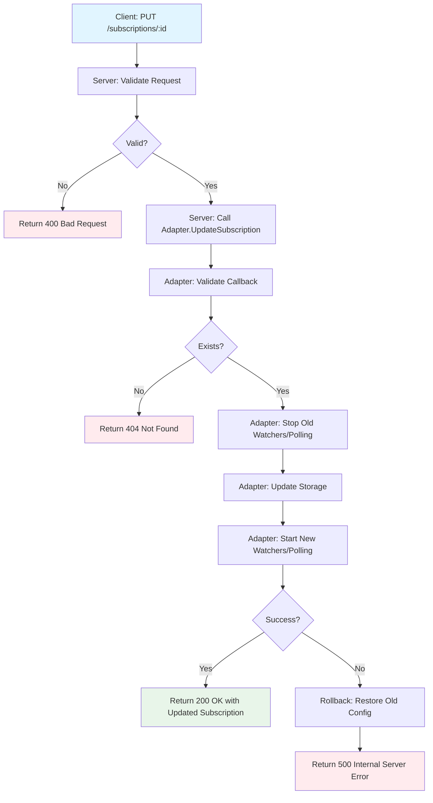

# Subscription UPDATE Operation - Behavior and Error Handling

This document describes the behavior, error scenarios, and rollback mechanisms for the subscription UPDATE operation (`PUT /subscriptions/{id}`).

## Overview

The UPDATE operation allows modifying an existing subscription's:
- **Callback URL**: Where webhook notifications are sent
- **Consumer Subscription ID**: Client-provided identifier
- **Filter**: Event filtering criteria (resource pools, types, resources)

## Operation Flow



## Validation Rules

### Server-Level Validation (HTTP Input)

1. **Request Body**:
   - Must be valid JSON
   - Must conform to Subscription schema

2. **Callback URL**:
   - **Required**: Cannot be empty
   - **Format**: Must be valid URL (parseable by `url.Parse`)
   - **Scheme**: Must be `http` or `https` (not `ftp`, `file`, etc.)
   - **Host**: Must have valid host component

   **Examples**:
   ```json
   // ✅ Valid
   {"callback": "https://smo.example.com/notify"}
   {"callback": "http://10.0.0.5:8080/webhooks"}

   // ❌ Invalid - empty
   {"callback": ""}

   // ❌ Invalid - not a URL
   {"callback": "not-a-url"}

   // ❌ Invalid - unsupported scheme
   {"callback": "ftp://example.com/webhook"}
   ```

3. **Filter** (Optional):
   - `null` = Subscribe to all events
   - `{}` = Subscribe to all events (empty filter)
   - Partial filters supported (e.g., only `resourcePoolId`)

### Adapter-Level Validation (Defense-in-Depth)

Adapters perform additional validation for programmatic calls:
- Callback URL non-empty check
- Subscription existence check

This dual-layer validation ensures:
- **Server** validates external HTTP requests
- **Adapter** validates internal programmatic calls

## Error Scenarios

### 1. Invalid Request Body (400 Bad Request)

**Trigger**: Malformed JSON or invalid fields

**Server Response**:
```http
HTTP/1.1 400 Bad Request
Content-Type: application/json

{
  "error": "BadRequest",
  "message": "Invalid request body: unexpected end of JSON input",
  "code": 400
}
```

**Client Action**: Fix JSON syntax, ensure all fields are valid

---

### 2. Empty Callback URL (400 Bad Request)

**Trigger**: `callback` field is empty string

**Server Response**:
```http
HTTP/1.1 400 Bad Request
Content-Type: application/json

{
  "error": "BadRequest",
  "message": "callback URL is required",
  "code": 400
}
```

**Client Action**: Provide valid callback URL

---

### 3. Invalid Callback URL Format (400 Bad Request)

**Trigger**: Callback is not a valid URL

**Server Response**:
```http
HTTP/1.1 400 Bad Request
Content-Type: application/json

{
  "error": "BadRequest",
  "message": "invalid callback URL format: parse \"not-a-url\": invalid URI for request",
  "code": 400
}
```

**Client Action**: Provide properly formatted URL

---

### 4. Unsupported URL Scheme (400 Bad Request)

**Trigger**: Callback uses non-HTTP(S) scheme

**Server Response**:
```http
HTTP/1.1 400 Bad Request
Content-Type: application/json

{
  "error": "BadRequest",
  "message": "callback URL must use http or https scheme",
  "code": 400
}
```

**Client Action**: Use `http://` or `https://` scheme only

---

### 5. Subscription Not Found (404 Not Found)

**Trigger**: Subscription ID doesn't exist

**Server Response**:
```http
HTTP/1.1 404 Not Found
Content-Type: application/json

{
  "error": "NotFound",
  "message": "Subscription not found: sub-nonexistent",
  "code": 404
}
```

**Client Action**: Verify subscription ID, create new subscription if needed

---

### 6. Polling/Watcher Restart Failure (500 Internal Server Error)

**Trigger**: Adapter fails to start new watchers after update

**Adapter Behavior**:
1. Stop old watchers/polling ✅
2. Update subscription in storage ✅
3. Start new watchers/polling ❌ **FAILS**
4. **Rollback**: Restore old subscription configuration
5. **Rollback**: Attempt to restart old watchers (best-effort)

**Server Response**:
```http
HTTP/1.1 500 Internal Server Error
Content-Type: application/json

{
  "error": "InternalServerError",
  "message": "failed to restart polling: <error details>",
  "code": 500
}
```

**Client Action**:
- Retry the UPDATE request
- Check gateway logs for root cause
- Verify subscription is still in original state (GET /subscriptions/:id)

**Recovery**: Subscription remains in original state (rollback successful)

---

## Adapter-Specific Behavior

### Kubernetes Adapter

**Storage**: Redis
**Notification Mechanism**: Kubernetes Informers/Watchers

**Update Flow**:
1. Validate callback URL
2. Get existing subscription from Redis
3. Convert to storage format
4. Update in Redis
5. Controller detects change via Redis watch
6. Controller restarts Kubernetes informers with new filter

**Rollback**: If Redis update fails, return error (no rollback needed - atomic operation)

**Race Condition Prevention**: None required (Redis provides atomic updates)

---

### OpenStack Adapter

**Storage**: In-memory map with `sync.RWMutex`
**Notification Mechanism**: Polling goroutines

**Update Flow**:
1. Validate callback URL
2. Acquire write lock
3. Check subscription exists
4. Create updated subscription object
5. **Stop old polling goroutine** (release lock temporarily)
6. **Re-acquire lock** (prevents race conditions)
7. Update in memory
8. Start new polling goroutine
9. Release lock

**Rollback**: If polling start fails:
1. Restore old subscription in memory
2. Attempt to restart old polling (best-effort)

**Race Condition Prevention**:
- Hold lock from update through successful polling start
- Prevents concurrent modifications during critical section

**Code Location**: `internal/adapters/openstack/subscriptions.go:185-187`

---

### AWS, Azure, GCP, VMware Adapters

**Storage**: In-memory map with `sync.Mutex` or `sync.RWMutex`
**Notification Mechanism**: Cloud-provider event streams (SNS, Event Grid, Pub/Sub, vCenter Events)

**Update Flow**:
1. Validate callback URL
2. Acquire lock
3. Check subscription exists
4. Update subscription in memory
5. Release lock

**Rollback**: N/A (in-memory update is atomic)

**Note**: These adapters don't start/stop watchers on update - subscriptions are passive filters on existing event streams.

---

## Filter Update Behavior

### Removing Filter (Subscribe to All Events)

**Request**:
```json
{
  "callback": "https://smo.example.com/notify",
  "filter": null
}
```

**Result**: Subscription receives notifications for ALL resource changes (no filtering)

---

### Empty Filter (Same as null)

**Request**:
```json
{
  "callback": "https://smo.example.com/notify",
  "filter": {}
}
```

**Result**: Empty filter means no filtering criteria - receives ALL events

---

### Partial Filter

**Request**:
```json
{
  "callback": "https://smo.example.com/notify",
  "filter": {
    "resourcePoolId": "pool-compute"
  }
}
```

**Result**: Receives events only for resources in `pool-compute` (any type, any specific resource)

---

### Complete Filter

**Request**:
```json
{
  "callback": "https://smo.example.com/notify",
  "filter": {
    "resourcePoolId": "pool-compute",
    "resourceTypeId": "machine",
    "resourceId": "res-123"
  }
}
```

**Result**: Receives events only for `res-123` of type `machine` in `pool-compute`

---

## Idempotency

**Question**: Is UPDATE idempotent?

**Answer**: **Yes**, with caveats:

1. **Same Request Repeated**: Safe to repeat - subscription ends up in desired state
2. **Concurrent UPDATEs**: **Not safe** - last write wins, may lose updates
3. **Recommendation**: Implement optimistic locking with `If-Match` header (future enhancement)

**Example - Safe Retry**:
```bash
# Initial UPDATE
curl -X PUT /subscriptions/sub-123 \
  -d '{"callback": "https://new-url.com"}'
# Response: 500 Internal Server Error

# Retry (safe - idempotent)
curl -X PUT /subscriptions/sub-123 \
  -d '{"callback": "https://new-url.com"}'
# Response: 200 OK
```

**Example - Unsafe Concurrent Updates**:
```bash
# Client A
curl -X PUT /subscriptions/sub-123 \
  -d '{"callback": "https://url-a.com"}'

# Client B (concurrent)
curl -X PUT /subscriptions/sub-123 \
  -d '{"callback": "https://url-b.com"}'

# Result: Last write wins (url-b), url-a is lost
```

---

## Testing Recommendations

### Unit Tests

**Coverage**: All error scenarios, validation rules

**Example Test Cases**:
- ✅ Update callback successfully
- ✅ Update filter successfully
- ✅ Remove filter (set to null)
- ✅ Empty callback returns 400
- ✅ Invalid URL format returns 400
- ✅ Unsupported scheme returns 400
- ✅ Subscription not found returns 404

**Location**: `internal/server/subscription_update_test.go`

---

### Integration Tests

**Coverage**: End-to-end with real adapters and storage

**Example Test Cases**:
- Create subscription → Update callback → Verify notifications sent to new URL
- Create subscription → Update filter → Verify only filtered events received
- Update with invalid callback → Verify rollback preserves original config
- Concurrent updates → Verify last-write-wins behavior

**Recommendation**: Use testcontainers for Redis, MinIO for realistic testing

---

### Load Tests

**Coverage**: Concurrent updates, high-throughput scenarios

**Example Scenarios**:
- 100 concurrent UPDATE requests to same subscription
- 1000 subscriptions updated simultaneously
- Rapid filter changes (10 updates/second)

**Expected Behavior**:
- No data corruption
- Consistent final state
- Graceful error handling under load

---

## Security Considerations

### SSRF Protection (Future Enhancement)

**Risk**: Malicious callback URLs could target internal services

**Example Attack**:
```json
{
  "callback": "http://localhost:6379/admin"
}
```

**Mitigation** (not yet implemented):
1. Blocklist internal IPs (127.0.0.0/8, 10.0.0.0/8, 192.168.0.0/16)
2. Blocklist cloud metadata endpoints (169.254.169.254)
3. Implement callback URL allowlist per tenant

**GitHub Issue**: Create issue for SSRF protection

---

### Callback Authentication

**Current**: No authentication required for callback URLs
**Risk**: Anyone with callback URL can send fake notifications

**Mitigation**: Webhook signature verification (HMAC-SHA256)

**Documentation**: See [Webhook Security Guide](webhook-security.md)

---

## Monitoring and Metrics

**Metrics Recorded**:
- `o2ims_adapter_operations_total{adapter="kubernetes",operation="UpdateSubscription",status="success|error"}`
- `o2ims_adapter_operation_duration_seconds{adapter="kubernetes",operation="UpdateSubscription"}`

**Logs**:
- `subscription updated` (INFO) - Successful update
- `failed to restart polling` (ERROR) - Rollback triggered
- `failed to rollback to old subscription` (ERROR) - Critical failure

**Alerting Recommendations**:
- Alert on `UpdateSubscription` error rate > 5%
- Alert on rollback failures (critical - data inconsistency)

---

## References

- [O-RAN O2 IMS Specification](https://specifications.o-ran.org/)
- [Webhook Security Guide](webhook-security.md)
- [API Mapping Documentation](api-mapping.md)
- [OpenAPI Specification](../api/openapi/o2ims.yaml)
