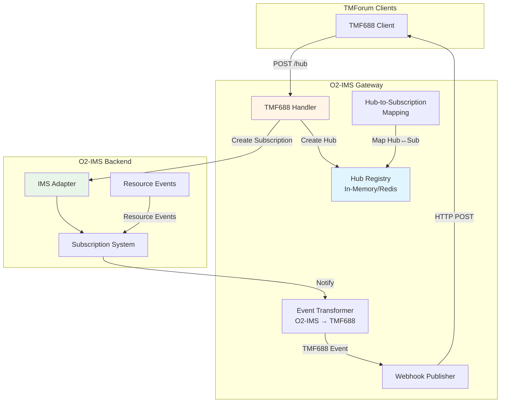

# TMF688 Event Management Integration Plan

## Current Status

**Handlers:** ✅ Implemented (basic CRUD operations)
**Routes:** ✅ Registered
**Integration:** ⚠️ Not connected to O2-IMS subscription system

## Architecture Overview



## Implementation Requirements

### 1. Hub Registry Storage

**Purpose:** Store TMF688 hub registrations with mapping to O2-IMS subscriptions

**Data Structure:**
```go
type HubRegistration struct {
    HubID                  string    // TMF688 hub ID
    Callback               string    // Webhook URL
    Query                  string    // Event filter query
    SubscriptionID         string    // O2-IMS subscription ID
    CreatedAt              time.Time
    Extensions             map[string]interface{}
}
```

**Storage Options:**
- In-memory map (development/testing)
- Redis (production - shared across gateway pods)
- Database (optional for persistence)

### 2. Query Parsing and Filter Mapping

**TMF688 Query Format Examples:**
```
eventType=ResourceCreationNotification
eventType=ResourceStateChangeNotification
resourceId=pool-123
eventType=ServiceOrderStateChangeEvent&state=completed
```

**Mapping to O2-IMS SubscriptionFilter:**
```go
func ParseTMF688Query(query string) (*adapter.SubscriptionFilter, error) {
    // Parse query string (key=value pairs)
    // Map to O2-IMS filter fields:
    // - resourceId → ResourceID
    // - resourcePoolId → ResourcePoolID
    // - resourceTypeId → ResourceTypeID
}
```

### 3. Hub Registration Handler Enhancement

**File:** `internal/handlers/tmforum_handler.go:705-725`

**Current Implementation:**
```go
func (h *TMForumHandler) RegisterTMF688Hub(c *gin.Context) {
    // Creates hub object without O2-IMS integration
    hub := &models.TMF688Hub{
        ID:       fmt.Sprintf("hub-%d", len(hubReq.Callback)),
        Callback: hubReq.Callback,
        Query:    hubReq.Query,
        AtType:   "EventSubscriptionInput",
    }
    c.JSON(http.StatusCreated, hub)
}
```

**Enhanced Implementation:**
```go
func (h *TMForumHandler) RegisterTMF688Hub(c *gin.Context) {
    ctx := c.Request.Context()

    var hubReq models.TMF688HubCreate
    if err := c.ShouldBindJSON(&hubReq); err != nil {
        c.JSON(http.StatusBadRequest, gin.H{"error": "BadRequest", "message": err.Error()})
        return
    }

    // Parse TMF688 query to O2-IMS filter
    filter, err := ParseTMF688Query(hubReq.Query)
    if err != nil {
        c.JSON(http.StatusBadRequest, gin.H{"error": "BadRequest", "message": "Invalid query format"})
        return
    }

    // Create O2-IMS subscription
    subscription := &adapter.Subscription{
        Callback:               hubReq.Callback,
        ConsumerSubscriptionID: "", // Will be set to hub ID after creation
        Filter:                 filter,
    }

    createdSub, err := h.adapter.CreateSubscription(ctx, subscription)
    if err != nil {
        h.logger.Error("failed to create O2-IMS subscription", zap.Error(err))
        c.JSON(http.StatusInternalServerError, gin.H{"error": "InternalError", "message": "Failed to create subscription"})
        return
    }

    // Create hub with generated ID
    hubID := uuid.New().String()
    hub := &models.TMF688Hub{
        ID:       hubID,
        Callback: hubReq.Callback,
        Query:    hubReq.Query,
        AtType:   "EventSubscriptionInput",
    }

    // Store hub registration with subscription mapping
    registration := &HubRegistration{
        HubID:          hubID,
        Callback:       hubReq.Callback,
        Query:          hubReq.Query,
        SubscriptionID: createdSub.SubscriptionID,
        CreatedAt:      time.Now(),
    }

    if err := h.hubStore.Save(ctx, registration); err != nil {
        h.logger.Error("failed to save hub registration", zap.Error(err))
        // Cleanup O2-IMS subscription
        _ = h.adapter.DeleteSubscription(ctx, createdSub.SubscriptionID)
        c.JSON(http.StatusInternalServerError, gin.H{"error": "InternalError", "message": "Failed to save hub"})
        return
    }

    c.JSON(http.StatusCreated, hub)
}
```

### 4. Hub Unregistration Handler Enhancement

**File:** `internal/handlers/tmforum_handler.go:729-738`

**Enhanced Implementation:**
```go
func (h *TMForumHandler) UnregisterTMF688Hub(c *gin.Context) {
    ctx := c.Request.Context()
    hubID := c.Param("id")

    // Get hub registration
    registration, err := h.hubStore.Get(ctx, hubID)
    if err != nil {
        c.JSON(http.StatusNotFound, gin.H{"error": "NotFound", "message": "Hub not found"})
        return
    }

    // Delete O2-IMS subscription
    if err := h.adapter.DeleteSubscription(ctx, registration.SubscriptionID); err != nil {
        h.logger.Warn("failed to delete O2-IMS subscription",
            zap.String("subscriptionId", registration.SubscriptionID),
            zap.Error(err))
    }

    // Delete hub registration
    if err := h.hubStore.Delete(ctx, hubID); err != nil {
        h.logger.Error("failed to delete hub registration", zap.Error(err))
        c.JSON(http.StatusInternalServerError, gin.H{"error": "InternalError", "message": "Failed to delete hub"})
        return
    }

    h.logger.Info("unregistered event hub",
        zap.String("hubId", hubID),
        zap.String("subscriptionId", registration.SubscriptionID))

    c.Status(http.StatusNoContent)
}
```

### 5. Event Transformation

**File:** `internal/handlers/tmforum_transform.go` (new section)

**Transform O2-IMS events to TMF688 events:**
```go
// TransformResourceEventToTMF688 converts an O2-IMS resource event to TMF688 format
func TransformResourceEventToTMF688(event *adapter.ResourceEvent, baseURL string) *models.TMF688Event {
    eventType := mapResourceEventToTMF688Type(event.EventType)

    tmfEvent := &models.TMF688Event{
        ID:           uuid.New().String(),
        Href:         fmt.Sprintf("%s/tmf-api/eventManagement/v4/event/%s", baseURL, event.ID),
        EventId:      event.ID,
        EventType:    eventType,
        EventTime:    &event.Timestamp,
        Description:  fmt.Sprintf("Resource %s event", event.EventType),
        TimeOccurred: &event.Timestamp,
        Domain:       "O2-IMS",
        Event: &EventPayload{
            Resource: TransformResourceToTMF639Resource(event.Resource, baseURL),
        },
        AtType: "Event",
    }

    return tmfEvent
}

// mapResourceEventToTMF688Type maps O2-IMS event types to TMF688 event types
func mapResourceEventToTMF688Type(eventType string) string {
    switch eventType {
    case "ResourceCreated":
        return "ResourceCreationNotification"
    case "ResourceUpdated":
        return "ResourceStateChangeNotification"
    case "ResourceDeleted":
        return "ResourceRemoveNotification"
    default:
        return "ResourceAttributeValueChangeNotification"
    }
}
```

### 6. Webhook Publishing

**File:** `internal/workers/webhook_publisher.go` (new file)

**Purpose:** Send TMF688 events to registered hub callbacks

```go
package workers

import (
    "bytes"
    "context"
    "encoding/json"
    "net/http"
    "time"

    "github.com/piwi3910/netweave/internal/models"
    "go.uber.org/zap"
)

type WebhookPublisher struct {
    client *http.Client
    logger *zap.Logger
}

func NewWebhookPublisher(logger *zap.Logger) *WebhookPublisher {
    return &WebhookPublisher{
        client: &http.Client{
            Timeout: 10 * time.Second,
        },
        logger: logger,
    }
}

func (w *WebhookPublisher) PublishEvent(ctx context.Context, callback string, event *models.TMF688Event) error {
    body, err := json.Marshal(event)
    if err != nil {
        return fmt.Errorf("failed to marshal event: %w", err)
    }

    req, err := http.NewRequestWithContext(ctx, "POST", callback, bytes.NewBuffer(body))
    if err != nil {
        return fmt.Errorf("failed to create request: %w", err)
    }

    req.Header.Set("Content-Type", "application/json")

    resp, err := w.client.Do(req)
    if err != nil {
        return fmt.Errorf("failed to send webhook: %w", err)
    }
    defer resp.Body.Close()

    if resp.StatusCode >= 400 {
        return fmt.Errorf("webhook returned error status: %d", resp.StatusCode)
    }

    w.logger.Info("published TMF688 event",
        zap.String("callback", callback),
        zap.String("eventId", event.EventId),
        zap.String("eventType", event.EventType),
        zap.Int("statusCode", resp.StatusCode))

    return nil
}
```

### 7. Event Listener Integration

**File:** `internal/server/server.go` (integration point)

**Connect O2-IMS subscription callbacks to TMF688 event publishing:**

```go
// In Server.SetupDMS() or similar initialization
func (s *Server) setupTMF688EventListener() {
    // Register callback handler for O2-IMS subscription events
    // This would be called by the O2-IMS adapter when events occur

    s.adapter.RegisterEventHandler(func(event *adapter.ResourceEvent) {
        // Get all hubs that should receive this event
        hubs, err := s.hubStore.ListAll(context.Background())
        if err != nil {
            s.logger.Error("failed to list hubs", zap.Error(err))
            return
        }

        // Transform to TMF688 format
        tmfEvent := TransformResourceEventToTMF688(event, s.baseURL)

        // Publish to all matching hubs
        for _, hub := range hubs {
            if shouldPublishToHub(event, hub) {
                go func(h *HubRegistration) {
                    ctx, cancel := context.WithTimeout(context.Background(), 30*time.Second)
                    defer cancel()

                    if err := s.webhookPublisher.PublishEvent(ctx, h.Callback, tmfEvent); err != nil {
                        s.logger.Error("failed to publish event to hub",
                            zap.String("hubId", h.HubID),
                            zap.String("callback", h.Callback),
                            zap.Error(err))
                    }
                }(hub)
            }
        }
    })
}
```

## Implementation Steps

### Phase 1: Storage Layer (Priority: High)
1. Create `HubRegistration` struct
2. Implement `HubStore` interface (in-memory)
3. Add `HubStore` to `TMForumHandler`

### Phase 2: Query Parsing (Priority: High)
1. Implement `ParseTMF688Query()` function
2. Add unit tests for query parsing
3. Handle edge cases (invalid queries, unsupported filters)

### Phase 3: Handler Enhancement (Priority: High)
1. Update `RegisterTMF688Hub()` to create O2-IMS subscriptions
2. Update `UnregisterTMF688Hub()` to delete O2-IMS subscriptions
3. Add error handling and cleanup logic

### Phase 4: Event Transformation (Priority: Medium)
1. Implement `TransformResourceEventToTMF688()`
2. Add event type mapping
3. Create unit tests for transformations

### Phase 5: Webhook Publishing (Priority: Medium)
1. Create `WebhookPublisher` component
2. Implement retry logic with exponential backoff
3. Add webhook delivery metrics

### Phase 6: Event Listener Integration (Priority: Medium)
1. Connect O2-IMS event system to TMF688 publishers
2. Implement event filtering logic
3. Add integration tests

### Phase 7: Redis Storage (Priority: Low)
1. Implement Redis-backed `HubStore`
2. Support multi-pod deployments
3. Add persistence for hub registrations

## Testing Strategy

### Unit Tests
- Query parsing logic
- Event transformation functions
- Hub store operations

### Integration Tests
- Hub registration → O2-IMS subscription creation
- Hub unregistration → O2-IMS subscription deletion
- Event filtering and matching

### E2E Tests
- Register hub → trigger resource event → verify webhook delivery
- Multiple hubs with different filters
- Hub unregistration stops events

## Dependencies

**Required:**
- O2-IMS adapter with working subscription system
- UUID generation for hub IDs
- HTTP client for webhook delivery

**Optional:**
- Redis for hub storage (production)
- Metrics for webhook delivery
- Dead letter queue for failed deliveries

## Configuration

**Environment Variables:**
```bash
# Webhook delivery settings
WEBHOOK_TIMEOUT=10s
WEBHOOK_MAX_RETRIES=3
WEBHOOK_RETRY_DELAY=1s

# Hub storage
HUB_STORE_TYPE=memory  # memory, redis
REDIS_HUB_KEY_PREFIX=tmf688:hub:
```

## Risks and Mitigations

| Risk | Impact | Mitigation |
|------|--------|------------|
| Webhook delivery failures | Events lost | Implement retry with backoff |
| High event volume | Performance | Async publishing with queue |
| Hub storage loss | Subscriptions lost | Use Redis for persistence |
| Query parsing complexity | Bugs | Extensive unit tests |

## Success Criteria

1. ✅ Hub registration creates O2-IMS subscription
2. ✅ Hub unregistration deletes O2-IMS subscription
3. ✅ O2-IMS events transformed to TMF688 format
4. ✅ Events delivered to registered webhooks
5. ✅ Query filters work correctly
6. ✅ Integration tests pass
7. ✅ Documentation updated

## Next Actions

1. Review this implementation plan
2. Get approval for architecture approach
3. Create GitHub issues for each phase
4. Start with Phase 1 (Storage Layer)
5. Implement incrementally with tests

---

**Status:** Ready for implementation
**Estimated Effort:** 3-5 days (full implementation)
**Priority:** Medium (core TMForum APIs already functional)
