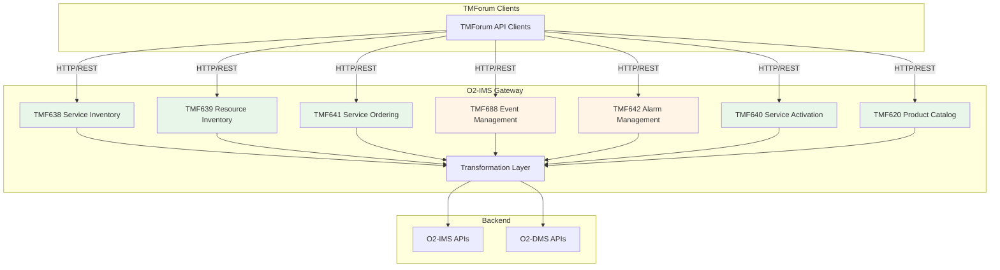

# TMForum API Implementation Status

This document tracks the implementation status of TMForum Open APIs in the O2-IMS Gateway.

## Overview

The O2-IMS Gateway provides TMForum API compatibility by implementing a translation layer between TMForum APIs and the native O2-IMS/O2-DMS interfaces. This allows TMForum-compliant systems to interact with O-RAN infrastructure.

## Implementation Architecture



Legend:
- 🟢 Green: Fully implemented (models, handlers, transformations, routes)
- 🟡 Yellow: Partially implemented (basic handlers, needs integration work)
- 🔴 Red: Models only (needs handlers and routes)

## API Implementation Status

### TMF638 - Service Inventory Management v4 🟢

**Status:** ✅ Fully Implemented

**Base Path:** `/tmf-api/serviceInventoryManagement/v4`

**Endpoints:**
- `GET /service` - List all services
- `GET /service/:id` - Get service by ID
- `POST /service` - Create new service
- `PATCH /service/:id` - Update service
- `DELETE /service/:id` - Delete service

**Mapping:**
- TMF638 Service ↔ O2-DMS Deployment
- Service characteristics ↔ Deployment extensions
- Service state ↔ Deployment status

**Files:**
- Models: `internal/models/tmforum.go`
- Handlers: `internal/handlers/tmforum_handler.go`
- Transformations: `internal/handlers/tmforum_transform.go`
- Routes: `internal/server/tmforum_routes.go`
- Tests: `tests/integration/o2ims/tmforum_test.go`

**Test Coverage:** ✅ Integration tests included

---

### TMF639 - Resource Inventory Management v4 🟢

**Status:** ✅ Fully Implemented

**Base Path:** `/tmf-api/resourceInventoryManagement/v4`

**Endpoints:**
- `GET /resource` - List all resources (pools and individual)
- `GET /resource/:id` - Get resource by ID
- `POST /resource` - Create new resource
- `PATCH /resource/:id` - Update resource
- `DELETE /resource/:id` - Delete resource

**Mapping:**
- TMF639 Resource (category="resourcePool") ↔ O2-IMS ResourcePool
- TMF639 Resource (other categories) ↔ O2-IMS Resource
- Resource characteristics ↔ Extensions
- Resource status/operational state ↔ O2-IMS state

**Files:**
- Models: `internal/models/tmforum.go`
- Handlers: `internal/handlers/tmforum_handler.go`
- Transformations: `internal/handlers/tmforum_transform.go`
- Routes: `internal/server/tmforum_routes.go`
- Tests: `tests/integration/o2ims/tmforum_test.go`

**Test Coverage:** ✅ Integration tests included

---

### TMF641 - Service Ordering Management v4 🟢

**Status:** ✅ Fully Implemented

**Base Path:** `/tmf-api/serviceOrdering/v4`

**Endpoints:**
- `GET /serviceOrder` - List all service orders
- `GET /serviceOrder/:id` - Get service order by ID
- `POST /serviceOrder` - Create new service order
- `PATCH /serviceOrder/:id` - Update service order
- `DELETE /serviceOrder/:id` - Cancel service order

**Mapping:**
- TMF641 ServiceOrder ↔ O2-DMS Deployment lifecycle
- ServiceOrderItem ↔ Deployment request
- Order state ↔ Deployment status (pending, inProgress, completed, failed, cancelled)
- Service reference ↔ Package ID and deployment configuration

**Files:**
- Models: `internal/models/tmforum.go`
- Handlers: `internal/handlers/tmforum_handler.go`
- Transformations: `internal/handlers/tmforum_transform.go`
- Routes: `internal/server/tmforum_routes.go`

**Test Coverage:** ⚠️ Integration tests needed

---

### TMF688 - Event Management v4 🟡

**Status:** ⚠️ Partially Implemented (hub registration complete, event publishing pending)

**Base Path:** `/tmf-api/eventManagement/v4`

**Endpoints:**
- `GET /event` - List events (returns empty array)
- `GET /event/:id` - Get event by ID (returns 404)
- `POST /event` - Create event (returns 501 Not Implemented)
- `POST /hub` - Register event subscription hub ✅ **Fully Implemented**
- `DELETE /hub/:id` - Unregister event subscription hub ✅ **Fully Implemented**

**Mapping:**
- TMF688 Hub ↔ O2-IMS Subscription ✅ **Implemented**
- Hub query parsing to O2-IMS filters ✅ **Implemented**
- Hub storage with subscription tracking ✅ **Implemented**
- Events pushed to subscribers via webhook callbacks ⚠️ **Pending**
- Event types map to O2-IMS resource lifecycle events ⚠️ **Pending**

**Files:**
- Models: `internal/models/tmforum.go`
- Handlers: `internal/handlers/tmforum_handler.go`
- Query Parsing: `internal/handlers/tmforum_query.go`
- Hub Storage: `internal/storage/hub_store.go`
- Routes: `internal/server/tmforum_routes.go`
- Tests: `internal/storage/hub_store_test.go`, `internal/handlers/tmforum_query_test.go`
- Implementation Plan: `docs/tmf688-implementation-plan.md`

**Completed:**
✅ Hub registration creates O2-IMS subscriptions
✅ Hub unregistration deletes O2-IMS subscriptions
✅ Query string parsing (resourceId, resourcePoolId, resourceTypeId, eventType)
✅ In-memory hub store with CRUD operations
✅ Automatic cleanup on errors
✅ Comprehensive unit tests (87.7% coverage)

**Remaining Work:**
- Event transformation (O2-IMS events → TMF688 format)
- Webhook publisher for event delivery
- Event listener integration with O2-IMS subscription system
- Redis-backed hub store for production (multi-pod support)

**Test Coverage:** ✅ Unit tests (31 tests, 100% query parsing, 87.7% storage)

---

### TMF642 - Alarm Management v4 🟡

**Status:** ⚠️ Partially Implemented (basic handlers)

**Base Path:** `/tmf-api/alarmManagement/v4`

**Endpoints:**
- `GET /alarm` - List all alarms (returns empty array)
- `GET /alarm/:id` - Get alarm by ID (returns 404)
- `PATCH /alarm/:id/acknowledge` - Acknowledge alarm
- `PATCH /alarm/:id/clear` - Clear alarm

**Mapping:**
- TMF642 Alarm ↔ O2-IMS/Kubernetes events and warnings
- Alarm severity ↔ Event severity
- Affected resources ↔ O2-IMS resources

**Files:**
- Models: `internal/models/tmforum.go`
- Handlers: `internal/handlers/tmforum_handler.go`
- Routes: `internal/server/tmforum_routes.go`

**Integration Work Needed:**
- Connect to Kubernetes event monitoring
- Transform K8s events to TMF642 alarms
- Implement alarm storage and retrieval
- Tests

---

### TMF640 - Service Activation and Configuration v4 🟢

**Status:** ✅ Fully Implemented

**Base Path:** `/tmf-api/serviceActivation/v4`

**Endpoints:**
- `GET /serviceActivation` - List all service activations
- `GET /serviceActivation/:id` - Get service activation by ID
- `POST /serviceActivation` - Create new service activation

**Mapping:**
- TMF640 ServiceActivation ↔ O2-DMS Deployment
- Activation state ↔ Deployment status (pending, inProgress, activated, failed)
- Activation mode ↔ automatic/manual deployment trigger
- Requested/actual activation dates ↔ Created/updated timestamps

**Files:**
- Models: `internal/models/tmforum.go`
- Handlers: `internal/handlers/tmforum_handler.go`
- Transformations: `internal/handlers/tmforum_handler.go` (helper functions)
- Routes: `internal/server/tmforum_routes.go`

**Test Coverage:** ⚠️ Tests needed

---

### TMF620 - Product Catalog Management v4 🟢

**Status:** ✅ Fully Implemented

**Base Path:** `/tmf-api/productCatalog/v4`

**Endpoints:**
- `GET /productOffering` - List all product offerings
- `GET /productOffering/:id` - Get product offering by ID

**Mapping:**
- TMF620 ProductOffering ↔ O2-DMS DeploymentPackage
- ProductSpecification ↔ Package ID, name, version
- Lifecycle status ↔ Active (all packages are active)
- Package metadata ↔ Product characteristics

**Files:**
- Models: `internal/models/tmforum.go`
- Handlers: `internal/handlers/tmforum_handler.go`
- Transformations: `internal/handlers/tmforum_handler.go` (transformPackageToOffering)
- Routes: `internal/server/tmforum_routes.go`

**Test Coverage:** ⚠️ Tests needed

---

## Common Models

The following shared models are used across multiple TMForum APIs:

### TMForum Standard Models

- `Characteristic` - Name-value pair for flexible attributes
- `PlaceRef` - Reference to a geographical or logical place
- `RelatedParty` - Reference to an individual or organization
- `Note` - Textual annotation
- `TimePeriod` - Time range with start and end dates
- `ServiceSpecificationRef` - Reference to service specification
- `ResourceSpecificationRef` - Reference to resource specification

### Cross-API References

- `TMF638ServiceRef` - Service reference (used in TMF641, TMF640, TMF642)
- `TMF639Resource` - Resource (used in TMF688 event payloads)
- `TMF638Service` - Service (used in TMF688 event payloads)
- `TMF641ServiceOrder` - Service order (used in TMF688 event payloads)

---

## Transformation Patterns

### Resource Mapping Pattern

```go
// O2-IMS → TMF639
func TransformResourcePoolToTMF639Resource(pool *adapter.ResourcePool, baseURL string) *models.TMF639Resource

// TMF639 → O2-IMS
func TransformTMF639ResourceToResourcePool(tmf *models.TMF639Resource) *adapter.ResourcePool
```

### Service Mapping Pattern

```go
// O2-DMS → TMF638
func TransformDeploymentToTMF638Service(dep *dmsadapter.Deployment, baseURL string) *models.TMF638Service

// TMF638 → O2-DMS
func TransformTMF638ServiceToDeployment(tmf *models.TMF638ServiceCreate) *dmsadapter.DeploymentRequest
```

### State Mapping Pattern

```go
// Deployment status → Service state
func mapDeploymentStatusToServiceState(status dmsadapter.DeploymentStatus) string

// Service state → Deployment status
func mapServiceStateToDeploymentStatus(state string) dmsadapter.DeploymentStatus
```

---

## Testing Status

### Integration Tests

**Location:** `tests/integration/o2ims/tmforum_test.go`

**Coverage:**

✅ **TMF638 Service Inventory:**
- List services
- Get service by ID
- Error handling (404 for non-existent)

✅ **TMF639 Resource Inventory:**
- List resources
- Get resource by ID
- Resource pool vs resource separation
- Resource characteristics
- List/detail consistency
- Concurrent access
- Response headers

❌ **TMF641 Service Ordering:** Tests needed

❌ **TMF688 Event Management:** Tests needed

❌ **TMF642 Alarm Management:** Tests needed

❌ **TMF640 Service Activation:** Tests needed

❌ **TMF620 Product Catalog:** Tests needed

### Unit Tests

❌ Transformation function unit tests needed for all APIs

---

## Next Steps

### Priority 1: Complete Core APIs

1. **TMF688 Event Management Integration**
   - Connect hub registration to O2-IMS subscriptions
   - Implement event publishing mechanism
   - Add comprehensive tests

2. **TMF641 Service Ordering Tests**
   - Integration tests for order lifecycle
   - Test order state transitions
   - Test multi-item orders

### Priority 2: Implement Alarm Management

3. **TMF642 Alarm Management**
   - Implement handlers and routes
   - Connect to Kubernetes event monitoring
   - Transform events to TMF642 alarms
   - Add tests

### Priority 3: Implement Remaining APIs

4. **TMF640 Service Activation**
   - Implement handlers and routes
   - Connect to deployment lifecycle
   - Add tests

5. **TMF620 Product Catalog**
   - Implement handlers and routes
   - Connect to DMS package catalog
   - Add tests

### Priority 4: Testing and Documentation

6. **Comprehensive Testing**
   - Unit tests for all transformation functions
   - Integration tests for all APIs
   - E2E tests for critical workflows
   - Performance testing

7. **Documentation**
   - API usage examples
   - Mapping documentation
   - Architecture diagrams
   - Compliance verification

---

## TMForum Compliance

### Standards Alignment

All implemented APIs follow TMForum Open API specifications:

- **TMF638:** Service Inventory Management API v4
- **TMF639:** Resource Inventory Management API v4
- **TMF641:** Service Ordering Management API v4
- **TMF688:** Event Management API v4
- **TMF642:** Alarm Management API v4
- **TMF640:** Service Activation and Configuration API v4
- **TMF620:** Product Catalog Management API v4

### Common Design Patterns

✅ RESTful HTTP/JSON APIs
✅ Standard TMForum resource structure (@type, @baseType, @schemaLocation)
✅ HATEOAS principles (href fields for navigation)
✅ Filtering via query parameters
✅ Standard error response format
✅ Pagination support (where applicable)

### Compliance Verification Needed

- [ ] TMForum API conformance testing
- [ ] API schema validation against TMForum specifications
- [ ] Interoperability testing with TMForum-compliant systems
- [ ] Performance benchmarking

---

## Architecture Decisions

### Design Choices

1. **Translation Layer Approach**
   - TMForum APIs mapped to native O2-IMS/O2-DMS APIs
   - Maintains separation of concerns
   - Allows independent evolution of both API sets

2. **Stateless Gateway**
   - No TMForum-specific persistence
   - All data sourced from O2-IMS/O2-DMS backends
   - Transformations performed on-demand

3. **Extension-Based Mapping**
   - TMForum-specific fields stored in extensions maps
   - Preserves O2-IMS/O2-DMS native structure
   - Allows round-trip conversion

4. **Unified Handler Pattern**
   - Single `TMForumHandler` struct for all APIs
   - Consistent error handling
   - Shared transformation utilities

### Trade-offs

**Advantages:**
- Clean separation between TMForum and O-RAN interfaces
- No duplication of backend data
- Flexible mapping through extensions
- Easy to add new TMForum APIs

**Limitations:**
- Some TMForum fields may not have direct O-RAN equivalents
- Transformation overhead on every request
- Complex multi-API workflows require careful coordination

---

## Metrics and Monitoring

### Recommended Metrics

- TMForum API request rates per endpoint
- Transformation latency
- Error rates by API and operation
- Backend (O2-IMS/O2-DMS) dependency health

### Observability

- Structured logging for all TMForum operations
- Request tracing across transformation layer
- Performance monitoring

---

## Version History

| Version | Date | Changes |
|---------|------|---------|
| 0.5.0 | 2026-01-16 | TMF688 hub integration with O2-IMS subscriptions, query parsing, hub storage |
| 0.4.0 | 2026-01-16 | Added TMF642, TMF640, TMF620 handlers and routes |
| 0.3.0 | 2026-01-16 | Added TMF688 Event Management handlers and routes |
| 0.2.0 | 2026-01-16 | Added TMF641, TMF642, TMF640, TMF620 models |
| 0.1.0 | 2026-01-15 | Initial implementation of TMF638 and TMF639 |

---

## Contributors

This implementation follows O-RAN specifications and TMForum Open API standards.

## References

- [TMForum Open API Specifications](https://www.tmforum.org/open-apis/)
- [O-RAN O2 Interface Specifications](https://specifications.o-ran.org/)
- [Project Architecture Documentation](./architecture.md)
