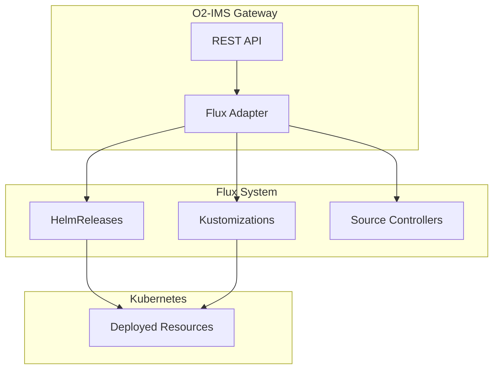

# Flux Adapter

The Flux adapter provides O2-DMS deployment management capabilities using [Flux CD](https://fluxcd.io/), a GitOps toolkit for Kubernetes.

## Overview

This adapter enables GitOps-based CNF/VNF deployment management through Flux resources:

- **HelmRelease**: Declarative Helm chart deployments with automated reconciliation
- **Kustomization**: Kubernetes manifest deployments with Kustomize overlays
- **GitRepository**: Git-based source references for deployments
- **HelmRepository**: Helm chart repository references

## Supported Capabilities

| Capability | Support | Description |
|------------|---------|-------------|
| Deployment Lifecycle | ✅ | Create, read, update, delete HelmReleases and Kustomizations |
| GitOps | ✅ | Full GitOps workflow with automatic reconciliation |
| Rollback | ✅ | Trigger reconciliation to previous Git revisions |
| Health Checks | ✅ | Monitor Flux resource conditions and status |
| Metrics | ✅ | Track deployment status and conditions |
| Package Management | ✅ | List GitRepositories and HelmRepositories as packages |
| Scaling | ✅ | Update replica values in HelmRelease deployments |

## Configuration

```go
import "github.com/piwi3910/netweave/internal/dms/adapters/flux"

config := &flux.Config{
    // Path to kubeconfig file (optional, uses in-cluster config if empty)
    Kubeconfig: "/path/to/kubeconfig",

    // Namespace where Flux resources are managed
    Namespace: "flux-system",

    // Namespace where source resources (GitRepository, HelmRepository) are located
    SourceNamespace: "flux-system",

    // Timeout for reconciliation operations
    ReconcileTimeout: 10 * time.Minute,

    // Default reconciliation interval for new resources
    Interval: 5 * time.Minute,

    // Create new resources in suspended state
    Suspend: false,

    // Enable garbage collection for Kustomizations
    Prune: true,

    // Enable force applying changes
    Force: false,

    // Default target namespace for deployments
    TargetNamespace: "default",
}

adapter, err := flux.NewAdapter(config)
if err != nil {
    log.Fatal(err)
}
```

## Usage Examples

### Creating a HelmRelease Deployment

```go
req := &adapter.DeploymentRequest{
    Name:      "nginx",
    Namespace: "production",
    Values: map[string]interface{}{
        "replicaCount": 3,
        "image": map[string]interface{}{
            "tag": "1.21",
        },
    },
    Extensions: map[string]interface{}{
        "flux.type":         "helmrelease",
        "flux.chart":        "nginx",
        "flux.sourceRef":    "bitnami",
        "flux.sourceKind":   "HelmRepository",
        "flux.chartVersion": "13.2.0",
    },
}

deployment, err := adapter.CreateDeployment(ctx, req)
```

### Creating a Kustomization Deployment

```go
req := &adapter.DeploymentRequest{
    Name:      "infrastructure",
    Namespace: "production",
    Extensions: map[string]interface{}{
        "flux.type":       "kustomization",
        "flux.path":       "./infrastructure/production",
        "flux.sourceRef":  "infra-repo",
        "flux.sourceKind": "GitRepository",
    },
}

deployment, err := adapter.CreateDeployment(ctx, req)
```

### Listing Deployments

```go
filter := &adapter.Filter{
    Namespace: "flux-system",
    Status:    adapter.DeploymentStatusDeployed,
    Labels: map[string]string{
        "app.kubernetes.io/name": "nginx",
    },
    Limit:  10,
    Offset: 0,
}

deployments, err := adapter.ListDeployments(ctx, filter)
```

### Updating a Deployment

```go
update := &adapter.DeploymentUpdate{
    Values: map[string]interface{}{
        "replicaCount": 5,
    },
    Extensions: map[string]interface{}{
        "flux.chartVersion": "14.0.0",
    },
}

deployment, err := adapter.UpdateDeployment(ctx, "nginx", update)
```

### Scaling a Deployment

```go
err := adapter.ScaleDeployment(ctx, "nginx", 5)
```

### Rolling Back a Deployment

```go
// Rollback to revision 0 (triggers reconciliation)
err := adapter.RollbackDeployment(ctx, "nginx", 0)
```

### Getting Deployment Status

```go
status, err := adapter.GetDeploymentStatus(ctx, "nginx")
// status.Status: "deployed", "deploying", "failed", etc.
// status.Progress: 0-100
// status.Conditions: Flux conditions (Ready, Healthy, etc.)
```

## REST API Examples

### List Deployments

```bash
curl -X GET https://gateway.example.com/o2ims/v1/deployments \
  -H "Accept: application/json" \
  -H "Authorization: Bearer <token>"
```

### Create HelmRelease

```bash
curl -X POST https://gateway.example.com/o2ims/v1/deployments \
  -H "Content-Type: application/json" \
  -H "Authorization: Bearer <token>" \
  -d '{
    "name": "nginx",
    "namespace": "production",
    "values": {
      "replicaCount": 3
    },
    "extensions": {
      "flux.type": "helmrelease",
      "flux.chart": "nginx",
      "flux.sourceRef": "bitnami",
      "flux.chartVersion": "13.2.0"
    }
  }'
```

### Create Kustomization

```bash
curl -X POST https://gateway.example.com/o2ims/v1/deployments \
  -H "Content-Type: application/json" \
  -H "Authorization: Bearer <token>" \
  -d '{
    "name": "infrastructure",
    "namespace": "production",
    "extensions": {
      "flux.type": "kustomization",
      "flux.path": "./infrastructure/production",
      "flux.sourceRef": "infra-repo"
    }
  }'
```

## Architecture



## Extension Fields

### HelmRelease Extensions

| Field | Type | Description |
|-------|------|-------------|
| `flux.type` | string | Set to "helmrelease" |
| `flux.chart` | string | Helm chart name |
| `flux.chartVersion` | string | Chart version constraint |
| `flux.sourceRef` | string | Name of HelmRepository or GitRepository |
| `flux.sourceKind` | string | "HelmRepository" or "GitRepository" |
| `flux.targetNamespace` | string | Target namespace for deployed resources |

### Kustomization Extensions

| Field | Type | Description |
|-------|------|-------------|
| `flux.type` | string | Set to "kustomization" |
| `flux.path` | string | Path to kustomization directory |
| `flux.sourceRef` | string | Name of GitRepository |
| `flux.sourceKind` | string | "GitRepository" |
| `flux.targetRevision` | string | Git revision to deploy |
| `flux.lastAppliedRevision` | string | Currently applied revision (read-only) |

## Status Mapping

| Flux Condition | DMS Status |
|----------------|------------|
| Ready=True | Deployed |
| Ready=False (Progressing) | Deploying |
| Ready=False (Failed) | Failed |
| Ready=Unknown | Deploying |
| No conditions | Pending |

## Error Handling

The adapter returns typed errors for common scenarios:

```go
deployment, err := adapter.GetDeployment(ctx, "nonexistent")
if err != nil {
    // Error: "deployment not found: nonexistent"
}

_, err = adapter.CreateDeployment(ctx, &adapter.DeploymentRequest{
    Name: "test",
    Extensions: map[string]interface{}{
        "flux.type": "helmrelease",
        // Missing flux.chart
    },
})
if err != nil {
    // Error: "flux.chart extension is required for HelmRelease"
}
```

## Performance Considerations

- **Lazy Initialization**: The adapter initializes the Kubernetes client on first use
- **Thread Safety**: Uses `sync.Once` for safe concurrent initialization
- **Pagination**: Supports limit/offset for large deployments lists
- **Caching**: Relies on Kubernetes API server caching

## Testing

Run the unit tests:

```bash
go test -v ./internal/dms/adapters/flux/...

# With coverage
go test -coverprofile=coverage.out ./internal/dms/adapters/flux/...
go tool cover -html=coverage.out
```

## Troubleshooting

### Common Issues

1. **"flux adapter not healthy"**: Check Kubernetes connectivity and Flux CRDs are installed
2. **"deployment not found"**: Verify the resource exists and namespace is correct
3. **"failed to create"**: Check Flux source resources exist (GitRepository/HelmRepository)

### Debugging

Enable debug logging:

```go
config := &flux.Config{
    Kubeconfig: os.Getenv("KUBECONFIG"),
    Namespace:  "flux-system",
}
```

Check Flux resource status:

```bash
# Check HelmReleases
kubectl get helmreleases -n flux-system

# Check Kustomizations
kubectl get kustomizations -n flux-system

# Check source resources
kubectl get gitrepositories,helmrepositories -n flux-system
```

## Prerequisites

- Kubernetes cluster with Flux CD installed
- Flux source-controller and kustomize-controller/helm-controller running
- RBAC permissions to manage Flux resources

## Security Considerations

- The adapter uses the Kubernetes dynamic client for CRD management
- Supports both in-cluster and kubeconfig-based authentication
- Follows Kubernetes RBAC for authorization
- Does not store credentials; relies on Kubernetes service accounts
