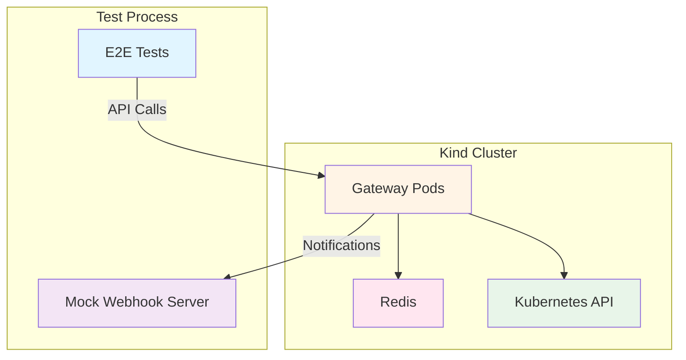

# End-to-End (E2E) Tests

Complete end-to-end tests for the O2-IMS Gateway that verify user workflows against a real Kubernetes cluster.

## Overview

E2E tests validate complete user journeys by:
- Deploying the gateway to a Kind cluster
- Executing real API calls
- Verifying responses and behavior
- Testing webhooks and subscriptions
- Validating multi-component integration

## Quick Start

```bash
# Setup test environment (creates Kind cluster, deploys gateway)
make test-e2e-setup

# Run E2E tests
make test-e2e

# Cleanup when done
make test-e2e-cleanup
```

## Prerequisites

| Tool | Version | Installation |
|------|---------|--------------|
| **Go** | 1.25.0+ | https://go.dev/doc/install |
| **Kind** | 0.20.0+ | https://kind.sigs.k8s.io/ |
| **kubectl** | 1.28.0+ | https://kubernetes.io/docs/tasks/tools/ |
| **Helm** | 3.12.0+ | https://helm.sh/docs/intro/install/ |
| **Docker** | 20.10.0+ | https://docs.docker.com/get-docker/ |

### Install Prerequisites

```bash
# macOS (using Homebrew)
brew install go kind kubectl helm

# Linux (example for Ubuntu)
# Go
wget https://go.dev/dl/go1.25.0.linux-amd64.tar.gz
sudo tar -C /usr/local -xzf go1.25.0.linux-amd64.tar.gz

# Kind
curl -Lo ./kind https://kind.sigs.k8s.io/dl/latest/kind-linux-amd64
chmod +x ./kind
sudo mv ./kind /usr/local/bin/kind

# kubectl
curl -LO "https://dl.k8s.io/release/$(curl -L -s https://dl.k8s.io/release/stable.txt)/bin/linux/amd64/kubectl"
chmod +x kubectl
sudo mv kubectl /usr/local/bin/

# Helm
curl https://raw.githubusercontent.com/helm/helm/main/scripts/get-helm-3 | bash
```

## Test Architecture

### Framework Components

```
tests/e2e/
├── framework.go           # Core test framework
├── webhook.go             # Mock webhook server for subscriptions
├── infrastructure_test.go # Infrastructure discovery tests
├── subscription_test.go   # Subscription workflow tests
├── setup.sh               # Environment setup script
├── cleanup.sh             # Environment cleanup script
└── README.md              # This file
```

### Test Environment

The E2E tests create a complete test environment:



## Test Suites

### Infrastructure Discovery (`infrastructure_test.go`)

Tests the complete infrastructure discovery workflow:

- ✅ List resource pools
- ✅ Get specific resource pool
- ✅ List resources in pool
- ✅ Get specific resource
- ✅ Filter resources by type
- ✅ Pagination support
- ✅ Error handling (non-existent resources)
- ✅ Invalid filter syntax

**Example:**
```bash
go test -v -tags=e2e ./tests/e2e/ -run TestInfrastructureDiscovery
```

### Subscription Workflow (`subscription_test.go`)

Comprehensive tests covering the complete subscription lifecycle and notification delivery:

#### Basic CRUD Operations

- ✅ Create subscription
- ✅ List subscriptions
- ✅ Get specific subscription
- ✅ Delete subscription
- ⏸️ Webhook notifications (requires resource changes)

#### Advanced Subscription Tests

**TestSubscriptionFiltering** - Tests subscription filtering by resource attributes:
- Creates two webhook servers
- Subscription 1: Filters for `Node` resources
- Subscription 2: Filters for `Namespace` resources
- Validates that each subscription receives only matching events
- Status: ⏸️ Framework ready, requires K8s resource creation

**TestConcurrentSubscriptions** - Tests multiple concurrent subscriptions:
- Creates 5 subscriptions in parallel using goroutines
- Each subscription has unique webhook server
- Validates thread-safe subscription creation
- Ensures all subscriptions are created successfully
- Tests mutex-protected concurrent access patterns
- Status: ✅ Complete

**TestSubscriptionInvalidCallback** - Tests error handling for invalid callback URLs:
- Invalid URL format: `"not-a-valid-url"`
- Empty callback: `""`
- Non-HTTP scheme: `"ftp://example.com/webhook"`
- Validates appropriate HTTP status codes (400 Bad Request)
- Status: ✅ Complete

**TestWebhookRetryLogic** - Tests webhook delivery with retry on failure:
- Creates webhook server that fails first 2 attempts
- Validates exponential backoff retry mechanism
- Ensures notification eventually succeeds after retries
- Tests resilience to temporary webhook failures
- Status: ⏸️ Framework ready, requires event triggering

**TestResourceLifecycleEvents** - Tests full resource lifecycle notification flow:
- Create resource → notification sent
- Update resource → notification sent
- Delete resource → notification sent
- Validates complete event stream for resource lifecycle
- Status: ⏸️ Framework ready, requires K8s resource creation

**TestSubscriptionFilterByResourcePool** - Tests filtering by resource pool ID:
- Creates subscription with pool-specific filter
- Validates events filtered by resource pool membership
- Tests hierarchical filtering (pool → resources)
- Status: ⏸️ Framework ready, requires K8s resource creation

**TestSubscriptionDeletionStopsNotifications** - Tests notification cessation:
- Creates subscription and receives initial notifications
- Deletes subscription
- Validates no further notifications received after deletion
- Tests cleanup of notification delivery
- Status: ⏸️ Framework ready, requires event triggering

**Example:**
```bash
# Run all subscription tests
go test -v -tags=e2e ./tests/e2e/ -run TestSubscription

# Run specific advanced test
go test -v -tags=e2e ./tests/e2e/ -run TestSubscriptionFiltering
go test -v -tags=e2e ./tests/e2e/ -run TestConcurrentSubscriptions
go test -v -tags=e2e ./tests/e2e/ -run TestWebhookRetryLogic
```

**Note**: Tests marked with ⏸️ have complete framework implementation but are currently skipped pending Kubernetes resource creation functionality. These tests will be enabled once the test infrastructure supports creating/modifying/deleting actual Kubernetes resources to trigger events.

## Running Tests

### Full E2E Workflow

```bash
# 1. Setup environment
make test-e2e-setup

# 2. Run tests
make test-e2e

# 3. Cleanup
make test-e2e-cleanup
```

### Run Specific Tests

```bash
# Run only infrastructure tests
go test -v -tags=e2e ./tests/e2e/ -run TestInfrastructureDiscovery

# Run only subscription tests
go test -v -tags=e2e ./tests/e2e/ -run TestSubscriptionWorkflow

# Run with verbose output
go test -v -tags=e2e ./tests/e2e/ -run TestInfrastructureDiscovery/list_resource_pools
```

### Manual Setup (Alternative to Makefile)

```bash
# Set environment variables
export CLUSTER_NAME=netweave-e2e
export NAMESPACE=netweave-e2e

# Run setup script
./tests/e2e/setup.sh

# Run tests
go test -v -tags=e2e -timeout=15m ./tests/e2e/...

# Cleanup
./tests/e2e/cleanup.sh
```

## Test Framework

### Creating a Test

```go
// +build e2e

package e2e

import (
    "testing"
    "github.com/stretchr/testify/require"
)

func TestMyFeature(t *testing.T) {
    if testing.Short() {
        t.Skip("Skipping E2E test in short mode")
    }

    fw, err := NewTestFramework(DefaultOptions())
    require.NoError(t, err)
    defer fw.Cleanup()

    // Your test code here
    resp, err := fw.APIClient.Get(fw.GatewayURL + "/o2ims/v1/resourcePools")
    require.NoError(t, err)
    // ... assertions
}
```

### Framework Options

```go
opts := &FrameworkOptions{
    KubeconfigPath: "~/.kube/config",
    GatewayURL:     "http://localhost:8080",
    Namespace:      "netweave-e2e",
    UseTLS:         false,
    Timeout:        5 * time.Minute,
}

fw, err := NewTestFramework(opts)
```

### Using the Webhook Server

```go
// Wait for a webhook notification
event, err := fw.WebhookServer.WaitForEvent(30 * time.Second)
if err == nil {
    fmt.Printf("Received event: %s\n", event.Type)
}

// Wait for specific event
event, err := fw.WebhookServer.WaitForEventWithFilter(
    30 * time.Second,
    func(e *WebhookEvent) bool {
        return e.ResourceType == "Node"
    },
)

// Get all received events
events := fw.WebhookServer.GetReceivedEvents()
```

## Environment Configuration

### Environment Variables

| Variable | Description | Default |
|----------|-------------|---------|
| `CLUSTER_NAME` | Kind cluster name | `netweave-e2e` |
| `NAMESPACE` | Kubernetes namespace | `netweave-e2e` |
| `KUBECONFIG` | Path to kubeconfig | `~/.kube/config` |

### Customizing the Setup

Edit `tests/e2e/setup.sh` to customize:
- Cluster configuration
- Gateway deployment settings
- Redis configuration
- Port forwarding setup

## Troubleshooting

### Tests Fail to Connect

**Problem**: Tests can't reach the gateway

**Solution**:
```bash
# Check port-forward is running
ps aux | grep "port-forward"

# Manually start port-forward if needed
kubectl port-forward -n netweave-e2e svc/netweave 8080:8080

# Verify gateway is ready
kubectl get pods -n netweave-e2e
kubectl logs -n netweave-e2e -l app.kubernetes.io/name=netweave
```

### Kind Cluster Creation Fails

**Problem**: `kind create cluster` fails

**Solutions**:
```bash
# Delete existing cluster
kind delete cluster --name netweave-e2e

# Check Docker is running
docker ps

# Try with explicit Docker context
kind create cluster --name netweave-e2e --retain
```

### Gateway Not Ready

**Problem**: Gateway pods not starting

**Solutions**:
```bash
# Check pod status
kubectl get pods -n netweave-e2e

# Check pod logs
kubectl logs -n netweave-e2e -l app.kubernetes.io/name=netweave

# Check events
kubectl get events -n netweave-e2e --sort-by='.lastTimestamp'

# Describe pod for details
kubectl describe pod -n netweave-e2e -l app.kubernetes.io/name=netweave
```

### Tests Timeout

**Problem**: Tests timeout waiting for responses

**Solutions**:
```bash
# Increase test timeout
go test -v -tags=e2e -timeout=30m ./tests/e2e/...

# Check gateway health
curl http://localhost:8080/healthz

# Check if Redis is ready
kubectl get pods -n netweave-e2e -l app=redis
```

## CI/CD Integration

E2E tests can run in CI pipelines:

```yaml
# Example GitHub Actions workflow
name: E2E Tests

on:
  pull_request:
  schedule:
    - cron: '0 2 * * *'  # Nightly

jobs:
  e2e:
    runs-on: ubuntu-latest
    steps:
      - uses: actions/checkout@v4

      - name: Setup Go
        uses: actions/setup-go@v5
        with:
          go-version: '1.25.0'

      - name: Setup Kind
        uses: helm/kind-action@v1
        with:
          cluster_name: netweave-e2e

      - name: Run E2E tests
        run: |
          make test-e2e-setup
          make test-e2e

      - name: Cleanup
        if: always()
        run: make test-e2e-cleanup
```

## Best Practices

### Writing E2E Tests

1. **Use build tags**: Always add `//go:build e2e` to E2E test files
2. **Check short mode**: Skip in short mode with `if testing.Short() { t.Skip() }`
3. **Use the framework**: Leverage `TestFramework` for consistent setup
4. **Clean up**: Always defer `fw.Cleanup()`
5. **Meaningful names**: Use descriptive test names
6. **Independent tests**: Each test should be self-contained
7. **Idempotent**: Tests should pass when run multiple times

### Test Organization

```go
func TestFeature(t *testing.T) {
    if testing.Short() {
        t.Skip("Skipping E2E test in short mode")
    }

    fw, err := NewTestFramework(DefaultOptions())
    require.NoError(t, err)
    defer fw.Cleanup()

    t.Run("scenario_1", func(t *testing.T) {
        // Test scenario 1
    })

    t.Run("scenario_2", func(t *testing.T) {
        // Test scenario 2
    })
}
```

### Assertions

```go
// Use require for critical assertions (stops test on failure)
require.NoError(t, err)
require.Equal(t, expected, actual)

// Use assert for non-critical checks (continues test on failure)
assert.Equal(t, expected, actual)
assert.Contains(t, list, item)
```

## Future Enhancements

Planned additions to the E2E test suite:

- [ ] Multi-tenant isolation tests
- [ ] Authentication/authorization tests
- [ ] DMS deployment lifecycle tests
- [ ] Performance/load tests
- [ ] Adapter failover scenarios
- [ ] Certificate rotation tests
- [ ] Upgrade/downgrade tests

## References

- [Testing in Go](https://go.dev/doc/tutorial/add-a-test)
- [Testify Documentation](https://pkg.go.dev/github.com/stretchr/testify)
- [Kind Documentation](https://kind.sigs.k8s.io/)
- [Kubernetes E2E Testing](https://github.com/kubernetes/community/blob/master/contributors/devel/sig-testing/e2e-tests.md)
