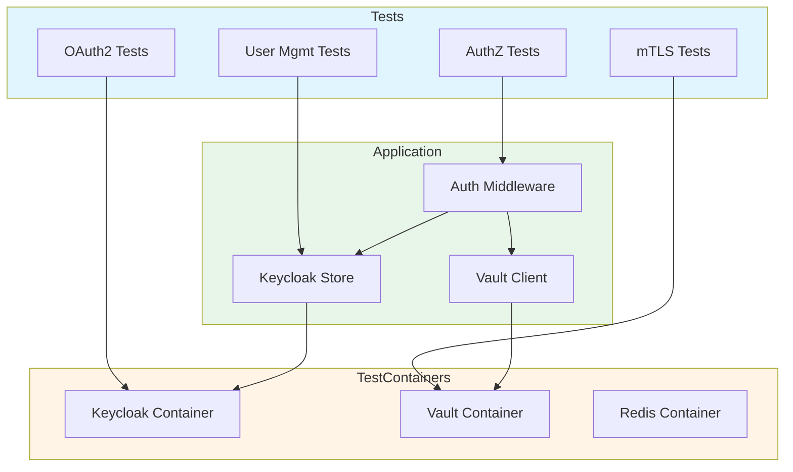

# Keycloak + Vault Integration Tests

Comprehensive integration tests for the complete authentication and authorization flow using Keycloak (OAuth2/OIDC) and Vault (mTLS/PKI).

## Overview

These tests cover the full authentication stack:

- **OAuth2/OIDC Authentication** via Keycloak
- **mTLS Certificate Management** via Vault PKI
- **Role-Based Access Control** (RBAC)
- **Tenant Isolation**
- **User Management Lifecycle**
- **Certificate Lifecycle** (issue, renew, revoke)

## Prerequisites

### Option 1: Automated (Testcontainers - Recommended for CI)

Tests use [testcontainers-go](https://golang.testcontainers.org/) to automatically start Keycloak and Vault containers. This is the default mode and requires:

- Docker installed and running
- Go 1.25.0+
- Sufficient Docker resources (2GB+ memory recommended)

### Option 2: Manual Setup (For Local Development)

Use the provided `docker-compose.yml` for persistent test environment:

```bash
# Start services
cd tests/integration/auth
docker-compose up -d

# Wait for services to be ready
docker-compose ps

# Stop services when done
docker-compose down
```

## Running Tests

### All Integration Tests

```bash
# Run all integration tests in this directory
go test -v -tags=integration ./tests/integration/auth/...

# With race detector
go test -v -race -tags=integration ./tests/integration/auth/...
```

### Specific Test Suites

```bash
# OAuth2 authentication flow
go test -v -tags=integration -run TestIntegration_OAuth2 ./tests/integration/auth/

# mTLS certificate validation
go test -v -tags=integration -run TestIntegration_MTLS ./tests/integration/auth/

# Authorization and RBAC
go test -v -tags=integration -run TestIntegration_Authorization ./tests/integration/auth/

# Certificate lifecycle
go test -v -tags=integration -run TestIntegration_Certificate ./tests/integration/auth/

# User management
go test -v -tags=integration -run TestIntegration_UserManagement ./tests/integration/auth/
```

### Skip Integration Tests

```bash
# Run only unit tests (skip integration tests)
go test -v -short ./...
```

## Test Coverage

### 1. OAuth2/OIDC Authentication Tests ✅

| Test | Description | Status |
|------|-------------|--------|
| OAuth2_AuthenticationFlow | Complete token acquisition and validation | ✅ Implemented |
| OAuth2_TokenRefresh | Token refresh flow | 🔄 TODO |
| OAuth2_TokenExpiry | Expired token handling | 🔄 TODO |
| OAuth2_InvalidToken | Invalid token rejection | 🔄 TODO |

### 2. mTLS Certificate Tests ✅

| Test | Description | Status |
|------|-------------|--------|
| MTLS_CertificateValidation | Certificate validation against Vault CA | ✅ Implemented |
| MTLS_UserLookup | User lookup by certificate subject | 🔄 TODO |
| MTLS_RoleAssignment | Role assignment via certificate | 🔄 TODO |
| MTLS_ExpiryHandling | Certificate expiry handling | 🔄 TODO |
| MTLS_RevokedRejection | Revoked certificate rejection | 🔄 TODO |

### 3. Authorization Tests ✅

| Test | Description | Status |
|------|-------------|--------|
| Authorization_RoleBasedAccess | Permission checks with Keycloak roles | ✅ Implemented |
| Authorization_TenantIsolation | Tenant isolation enforcement | ✅ Implemented |
| Authorization_PlatformAdmin | Platform admin access | 🔄 TODO |
| Authorization_TenantAdmin | Tenant admin access | 🔄 TODO |
| Authorization_UnauthorizedDenial | Unauthorized access denial | 🔄 TODO |

### 4. User Management Tests ✅

| Test | Description | Status |
|------|-------------|--------|
| UserManagement_Lifecycle | Complete CRUD lifecycle | ✅ Implemented |
| UserManagement_RoleAssignment | Role assignment and revocation | 🔄 TODO |
| UserManagement_ListByTenant | User listing by tenant | 🔄 TODO |

### 5. Certificate Lifecycle Tests ✅

| Test | Description | Status |
|------|-------------|--------|
| Certificate_RevocationWorkflow | Certificate generation and revocation | ✅ Implemented |
| Certificate_Renewal | Certificate renewal | 🔄 TODO |
| Certificate_CRLUpdates | CRL updates | 🔄 TODO |
| Certificate_OCSPQueries | OCSP queries | 🔄 TODO |

### 6. Performance Tests

| Test | Description | Target | Status |
|------|-------------|--------|--------|
| Perf_TokenValidation | Token validation throughput | 1000 req/sec | 🔄 TODO |
| Perf_UserLookup | User lookup latency | <10ms p95 | 🔄 TODO |
| Perf_RoleCheck | Role check latency | <5ms p95 | 🔄 TODO |
| Perf_CertValidation | Certificate validation latency | <20ms p95 | 🔄 TODO |

### 7. Error Scenario Tests

| Test | Description | Status |
|------|-------------|--------|
| Error_KeycloakUnavailable | Keycloak unavailable handling | 🔄 TODO |
| Error_VaultUnavailable | Vault unavailable handling | 🔄 TODO |
| Error_NetworkTimeout | Network timeout handling | 🔄 TODO |
| Error_MalformedToken | Malformed token handling | 🔄 TODO |

### 8. Migration Tests

| Test | Description | Status |
|------|-------------|--------|
| Migration_RedisToKeycloak | Data migration from Redis | 🔄 TODO |
| Migration_Rollback | Rollback functionality | 🔄 TODO |
| Migration_DualStore | Dual-store operation | 🔄 TODO |

## Test Data

Tests automatically create the following test data:

### Tenants
- `tenant-test` - Primary test tenant
- `tenant-other` - Secondary tenant for isolation tests

### Users
- `admin@test.com` (Password123!) - Platform admin
- `operator@test.com` (Password123!) - Tenant operator
- `viewer@test.com` (Password123!) - Tenant viewer
- `other@test.com` (Password123!) - User in different tenant

### Roles
- `role-admin` - Platform admin (all permissions)
- `role-tenant-admin` - Tenant admin (tenant-scoped all permissions)
- `role-operator` - Operator (read + create deployments)
- `role-viewer` - Viewer (read-only)

## Troubleshooting

### Containers Won't Start

```bash
# Check Docker resources
docker system info

# Increase Docker memory limit to 4GB+ in Docker settings

# Clean up old containers
docker system prune -a
```

### Tests Timeout

```bash
# Increase test timeout
go test -timeout 30m -v -tags=integration ./tests/integration/auth/

# Check container logs
docker-compose logs keycloak
docker-compose logs vault
```

### Port Conflicts

```bash
# Check what's using ports 8080/8200
lsof -i :8080
lsof -i :8200

# Stop conflicting services or modify docker-compose.yml ports
```

### Keycloak Not Ready

```bash
# Wait for Keycloak to fully start (can take 60+ seconds)
docker-compose logs -f keycloak

# Look for: "Listening on: http://0.0.0.0:8080"
```

## CI/CD Integration

These tests run automatically in GitHub Actions CI:

```yaml
# .github/workflows/ci.yml
- name: Run Integration Tests
  run: make test-integration
  env:
    DOCKER_BUILDKIT: 1
```

## Architecture



## Performance Benchmarks

Run benchmarks to measure authentication performance:

```bash
# Run all benchmarks
go test -bench=. -benchmem -tags=integration ./tests/integration/auth/

# Specific benchmark
go test -bench=BenchmarkTokenValidation -benchmem -tags=integration ./tests/integration/auth/
```

## Contributing

When adding new tests:

1. Follow the existing test structure
2. Use `setupTestEnvironment(t)` for test setup
3. Always `defer env.cleanup(t)` to prevent resource leaks
4. Use descriptive test names: `TestIntegration_<Feature>_<Scenario>`
5. Add test to coverage table in this README
6. Update documentation if adding new test categories

## References

- [Keycloak Documentation](https://www.keycloak.org/documentation)
- [HashiCorp Vault PKI](https://developer.hashicorp.com/vault/docs/secrets/pki)
- [testcontainers-go Documentation](https://golang.testcontainers.org/)
- [OAuth 2.0 RFC 6749](https://datatracker.ietf.org/doc/html/rfc6749)
- [OIDC Specification](https://openid.net/specs/openid-connect-core-1_0.html)
